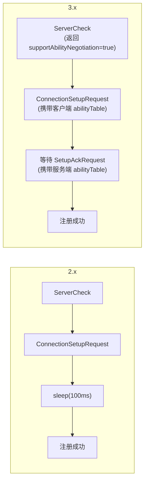
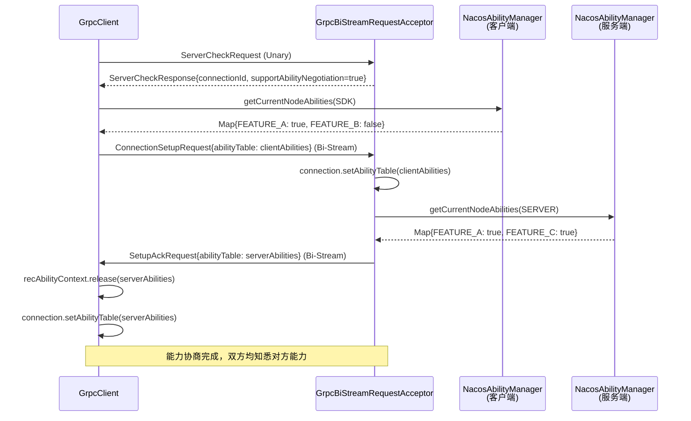
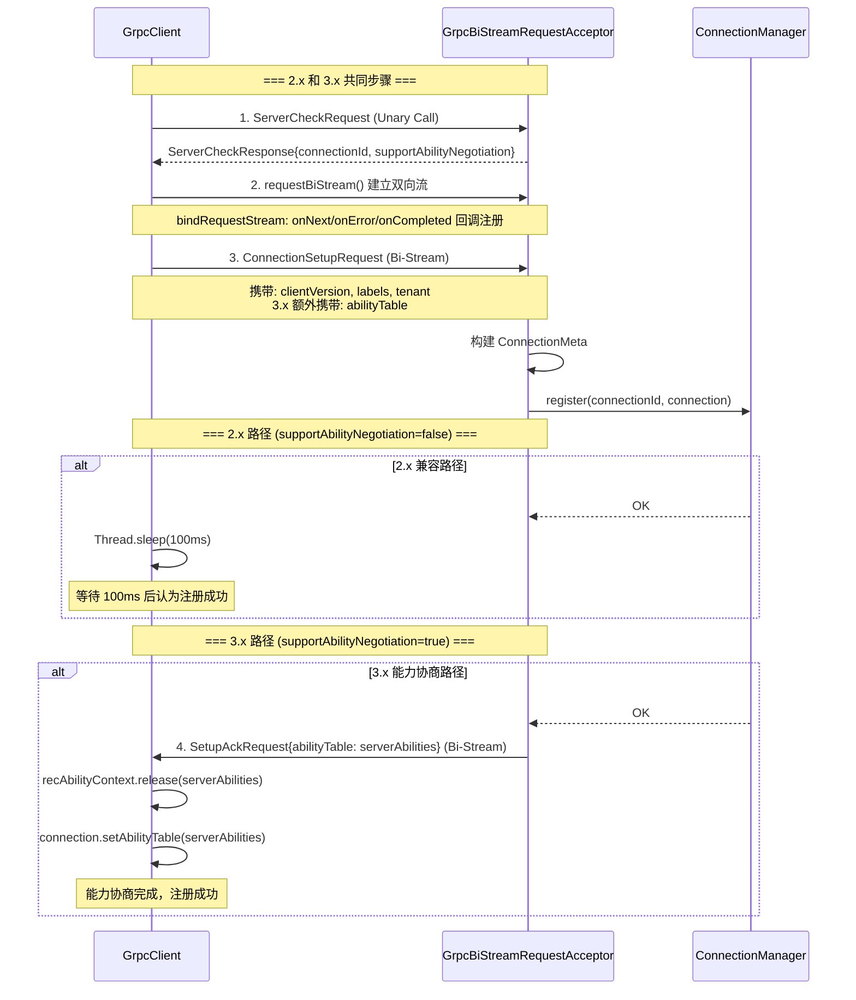

# Nacos 2.x vs 3.x gRPC 通信差异分析

## 目录

1. [概述](#1-概述)
2. [Proto 协议层](#2-proto-协议层)
3. [能力协商机制（核心差异）](#3-能力协商机制核心差异)
4. [ServerCheckResponse 新增字段](#4-servercheckresponse-新增字段)
5. [ConnectionSetupRequest 新增 abilityTable](#5-connectionsetuprequest-新增-abilitytable)
6. [新增 SetupAckRequest](#6-新增-setupackrequest)
7. [NacosAbilityManager 能力管理框架](#7-nacosabilitymanager-能力管理框架)
8. [新增模块的 gRPC 客户端](#8-新增模块的-grpc-客户端)
9. [新增 gRPC Request/Response 类型](#9-新增-grpc-requestresponse-类型)
10. [其他差异](#10-其他差异)
11. [完整连接建立流程对比](#11-完整连接建立流程对比)
12. [总结](#12-总结)

---

## 1. 概述

Nacos 3.x 的 gRPC 通信层在 2.x 基础上进行了扩展，**Proto 协议定义完全兼容**（同一个 `nacos_grpc_service.proto`），底层 gRPC 框架（`Request/request` Unary + `BiRequestStream/requestBiStream` BidiStream）也没有变化。

核心差异在于 3.x 引入了**双向能力协商机制**，让客户端和服务端在连接建立时互相交换能力表，为后续功能扩展（如 AI 模块、Fuzzy Watch 等）提供了基础设施。



---

## 2. Proto 协议层

**完全相同。** 2.x 和 3.x 使用同一个 Proto 文件：

[`nacos_grpc_service.proto`](file:///d:/workspace/java_projects/source_projects/nacos/api/src/main/proto/nacos_grpc_service.proto)

```protobuf
syntax = "proto3";

message Metadata {
  string type = 3;
  string clientIp = 8;
  map<string, string> headers = 7;
}

message Payload {
  Metadata metadata = 2;
  google.protobuf.Any body = 3;
}

service Request {
  rpc request (Payload) returns (Payload) {}
}

service BiRequestStream {
  rpc requestBiStream (stream Payload) returns (stream Payload) {}
}
```

这意味着 **3.x 客户端可以连接 2.x 服务端**（走兼容路径），反之亦然。

---

## 3. 能力协商机制（核心差异）

这是 3.x 最大的变化。核心源码在 [GrpcClient.connectToServer()](file:///d:/workspace/java_projects/source_projects/nacos/common/src/main/java/com/alibaba/nacos/common/remote/client/grpc/GrpcClient.java#L370-L430)：

### 3.1 2.x 连接建立流程

```java
// 2.x 简化版流程：
ConnectionSetupRequest conSetupRequest = new ConnectionSetupRequest();
conSetupRequest.setClientVersion(getClientVersion());
conSetupRequest.setLabels(super.getLabels());
conSetupRequest.setTenant(super.getTenant());
// 没有 abilityTable
grpcConn.sendRequest(conSetupRequest);

// 等待 100ms 就算注册成功（无能力协商）
Thread.sleep(100L);
return grpcConn;
```

### 3.2 3.x 连接建立流程

```java
// 3.x 完整流程：
ConnectionSetupRequest conSetupRequest = new ConnectionSetupRequest();
conSetupRequest.setClientVersion(getClientVersion());
conSetupRequest.setLabels(super.getLabels());

// 新增：携带客户端能力表
conSetupRequest.setAbilityTable(
    NacosAbilityManagerHolder.getInstance()
        .getCurrentNodeAbilities(abilityMode()));

conSetupRequest.setTenant(super.getTenant());
grpcConn.sendRequest(conSetupRequest);

// 新增：等待服务端返回能力表
if (recAbilityContext.isNeedToSync()) {
    // 3.x 路径：等待 SetupAckRequest
    recAbilityContext.await(
        this.clientConfig.capabilityNegotiationTimeout(),
        TimeUnit.MILLISECONDS);
    if (!recAbilityContext.check(grpcConn)) {
        return null;  // 能力协商失败，触发重连
    }
} else {
    // 2.x 兼容路径：等待 100ms 就算成功
    Thread.sleep(100L);
}
return grpcConn;
```

### 3.3 RecAbilityContext — 能力协商上下文

```java
static class RecAbilityContext {
    private volatile Connection connection;  // 等待能力表的连接
    private volatile CountDownLatch blocker; // 阻塞等待
    private volatile boolean needToSync = false;  // 是否需要协商

    public void reset(Connection connection) {
        this.connection = connection;
        this.blocker = new CountDownLatch(1);
        this.needToSync = true;
    }

    public void release(Map<String, Boolean> abilities) {
        if (abilities != null) {
            connection.setAbilityTable(abilities);
        }
        this.needToSync = false;
        blocker.countDown();  // 释放等待
    }
}
```

### 3.4 客户端接收 SetupAckRequest

在 [GrpcClient.bindRequestStream()](file:///d:/workspace/java_projects/source_projects/nacos/common/src/main/java/com/alibaba/nacos/common/remote/client/grpc/GrpcClient.java#L270-L310) 中：

```java
@Override
public void onNext(Payload payload) {
    Request request = (Request) GrpcUtils.parse(payload);

    if (request instanceof SetupAckRequest) {
        // 收到服务端能力表
        SetupAckRequest setupAckRequest = (SetupAckRequest) request;
        Map<String, Boolean> abilityTable = setupAckRequest.getAbilityTable();
        recAbilityContext.release(abilityTable);  // 释放阻塞
        return;
    }

    // 普通服务端推送处理...
}
```

---

## 4. ServerCheckResponse 新增字段

[ServerCheckResponse.java](file:///d:/workspace/java_projects/source_projects/nacos/api/src/main/java/com/alibaba/nacos/api/remote/response/ServerCheckResponse.java)

| 字段 | 2.x | 3.x |
|------|:---:|:---:|
| `connectionId` | 有 | 有 |
| `supportAbilityNegotiation` | **无** | **新增** |

```java
public class ServerCheckResponse extends Response {
    private String connectionId;
    private boolean supportAbilityNegotiation;  // 3.x 新增

    public ServerCheckResponse(String connectionId, boolean supportAbilityNegotiation) {
        this.connectionId = connectionId;
        this.supportAbilityNegotiation = supportAbilityNegotiation;
    }
}
```

客户端在 `connectToServer()` 中根据此字段决定是否走能力协商路径：

```java
ServerCheckResponse serverCheckResponse = (ServerCheckResponse) response;
if (serverCheckResponse.isSupportAbilityNegotiation()) {
    this.recAbilityContext.reset(grpcConn);  // 标记需要协商
    grpcConn.setAbilityTable(null);           // 初始化为 null
}
```

---

## 5. ConnectionSetupRequest 新增 abilityTable

[ConnectionSetupRequest.java](file:///d:/workspace/java_projects/source_projects/nacos/api/src/main/java/com/alibaba/nacos/api/remote/request/ConnectionSetupRequest.java)

| 字段 | 2.x | 3.x |
|------|:---:|:---:|
| `clientVersion` | 有 | 有 |
| `labels` | 有 | 有 |
| `tenant` | 有 | 有 |
| `abilityTable` | **无** | **新增** `Map<String, Boolean>` |

```java
public class ConnectionSetupRequest extends InternalRequest {
    private String clientVersion;
    private String tenant;
    private Map<String, String> labels = new HashMap<>();
    private Map<String, Boolean> abilityTable;  // 3.x 新增
}
```

---

## 6. 新增 SetupAckRequest

[SetupAckRequest.java](file:///d:/workspace/java_projects/source_projects/nacos/api/src/main/java/com/alibaba/nacos/api/remote/request/SetupAckRequest.java)

3.x 新增了 `SetupAckRequest`，服务端在注册成功后通过 Bi-Stream 返回自己的 `abilityTable`：

```java
public class SetupAckRequest extends ServerRequest {
    private Map<String, Boolean> abilityTable;

    public SetupAckRequest(Map<String, Boolean> abilityTable) {
        this.abilityTable = abilityTable;
    }
}
```

服务端发送 SetupAck 的代码在 [GrpcBiStreamRequestAcceptor](file:///d:/workspace/java_projects/source_projects/nacos/core/src/main/java/com/alibaba/nacos/core/remote/grpc/GrpcBiStreamRequestAcceptor.java#L160-L200)：

```java
if (parseObj instanceof ConnectionSetupRequest) {
    ConnectionSetupRequest setUpRequest = (ConnectionSetupRequest) parseObj;

    // 构建 ConnectionMeta
    ConnectionMeta metaInfo = new ConnectionMeta(connectionId, ...);

    // 保存客户端能力表
    if (setUpRequest.getAbilityTable() != null) {
        connection.setAbilityTable(setUpRequest.getAbilityTable());
    }

    // 注册连接
    if (connectionManager.register(connectionId, connection)) {
        // 返回服务端能力表
        connection.sendRequestNoAck(new SetupAckRequest(
            NacosAbilityManagerHolder.getInstance()
                .getCurrentNodeAbilities(AbilityMode.SERVER)));
    }
}
```

---

## 7. NacosAbilityManager 能力管理框架

[NacosAbilityManagerHolder.java](file:///d:/workspace/java_projects/source_projects/nacos/common/src/main/java/com/alibaba/nacos/common/ability/discover/NacosAbilityManagerHolder.java)

3.x 新增了完整的能力管理框架，通过 SPI 发现 `AbstractAbilityControlManager` 实现：

```java
public class NacosAbilityManagerHolder {
    private static AbstractAbilityControlManager abstractAbilityControlManager;

    public static synchronized AbstractAbilityControlManager getInstance() {
        if (null == abstractAbilityControlManager) {
            // SPI 发现所有 AbstractAbilityControlManager 实现
            Collection<AbstractAbilityControlManager> load =
                NacosServiceLoader.load(AbstractAbilityControlManager.class);
            // 按优先级排序，取最高优先级
            List<AbstractAbilityControlManager> collect = load.stream()
                .sorted(Comparator.comparingInt(
                    AbstractAbilityControlManager::getPriority))
                .collect(Collectors.toList());
            if (load.size() > 0) {
                abstractAbilityControlManager = collect.get(collect.size() - 1);
            }
        }
        return abstractAbilityControlManager;
    }
}
```

**客户端查询服务端能力：**

```java
// NamingGrpcClientProxy
public boolean isAbilitySupportedByServer(AbilityKey abilityKey) {
    return rpcClient.getConnectionAbility(abilityKey) == AbilityStatus.SUPPORTED;
}
```

**能力协商时序图：**



---

## 8. 新增模块的 gRPC 客户端

| 模块 | 2.x | 3.x | 说明 |
|------|:---:|:---:|------|
| Naming | `NamingGrpcClientProxy` | 同 2.x | 命名服务 |
| Config | `ConfigRpcTransportClient` | 同 2.x | 配置管理 |
| **AI** | **无** | **新增** `AiGrpcClient` | MCP/A2A/Prompt/Skill/AgentSpec |
| **Lock** | **无** | **新增** `LockGrpcClient` | 分布式锁 |

### 8.1 AiGrpcClient

[AiGrpcClient.java](file:///d:/workspace/java_projects/source_projects/nacos/client/src/main/java/com/alibaba/nacos/client/ai/remote/AiGrpcClient.java)

```java
public class AiGrpcClient implements AiClientProxy {
    private final RpcClient rpcClient;
    private final AiGrpcRedoService redoService;
    private NacosMcpServerCacheHolder mcpServerCacheHolder;
    private NacosAgentCardCacheHolder agentCardCacheHolder;

    public void start(NacosMcpServerCacheHolder mcpServerCacheHolder,
        NacosAgentCardCacheHolder agentCardCacheHolder) throws NacosException {
        this.serverListManager.start();
        this.rpcClient.registerConnectionListener(this.redoService);
        this.rpcClient.serverListFactory(this.serverListManager);
        this.rpcClient.start();
    }
}
```

### 8.2 LockGrpcClient

[LockGrpcClient.java](file:///d:/workspace/java_projects/source_projects/nacos/client/src/main/java/com/alibaba/nacos/client/lock/remote/grpc/LockGrpcClient.java)

分布式锁模块的 gRPC 客户端，处理锁的获取、释放、续约等操作。

---

## 9. 新增 gRPC Request/Response 类型

3.x 新增了大量 AI 相关的 gRPC 请求类型（均标记 `@Since("3.0.x")`）：

### 9.1 MCP Server 相关

| Request | Response | Handler |
|---------|----------|---------|
| `QueryMcpServerRequest` | `QueryMcpServerResponse` | `QueryMcpServerRequestHandler` |
| `ReleaseMcpServerRequest` | `ReleaseMcpServerResponse` | `ReleaseMcpServerRequestHandler` |
| `McpServerEndpointRequest` | `McpServerEndpointResponse` | `McpServerEndpointRequestHandler` |

### 9.2 A2A Agent 相关

| Request | Response | Handler |
|---------|----------|---------|
| `QueryAgentCardRequest` | `QueryAgentCardResponse` | `QueryAgentCardRequestHandler` |
| `ReleaseAgentCardRequest` | `ReleaseAgentCardResponse` | `ReleaseAgentCardRequestHandler` |
| `AgentEndpointRequest` | `AgentEndpointResponse` | `AgentEndpointRequestHandler` |
| `BatchAgentEndpointRequest` | `BatchAgentEndpointResponse` | `BatchAgentEndpointRequestHandler` |

### 9.3 Prompt 相关

| Request | Response | Handler |
|---------|----------|---------|
| `QueryPromptRequest` | `QueryPromptResponse` | `QueryPromptRequestHandler` |

这些 Handler 通过 Spring 自动扫描注册到 `RequestHandlerRegistry`，与 2.x 的 Config/Naming Handler 共存。

---

## 10. 其他差异

### 10.1 Fuzzy Watch（模糊监听）

| 特性 | 2.x | 3.x |
|------|:---:|:---:|
| Config Fuzzy Watch | 无 | 有 (`ConfigFuzzyWatchRequestHandler`) |
| Naming Fuzzy Watch | 无 | 有 (`NamingFuzzyWatchRequestHandler`) |

### 10.2 TLS 支持

| 特性 | 2.x | 3.x |
|------|:---:|:---:|
| 基础 TLS | 有 | 有 |
| SSL 证书动态刷新 | 无 | 有 (`RpcServerSslContextRefresher`) |

### 10.3 AI Registry 适配器

| 特性 | 2.x | 3.x |
|------|:---:|:---:|
| MCP Registry 协议适配 | 无 | 有（端口 9080） |
| Skill Registry 协议适配 | 无 | 有（端口 9080） |

### 10.4 鉴权类型

| 特性 | 2.x | 3.x |
|------|:---:|:---:|
| `SignType.CONFIG` | 有 | 有 |
| `SignType.NAMING` | 有 | 有 |
| `SignType.AI` | **无** | **新增** |
| `SignType.LOCK` | **无** | **新增** |

### 10.5 gRPC 配置项

3.x 新增了更细粒度的 gRPC 配置：

```properties
# 3.x 新增的 gRPC 配置
nacos.remote.server.grpc.sdk.max-inbound-message-size=10485760
nacos.remote.server.grpc.sdk.keep-alive-time=7200000
nacos.remote.server.grpc.sdk.keep-alive-timeout=20000
nacos.remote.server.grpc.sdk.permit-keep-alive-time=300000

nacos.remote.server.grpc.cluster.max-inbound-message-size=10485760
nacos.remote.server.grpc.cluster.keep-alive-time=7200000
nacos.remote.server.grpc.cluster.keep-alive-timeout=20000
nacos.remote.server.grpc.cluster.permit-keep-alive-time=300000
```

---

## 11. 完整连接建立流程对比



---

## 12. 总结

| 维度 | 2.x | 3.x |
|------|-----|-----|
| **Proto 协议** | `nacos_grpc_service.proto` | 相同（完全兼容） |
| **连接建立** | `ServerCheck → ConnectionSetup → sleep(100ms)` | `ServerCheck → ConnectionSetup(带 abilityTable) → SetupAck(带 abilityTable)` |
| **能力协商** | 无 | 双向能力表交换 |
| **新增模块** | Naming + Config | + AI + Lock |
| **新增 gRPC 类型** | 约 20 个 | + 约 15 个 AI 相关 |
| **Fuzzy Watch** | 无 | Config + Naming |
| **TLS 动态刷新** | 无 | 有 |
| **AI Registry 适配器** | 无 | MCP + Skill Registry（端口 9080） |
| **鉴权类型** | CONFIG, NAMING | + AI, LOCK |
| **向后兼容** | — | 3.x 客户端可连接 2.x 服务端（走 sleep(100ms) 兼容路径） |

**核心结论：** Proto 协议层完全兼容，3.x 的核心升级是引入了**能力协商机制**，让客户端和服务端能互相知道对方支持哪些特性，为 AI 模块、Fuzzy Watch、分布式锁等新功能提供了可扩展的基础设施。
