# Nacos 3.x AI Registry 功能详解与实现原理

## 目录

1. [概述](#1-概述)
2. [AI Registry 架构总览](#2-ai-registry-架构总览)
3. [AI 资源模型](#3-ai-资源模型)
4. [MCP Server 注册与管理](#4-mcp-server-注册与管理)
5. [A2A Agent 注册与管理](#5-a2a-agent-注册与管理)
6. [Prompt 管理](#6-prompt-管理)
7. [Skill 管理](#7-skill-管理)
8. [AgentSpec 管理](#8-agentspec-管理)
9. [AI 资源生命周期](#9-ai-资源生命周期)
10. [发布流水线](#10-发布流水线)
11. [客户端 SDK 使用](#11-客户端-sdk-使用)
12. [AI Registry 适配器](#12-ai-registry-适配器)
13. [存储与持久化](#13-存储与持久化)
14. [总结](#14-总结)
15. [深入实现细节](#15-深入实现细节)
    - [15.1 客户端 AiGrpcClient 实现](#151-客户端-aigrpcclient-实现)
    - [15.2 服务端 gRPC 请求处理器](#152-服务端-grpc-请求处理器)
    - [15.3 AiResourceManager — CAS 乐观锁更新](#153-airesourcemanager--cas-乐观锁更新)
    - [15.4 客户端缓存机制](#154-客户端缓存机制)
    - [15.5 可见性插件集成](#155-可见性插件集成)
    - [15.6 Trace 审计日志](#156-trace-审计日志)
    - [15.7 资源导入机制](#157-资源导入机制)
16. [配置参考](#16-配置参考)

---

## 1. 概述

Nacos 3.x 引入了 **AI Registry**，作为与 Config（配置管理）、Naming（服务发现）并列的**一等能力**。AI Registry 负责 AI 资源的注册、治理、发现和分发，支持以下五类核心 AI 资源：

| 资源类型 | 说明 | 协议标准 |
|---------|------|---------|
| **MCP Server** | Model Context Protocol 服务端注册 | Anthropic MCP |
| **A2A Agent** | Agent-to-Agent 通信协议 Agent 注册 | Google A2A 1.0.0 |
| **Prompt** | AI 提示词模板管理 | Nacos 自定义 |
| **Skill** | AI Agent 技能包管理 | Agent Skills Spec |
| **AgentSpec** | Agent 完整规格定义包 | Nacos 自定义 |

**核心设计原则：**

- **以版本为中心**：所有 AI 资源都基于 `AiResource`（元数据）+ `AiResourceVersion`（版本）双行模型
- **运行时与管理面分离**：Client API 面向运行时查询/订阅，Admin API 面向管理操作
- **插件组合**：可见性、存储、Trace、发布流水线均通过插件扩展
- **允许快速演进**：AI 协议变化快，规范支持不兼容调整和迁移

---

## 2. AI Registry 架构总览

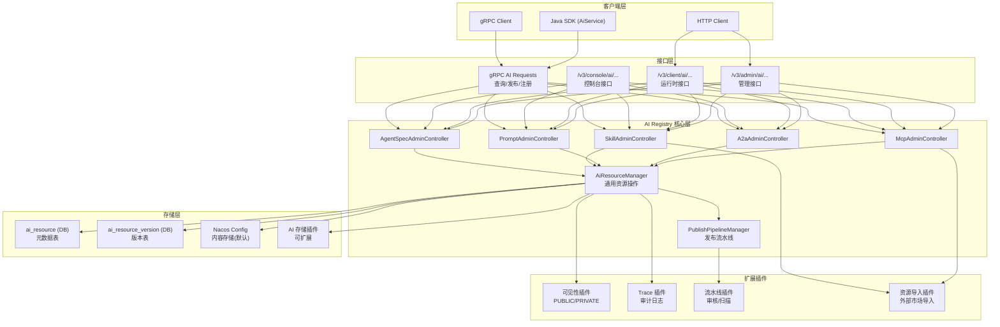

**模块依赖关系：**

```
ai/                                          # AI Registry 核心模块
├── controller/                              # REST API 控制器
│   ├── McpAdminController.java             # MCP Server 管理
│   ├── A2aAdminController.java             # A2A Agent 管理
│   ├── PromptAdminController.java          # Prompt 管理
│   ├── SkillAdminController.java           # Skill 管理
│   └── AgentSpecAdminController.java       # AgentSpec 管理
├── service/                                 # 业务服务层
│   ├── McpServerOperationService.java      # MCP 领域服务
│   ├── a2a/A2aServerOperationService.java  # A2A 领域服务
│   ├── prompt/PromptOperationService.java  # Prompt 领域服务
│   ├── skills/SkillOperationService.java   # Skill 领域服务
│   ├── agentspecs/AgentSpecOperationService.java # AgentSpec 领域服务
│   ├── resource/AiResourceManager.java       # 通用资源管理器
│   └── pipeline/PublishPipelineManager.java  # 发布流水线管理
├── service/repository/                      # 数据持久化
│   ├── AiResourcePersistService.java         # ai_resource 表操作
│   └── AiResourceVersionPersistService.java  # ai_resource_version 表操作
├── storage/                                  # 存储实现
│   └── NacosConfigAiResourceStorage.java   # 基于 Config 的存储
├── model/                                   # 领域模型
│   ├── AiResource.java                       # 元数据实体
│   └── AiResourceVersion.java               # 版本实体
└── remote/handler/                          # gRPC 请求处理器
    ├── QueryMcpServerRequestHandler.java
    ├── QueryPromptRequestHandler.java
    └── ReleaseMcpServerRequestHandler.java

ai-registry-adaptor/                         # AI Registry 适配器（独立模块）
├── controller/
│   ├── McpRegistryController.java           # MCP Registry 协议适配
│   └── SkillsRegistryController.java        # Skills Registry 协议适配
└── service/
    ├── NacosMcpRegistryService.java
    └── NacosSkillsRegistryService.java
```

---

## 3. AI 资源模型

### 3.1 身份模型

```text
AiResource 身份: namespaceId + type + name
AiResourceVersion 身份: namespaceId + type + name + version
```

### 3.2 AiResource — 元数据行

| 字段 | 含义 |
|------|------|
| `namespaceId` | Namespace 隔离边界 |
| `type` | 资源类型：`mcp`/`a2a`/`prompt`/`skill`/`agentspec` |
| `name` | 稳定资源名 |
| `desc` | 资源描述 |
| `status` | `enable` / `disable` |
| `owner` | 创建者 |
| `scope` | 可见性：`PUBLIC` / `PRIVATE` |
| `bizTags` | 业务标签 JSON |
| `versionInfo` | 版本治理摘要 JSON（editingVersion / reviewingVersion / onlineCnt / labels） |
| `metaVersion` | 乐观锁版本（CAS 更新） |
| `downloadCount` | 下载/使用次数 |

### 3.3 AiResourceVersion — 版本行

| 字段 | 含义 |
|------|------|
| `namespaceId`, `type`, `name` | 父元数据身份 |
| `version` | 版本字符串 |
| `author` | 创建者 |
| `desc` | 版本描述/Commit message |
| `status` | 版本生命周期状态 |
| `storage` | 内容存储指针 JSON |
| `publishPipelineInfo` | 流水线执行状态 JSON |
| `downloadCount` | 版本下载次数 |

### 3.4 版本状态流转

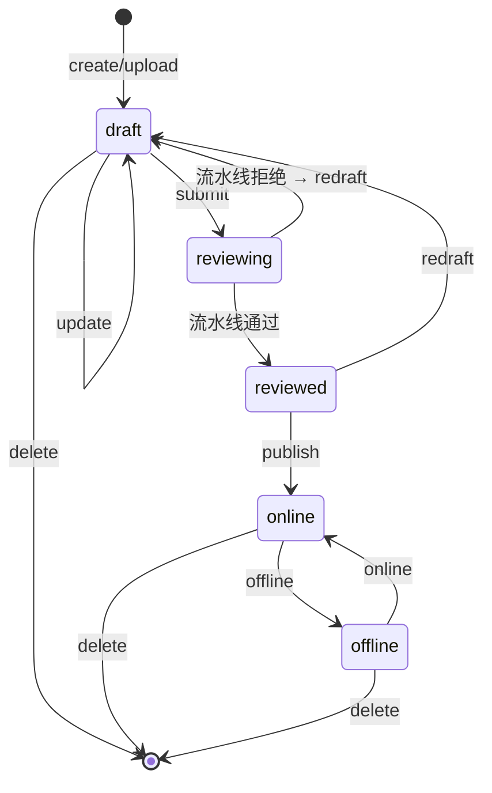

---

## 4. MCP Server 注册与管理

### 4.1 身份与模型

```text
namespaceId -> mcp -> mcpName
```

MCP Server 描述一个 MCP 兼容服务端，包含：

- Server 元数据和协议信息
- Version details 和 latest published version
- Tool specification（工具定义）
- Resource specification（资源定义）
- Backend/Frontend endpoint 引用

### 4.2 Endpoint 模型

| 模式 | 说明 |
|------|------|
| **REF** | MCP 资源引用已有 Naming service |
| **Direct endpoint** | Nacos 在 MCP endpoint group 下创建/更新 Naming service，注册 endpoint instance |

### 4.3 核心 API

**Admin API：**

```java
// McpAdminController
@GetMapping("/list")              // 列表查询（分页）
@GetMapping                       // 详情查询
@PostMapping("/release")         // 发布 MCP Server
@PutMapping("/update")           // 更新 MCP Server
@DeleteMapping("/{mcpName}")     // 删除 MCP Server
@PostMapping("/import")          // 导入 MCP Server
```

**Client API：**

```java
// McpClientController
@GetMapping("/{mcpName}")                    // 运行时查询 MCP 详情
@PostMapping("/{mcpName}/endpoint")          // 注册 Endpoint
@DeleteMapping("/{mcpName}/endpoint")       // 注销 Endpoint
@GetMapping("/{mcpName}/endpoint")         // 查询 Endpoint 列表
```

**gRPC API：**

```java
// QueryMcpServerRequestHandler
// ReleaseMcpServerRequestHandler
// McpServerEndpointRequestHandler
```

### 4.4 实现原理

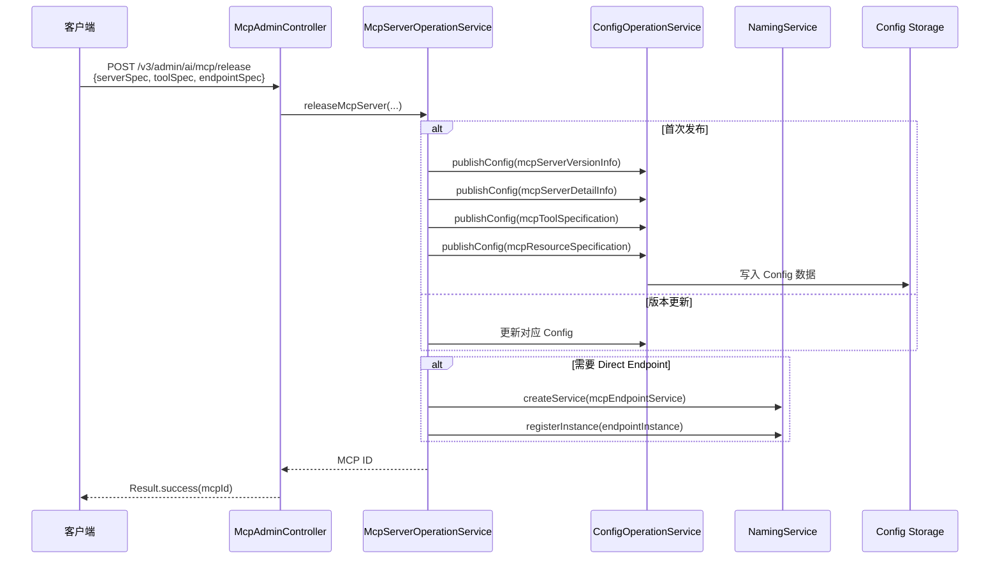

**当前兼容存储：** MCP 元数据通过 Config 形态记录保存（`McpServerVersionInfo`、`McpServerDetailInfo`、`McpToolSpecification`、`McpResourceSpecification`），通过 Naming service 表达 endpoint。这是兼容存储，目标标准模型应为 `ai_resource + ai_resource_version`。

---

## 5. A2A Agent 注册与管理

### 5.1 身份与模型

```text
namespaceId -> a2a -> agentName
```

A2A Agent 资源包含 AgentCard 元数据和版本化 AgentCard 详情：

- Agent name、description、provider、capabilities、skills、authentication
- Version list 和 latest published version
- 通过 agent interface 表达的 service-style endpoints

**当前兼容字段：** 为兼容 0.x 客户端，保留 `url`、`protocolVersion`、`preferredTransport` 等 legacy 字段。1.0.0 模型以 `supportedInterfaces` 为主。

### 5.2 Endpoint 模型

A2A endpoint 由运行时客户端注册，通过 A2A endpoint group 下的 Naming service 表达：

- Endpoint 绑定到具体 agent 版本
- 当存在多个兼容 endpoint 时，当前实现**随机选择**（后续需定义确定性选择规范）

### 5.3 核心 API

```java
// A2aAdminController
@PostMapping("/register")        // 注册 AgentCard
@GetMapping("/{agentName}")    // 查询 AgentCard
@PutMapping("/{agentName}")    // 更新 AgentCard
@DeleteMapping("/{agentName}") // 删除 AgentCard
@PostMapping("/{agentName}/endpoint")     // 注册 Endpoint
@DeleteMapping("/{agentName}/endpoint")  // 注销 Endpoint
```

### 5.4 AgentId 编码

[A2aServerOperationService.java](file:///d:/workspace/java_projects/source_projects/nacos/ai/src/main/java/com/alibaba/nacos/ai/service/a2a/A2aServerOperationService.java)

由于 Agent name 允许用户自定义且无限制，直接作为 Config dataId 可能导致不可控行为。因此引入 `AgentIdCodec` 对 agent name 进行编码：

```java
public interface AgentIdCodec {
    String encode(String agentName);           // 编码为存储 identity
    String encodeForSearch(String agentName); // 编码用于模糊搜索
    String decode(String agentId);             // 解码为 agent name
}
```

---

## 6. Prompt 管理

### 6.1 身份与模型

```text
namespaceId -> prompt -> promptKey
```

Prompt 版本包含：
- Prompt template 内容
- 可选变量定义（`PromptVariable`）
- 用于运行时条件获取的 md5
- 作者、commit message、状态、存储指针等版本元数据

### 6.2 生命周期

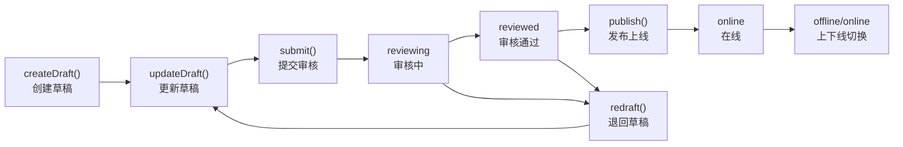

### 6.3 核心 API

```java
// PromptAdminController
@PostMapping("/draft")           // 创建 Draft
@PutMapping("/draft")            // 更新 Draft
@DeleteMapping("/draft")        // 删除 Draft
@PostMapping("/submit")          // 提交审核
@PostMapping("/publish")         // 发布
@PostMapping("/force-publish")   // 强制发布
@PostMapping("/redraft")          // 退回草稿
@PutMapping("/online-status")    // 上下线
@PutMapping("/labels")            // 更新 Labels
@DeleteMapping                   // 删除 Prompt
@GetMapping("/{promptKey}")     // 查询详情
@GetMapping("/list")            // 列表查询
```

### 6.4 运行时查询

```java
// PromptClientController
@GetMapping("/{promptKey}")      // 运行时查询 Prompt
```

客户端通过 `promptKey` + 可选 `version`/`label` + 可选 `md5` 查询。如果 md5 与当前版本内容 md5 一致，服务端返回 `not-modified`。

---

## 7. Skill 管理

### 7.1 包模型

Skill 是可复用的 AI Agent 能力包，包含：

- **`SKILL.md`**：主描述和指令文件（YAML frontmatter + Markdown 正文）
- **可选资源文件**：`scripts/`、`references/`、`assets/` 等
- 元数据：description、bizTags、owner、scope、labels、version

**SKILL.md 格式：**

```yaml
---
name: my-skill
description: A sample skill for data analysis
license: MIT
compatibility:
  - nacos >= 3.2.0
metadata:
  category: data-analysis
  tags: [csv, json, excel]
allowed-tools:
  - name: file-read
  - name: data-query
---

# Data Analysis Skill

This skill helps analyze structured data...
```

### 7.2 生命周期

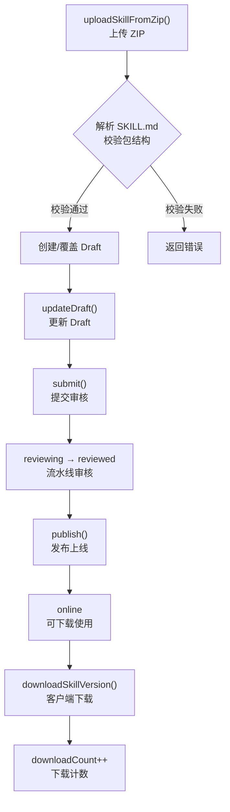

### 7.3 客户端轮询监听

Nacos 不为 Skill 提供推送通道，客户端 SDK 通过**周期性条件查询**实现监听：

```java
// 默认轮询间隔: 10000ms
GET /v3/client/ai/skills?name={name}&md5={cachedMd5}

// 响应头:
// Content-Type: application/zip
// Content-Disposition: attachment;filename={name}.zip
// ETag: "{md5}"
// X-Nacos-Skill-Md5: {md5}
// X-Nacos-Skill-Resolved-Version: {version}

// 304 Not Modified: md5 一致, body 为空
// 200 OK: 返回 ZIP 内容
// 404 Not Found: 资源缺失, 客户端淘汰缓存
```

---

## 8. AgentSpec 管理

### 8.1 包模型

AgentSpec 是版本化 Agent 定义包，包含：

- **`manifest.json`**：主描述文件
- **可选资源文件**：agent instructions、类型化资产等
- 元数据：description、bizTags、owner、scope、labels、version

### 8.2 与 Skill 的区别

| 特性 | Skill | AgentSpec |
|------|-------|-----------|
| 主文件 | `SKILL.md` | `manifest.json` |
| 独立 manifest index | 是（SkillIndexManifest） | 否 |
| 内容格式 | YAML frontmatter + Markdown | JSON |
| 用途 | Agent 技能包 | Agent 完整规格定义 |

### 8.3 客户端监听

与 Skill 类似，客户端使用 HTTP 轮询 + 条件查询（基于 MD5 的 ETag）检测内容变更：

```java
GET /v3/client/ai/agentspec?namespaceId=&name=&md5={cached-md5}

// 304 Not Modified: 内容未变
// 200 OK: 返回 AgentSpec JSON + X-Nacos-AgentSpec-Md5 + X-Nacos-AgentSpec-Resolved-Version
```

---

## 9. AI 资源生命周期

### 9.1 通用生命周期流程

所有 AI 资源（Prompt、Skill、AgentSpec）共享相同的生命周期：

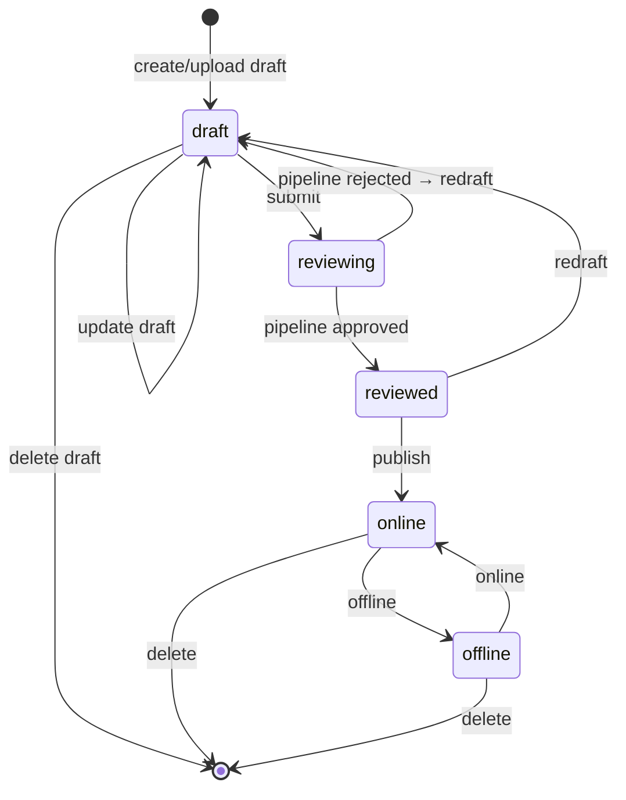

### 9.2 状态说明

| 状态 | 含义 |
|------|------|
| `draft` | 正在编辑的版本 |
| `reviewing` | 已提交到发布流水线审核 |
| `reviewed` | 流水线已通过，等待显式发布 |
| `online` | 已发布且可查询 |
| `offline` | 已存在但从运行时路由中移除 |

### 9.3 关键操作

| 操作 | 说明 |
|------|------|
| **createDraft** | 创建新 draft，可基于已有版本 fork |
| **updateDraft** | 修改当前 draft 内容 |
| **deleteDraft** | 删除 draft，清理元数据和存储 |
| **submit** | 提交审核，触发发布流水线 |
| **publish** | 发布版本到 online |
| **forcePublish** | 绕过流水线校验，直接发布（管理操作） |
| **redraft** | 将 reviewed 版本退回 draft |
| **online/offline** | 上下线切换 |
| **delete** | 删除资源或版本 |

### 9.4 Labels 机制

- `latest` 是保留的默认 label，表示最近发布版本
- Labels 映射到版本字符串，**不得指向 draft 或 reviewing 版本**
- 运行时通过 label 查询时，在请求时解析 label

---

## 10. 发布流水线

### 10.1 流水线架构

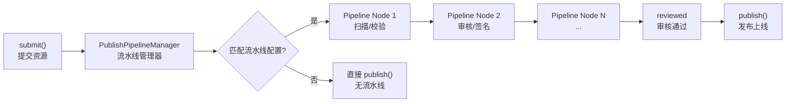

### 10.2 流水线配置

流水线通过 SPI 插件机制扩展：

```java
// PublishPipelineService SPI
public interface PublishPipelineService {
    String pipelineId();
    PipelineExecutionResult execute(PipelineExecutionContext context);
}

// PublishPipelineServiceBuilder SPI
public interface PublishPipelineServiceBuilder {
    String pipelineId();
    PublishPipelineService build(Properties properties);
}
```

### 10.3 流水线执行结果

| 结果 | 含义 |
|------|------|
| `APPROVED` | 流水线通过，版本变为 `reviewed` |
| `REJECTED` | 流水线拒绝，版本保持 `reviewed`（需 redraft） |
| `PENDING` | 流水线执行中 |

---

## 11. 客户端 SDK 使用

### 11.1 AiService 接口

[AiService.java](file:///d:/workspace/java_projects/source_projects/nacos/api/src/main/java/com/alibaba/nacos/api/ai/AiService.java)

```java
public interface AiService extends A2aService {

    // ========== MCP Server ==========
    McpServerDetailInfo getMcpServer(String mcpName) throws NacosException;
    McpServerDetailInfo getMcpServer(String mcpName, String version) throws NacosException;
    String releaseMcpServer(McpServerBasicInfo serverSpec,
        McpToolSpecification toolSpec,
        McpResourceSpecification resourceSpec,
        McpEndpointSpec endpointSpec) throws NacosException;
    void registerMcpServerEndpoint(String mcpName, String address, int port, String version)
        throws NacosException;
    void deregisterMcpServerEndpoint(String mcpName, String address, int port)
        throws NacosException;
    McpServerDetailInfo subscribeMcpServer(String mcpName, String version,
        AbstractNacosMcpServerListener listener) throws NacosException;

    // ========== A2A Agent ==========
    AgentCard getAgentCard(String agentName) throws NacosException;
    AgentCard getAgentCard(String agentName, String version) throws NacosException;
    void registerAgentCard(AgentCard agentCard) throws NacosException;
    void registerAgentEndpoint(String agentName, String address, int port, String version)
        throws NacosException;
    AgentCard subscribeAgentCard(String agentName, String version,
        AbstractNacosAgentCardListener listener) throws NacosException;

    // ========== Prompt ==========
    Prompt getPrompt(String promptKey) throws NacosException;
    Prompt getPromptByVersion(String promptKey, String version) throws NacosException;
    Prompt getPromptByLabel(String promptKey, String label) throws NacosException;
    Prompt subscribePrompt(String promptKey, String version, String label,
        AbstractNacosPromptListener listener) throws NacosException;

    // ========== Skill ==========
    byte[] downloadSkillZip(String skillName) throws NacosException;
    byte[] downloadSkillZipByVersion(String skillName, String version) throws NacosException;
    byte[] downloadSkillZipByLabel(String skillName, String label) throws NacosException;
    byte[] subscribeSkill(String skillName, String version, String label,
        AbstractNacosSkillListener listener) throws NacosException;

    // ========== AgentSpec ==========
    AgentSpec loadAgentSpec(String agentSpecName) throws NacosException;
    AgentSpec subscribeAgentSpec(String agentSpecName,
        AbstractNacosAgentSpecListener listener) throws NacosException;
}
```

### 11.2 使用示例

```java
// 1. 创建 AiService
Properties properties = new Properties();
properties.put("serverAddr", "127.0.0.1:8848");
properties.put("namespace", "my-namespace");

AiService aiService = NacosFactory.createAiService(properties);

// 2. MCP Server 查询
McpServerDetailInfo mcpServer = aiService.getMcpServer("my-mcp-server");
System.out.println("MCP Tools: " + mcpServer.getToolSpecification().getTools());

// 3. Prompt 查询
Prompt prompt = aiService.getPrompt("code-review-prompt");
System.out.println("Prompt Template: " + prompt.getTemplate());

// 4. Skill 下载
byte[] skillZip = aiService.downloadSkillZip("data-analysis-skill");
// 解压并使用

// 5. AgentSpec 加载
AgentSpec agentSpec = aiService.loadAgentSpec("my-agent-spec");
System.out.println("Agent Instructions: " + agentSpec.getInstructions());

// 6. 订阅变更（支持监听）
aiService.subscribeMcpServer("my-mcp-server", null, new AbstractNacosMcpServerListener() {
    @Override
    public void onMcpServerChanged(McpServerDetailInfo mcpServer) {
        System.out.println("MCP Server changed: " + mcpServer.getMcpName());
    }
});
```

---

## 12. AI Registry 适配器

### 12.1 概述

AI Registry 适配器是一个**独立的 Spring Boot 应用**，在独立端口（默认 9080）上运行，提供社区兼容的 Registry 协议端点。

### 12.2 功能

| 端点 | 协议 | 说明 |
|------|------|------|
| `/mcp/registry` | MCP Registry Protocol | 兼容 MCP 社区 registry 客户端 |
| `/skills/registry` | Agent Skills Registry Protocol | 兼容 Agent Skills 社区 registry 客户端 |

### 12.3 启动方式

```properties
# application.properties
nacos.ai.mcp.registry.enabled=true      # 启用 MCP Registry
nacos.ai.skill.registry.enabled=true    # 启用 Skill Registry
nacos.ai.registry.port=9080             # 适配器端口
```

---

## 13. 存储与持久化

### 13.1 双层存储架构

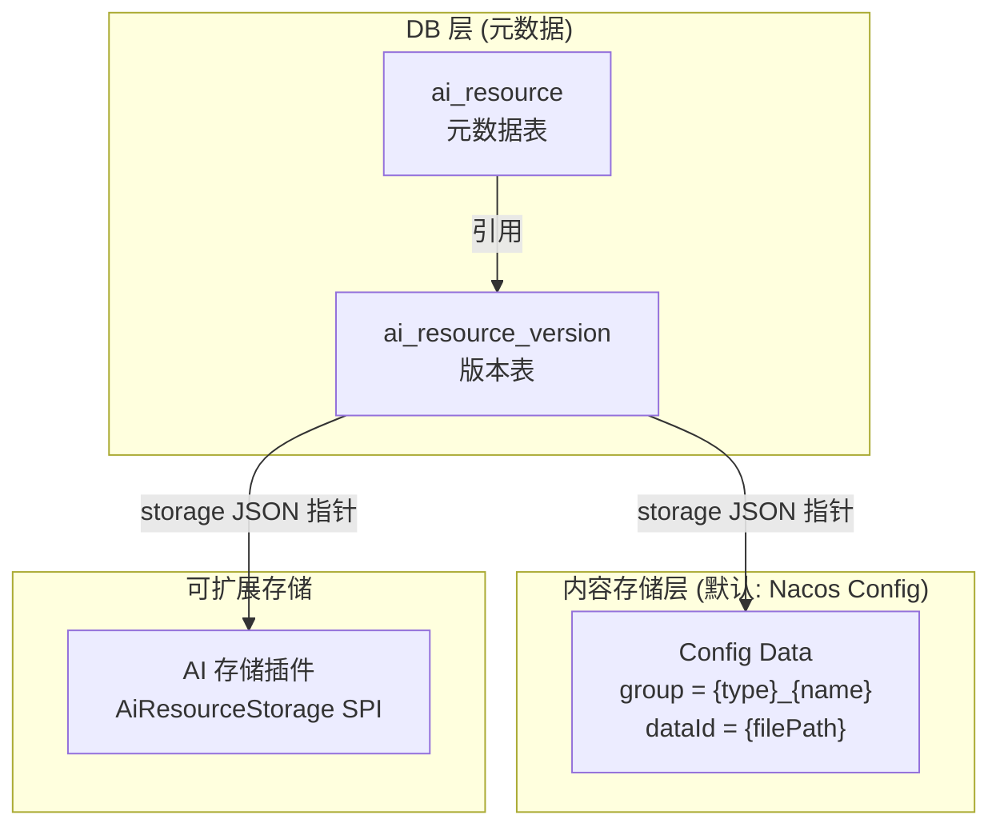

### 13.2 存储 Key 格式

```java
// Skill (Legacy 4-part)
namespaceId:skillName:version:filePath

// Typed (5-part)
namespaceId:resourceType:name:version:filePath
// resourceType = "skill" | "agentspec" | "prompt"
```

### 13.3 AiResourceStorage SPI

```java
public interface AiResourceStorage {
    void save(StorageKey key, byte[] content);
    byte[] get(StorageKey key);
    void delete(StorageKey key);
}
```

默认实现为 `NacosConfigAiResourceStorage`，基于 Nacos Config 存储。

---

## 14. 总结

Nacos 3.x AI Registry 是一个完整的 AI 资源注册中心，核心特点：

1. **五类 AI 资源**：MCP Server、A2A Agent、Prompt、Skill、AgentSpec，覆盖 AI Agent 开发全生命周期
2. **版本化管理**：基于 `AiResource` + `AiResourceVersion` 的双行模型，支持 draft → reviewing → reviewed → online → offline 的完整生命周期
3. **插件化扩展**：可见性、存储、Trace、发布流水线均通过 SPI 插件机制扩展
4. **多接口面**：Admin API（管理）、Client API（运行时）、Console API（控制台）、gRPC（SDK）、AI Registry 适配器（社区兼容）
5. **双层存储**：DB 存元数据，Config/插件存内容，解耦元数据和内容存储
6. **运行时与管理面分离**：Client API 只暴露查询和订阅，Admin API 暴露完整管理能力

---

## 15. 深入实现细节

### 15.1 客户端 AiGrpcClient 实现

[AiGrpcClient.java](file:///d:/workspace/java_projects/source_projects/nacos/client/src/main/java/com/alibaba/nacos/client/ai/remote/AiGrpcClient.java)

AI 模块的 gRPC 客户端同时使用 gRPC + HTTP 双通道通信：

```java
public class AiGrpcClient implements AiClientProxy {
    private final RpcClient rpcClient;              // gRPC 通道
    private final AiGrpcRedoService redoService;    // 断线重做
    private NacosMcpServerCacheHolder mcpServerCacheHolder;
    private NacosAgentCardCacheHolder agentCardCacheHolder;

    public void start(NacosMcpServerCacheHolder mcpServerCacheHolder,
        NacosAgentCardCacheHolder agentCardCacheHolder) {
        this.mcpServerCacheHolder = mcpServerCacheHolder;
        this.agentCardCacheHolder = agentCardCacheHolder;
        this.serverListManager.start();
        this.rpcClient.registerConnectionListener(this.redoService);
        this.rpcClient.serverListFactory(this.serverListManager);
        this.rpcClient.start();
    }

    // MCP Server 查询 (gRPC)
    public McpServerDetailInfo getMcpServer(String mcpName, String version) {
        QueryMcpServerRequest request = new QueryMcpServerRequest();
        request.setMcpName(mcpName);
        request.setVersion(version);
        QueryMcpServerResponse response = (QueryMcpServerResponse)
            rpcClient.request(request);
        return response.getMcpServerDetailInfo();
    }

    // MCP Server 发布 (gRPC)
    public String releaseMcpServer(McpServerBasicInfo serverSpec, ...) {
        ReleaseMcpServerRequest request = new ReleaseMcpServerRequest();
        // ... 设置参数
        ReleaseMcpServerResponse response = (ReleaseMcpServerResponse)
            rpcClient.request(request);
        return response.getMcpId();
    }
}
```

**gRPC Request 类型映射：**

| 操作 | Request 类 | Response 类 | Handler |
|------|-----------|-------------|---------|
| 查询 MCP | `QueryMcpServerRequest` | `QueryMcpServerResponse` | `QueryMcpServerRequestHandler` |
| 发布 MCP | `ReleaseMcpServerRequest` | `ReleaseMcpServerResponse` | `ReleaseMcpServerRequestHandler` |
| 注册 Endpoint | `McpServerEndpointRequest` | `McpServerEndpointResponse` | `McpServerEndpointRequestHandler` |
| 查询 AgentCard | `QueryAgentCardRequest` | `QueryAgentCardResponse` | `QueryAgentCardRequestHandler` |
| 发布 AgentCard | `ReleaseAgentCardRequest` | `ReleaseAgentCardResponse` | `ReleaseAgentCardRequestHandler` |
| 查询 Prompt | `QueryPromptRequest` | `QueryPromptResponse` | `QueryPromptRequestHandler` |

### 15.2 服务端 gRPC 请求处理器

[QueryMcpServerRequestHandler.java](file:///d:/workspace/java_projects/source_projects/nacos/ai/src/main/java/com/alibaba/nacos/ai/remote/handler/QueryMcpServerRequestHandler.java)

所有 AI 资源的 gRPC 请求处理器都继承自 `RequestHandler<T, R>`，通过 Spring 自动扫描注册到 `RequestHandlerRegistry`：

```java
@Component
public class QueryMcpServerRequestHandler
    extends RequestHandler<QueryMcpServerRequest, QueryMcpServerResponse> {

    @Override
    @Secured(action = ActionTypes.READ, signType = SignType.AI)
    public QueryMcpServerResponse handle(QueryMcpServerRequest request, RequestMeta meta) {
        // 1. 参数校验
        if (StringUtils.isBlank(request.getMcpName())) {
            return errorResponse(INVALID_PARAM, "mcpName can't be empty");
        }

        // 2. 通过 McpServerIndex 查找 MCP Server
        McpServerIndexData indexData = mcpServerIndex.getMcpServerByName(
            request.getNamespaceId(), request.getMcpName());

        // 3. 获取详情
        McpServerDetailInfo detail = mcpServerOperationService.getMcpServerDetail(...);

        // 4. 返回响应
        QueryMcpServerResponse response = new QueryMcpServerResponse();
        response.setMcpServerDetailInfo(detail);
        return response;
    }
}
```

**Handler 注册流程：**

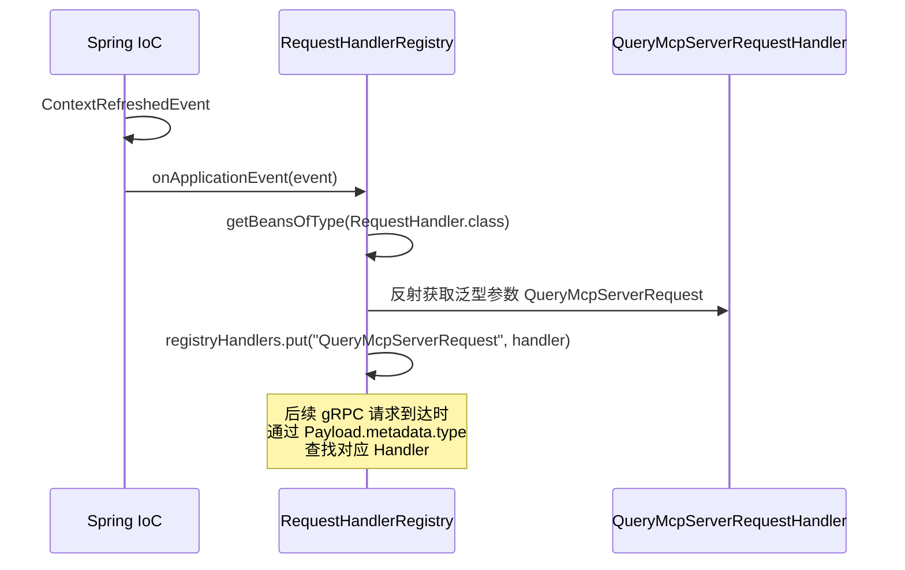

### 15.3 AiResourceManager — CAS 乐观锁更新

[AiResourceManager.java](file:///d:/workspace/java_projects/source_projects/nacos/ai/src/main/java/com/alibaba/nacos/ai/service/resource/AiResourceManager.java)

所有 AI 资源的元数据更新都通过 `AiResourceManager` 的 CAS（Compare-And-Swap）乐观锁机制，防止并发冲突：

```java
@Service
public class AiResourceManager {

    // CAS 重试循环
    CasResult doCasLoop(String namespaceId, String name, String type,
        long initialExpected, AiResource newValue,
        BiConsumer<AiResource, AiResource> onConflictRefresh) {

        long expected = initialExpected;
        for (int i = 0; i < MAX_WORKING_VERSION_RETRY; i++) {
            // 尝试 CAS 更新
            if (aiResourcePersistService.updateMetaCas(
                namespaceId, name, type, expected, newValue)) {
                return CasResult.SUCCESS;
            }

            // 冲突：重新读取最新版本
            AiResource latest = aiResourcePersistService.find(namespaceId, name, type);
            if (latest == null || latest.getMetaVersion() == null) {
                return CasResult.META_LOST;
            }

            // 刷新非目标字段，保留目标字段
            expected = latest.getMetaVersion();
            onConflictRefresh.accept(newValue, latest);
        }
        return CasResult.MAX_RETRIES;
    }
}
```

**CAS 更新示例（更新 versionInfo）：**

```java
public void updateVersionInfoCas(String namespaceId, AiResource meta,
    ResourceVersionInfo info) throws NacosException {

    AiResource newValue = new AiResource();
    newValue.setVersionInfo(JacksonUtils.toJson(info));  // 目标字段

    CasResult result = doCasLoop(namespaceId, meta.getName(), meta.getType(),
        meta.getMetaVersion(), newValue, (nv, latest) -> {
            // 冲突时：刷新非目标字段（status, desc, bizTags, ext）
            nv.setStatus(latest.getStatus());
            nv.setDesc(latest.getDesc());
            nv.setBizTags(latest.getBizTags());
            nv.setExt(latest.getExt());
        });
    handleStrictCasResult(result);
}
```

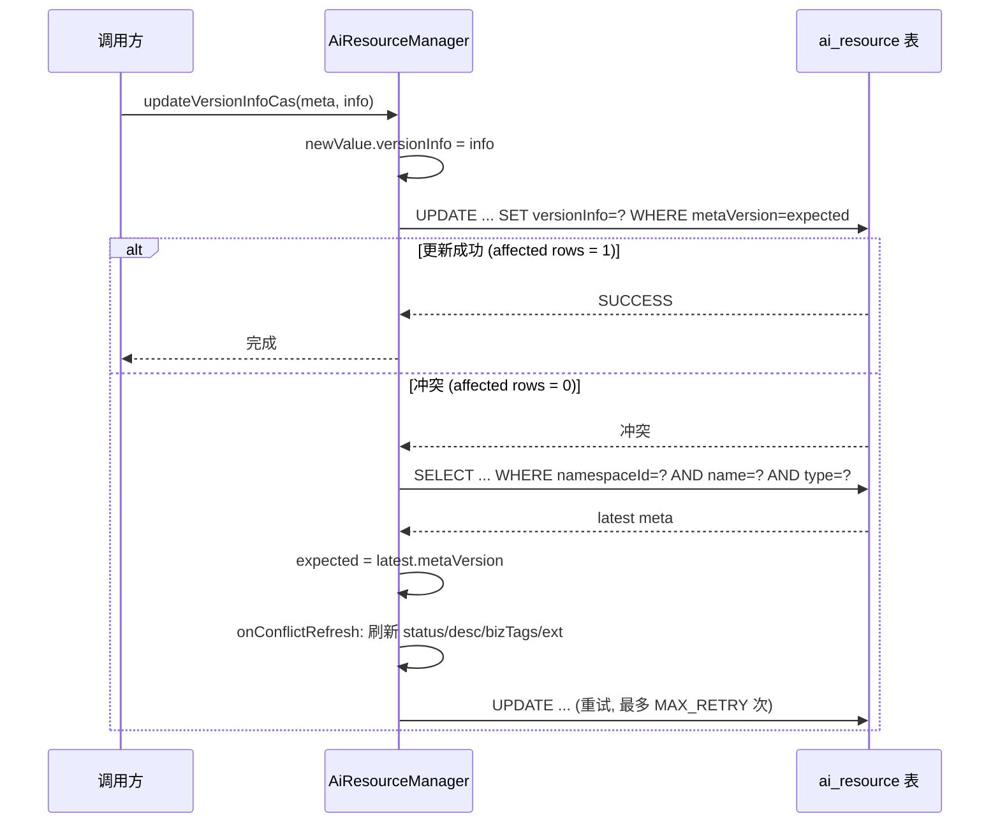

### 15.4 客户端缓存机制

AI 客户端为每种资源类型维护独立的缓存 Holder，支持订阅变更通知：

```java
// 缓存 Holder 类
NacosMcpServerCacheHolder      // MCP Server 缓存
NacosAgentCardCacheHolder      // AgentCard 缓存
NacosPromptCacheHolder         // Prompt 缓存
NacosAgentSpecCacheHolder      // AgentSpec 缓存
NacosSkillCacheHolder          // Skill 缓存
```

**缓存更新流程（以 Skill 为例）：**

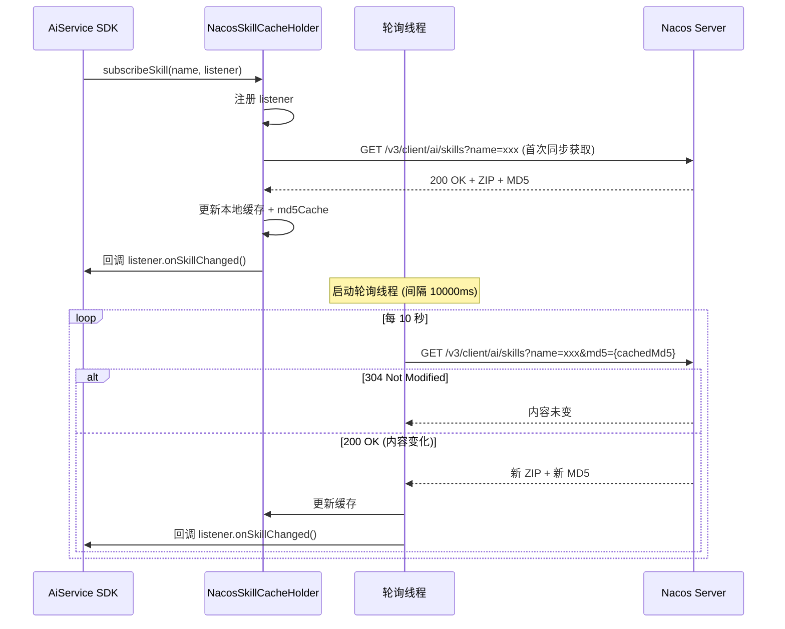

### 15.5 可见性插件集成

AI 资源通过共享的可见性插件模型实现访问控制：

```java
// VisibilityHelper — AI 模块中的可见性辅助类
public class VisibilityHelper {

    // 创建资源时解析默认 scope
    public static String resolveDefaultScope() {
        VisibilityService visibilityService = getVisibilityService();
        return visibilityService != null
            ? visibilityService.getDefaultScope()
            : VisibilityConstants.SCOPE_PUBLIC;
    }

    // 查询时检查可见性
    public static boolean isVisible(AiResource resource) {
        // 通过 QueryAdvisor SPI 判断当前用户是否可见
        QueryAdvisor advisor = getQueryAdvisor();
        VisibilityQueryContext context = buildContext(resource);
        return advisor == null || advisor.isVisible(context);
    }
}
```

**可见性规则：**

| 操作 | 规则 |
|------|------|
| 创建 | 通过配置的可见性服务解析默认 scope |
| 读 | 资源存在但调用者不可见时，返回 not found |
| 写 | 修改元数据、版本或 scope 前检查写权限 |
| 查询 | 通过 visibility query advice 过滤，而非先读取大结果集再过滤 |

### 15.6 Trace 审计日志

AI 资源操作通过 `AiResourceTraceService` 发出 Trace 事件：

```java
// 审计的操作类型
OP_CREATE_DRAFT    // 创建草稿
OP_UPDATE_DRAFT    // 更新草稿
OP_DELETE_DRAFT    // 删除草稿
OP_SUBMIT          // 提交审核
OP_REVIEW_APPROVED // 审核通过
OP_REVIEW_REJECTED // 审核拒绝
OP_PUBLISH         // 发布
OP_FORCE_PUBLISH   // 强制发布
OP_ONLINE          // 上线
OP_OFFLINE         // 下线
OP_DELETE          // 删除
OP_DOWNLOAD        // 下载
OP_LABEL_UPDATE    // 标签更新
OP_DESC_UPDATE     // 描述更新
OP_SCOPE_UPDATE    // 可见性更新
```

默认 Trace 插件将审计日志写入 `ai-resource-trace.log`，格式为 JSON 行：

```json
{
  "type": "skill",
  "name": "data-analysis",
  "version": "1.0.0",
  "operation": "publish",
  "operator": "admin",
  "clientIp": "192.168.1.100",
  "timestamp": "2026-06-10T10:30:00Z"
}
```

### 15.7 资源导入机制

AI 资源支持从外部数据源导入，通过 `AiResourceImportManager` 和 SPI 插件实现：

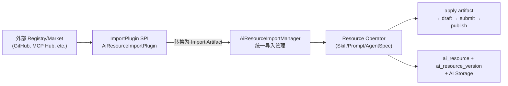

---

## 16. 配置参考

```properties
# AI 模块总开关
nacos.extension.ai.enabled=true

# AI Registry 适配器
nacos.ai.mcp.registry.enabled=true
nacos.ai.skill.registry.enabled=true
nacos.ai.registry.port=9080

# 客户端轮询间隔 (毫秒)
nacosAiMcpServerCacheUpdateInterval=10000
nacosAiAgentCardCacheUpdateInterval=10000
nacosAiPromptCacheUpdateInterval=10000
nacosAiSkillCacheUpdateInterval=10000
nacosAiAgentSpecCacheUpdateInterval=10000
```
