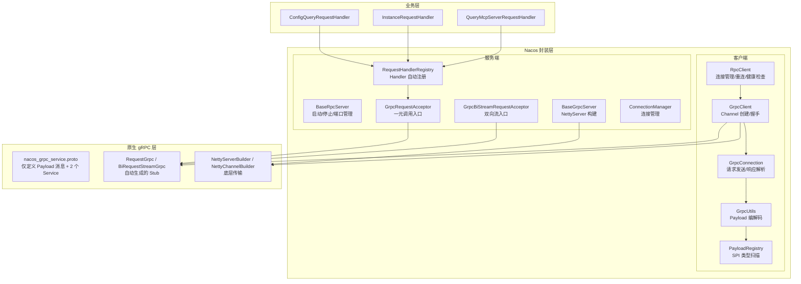
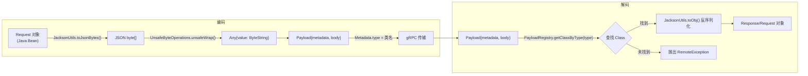
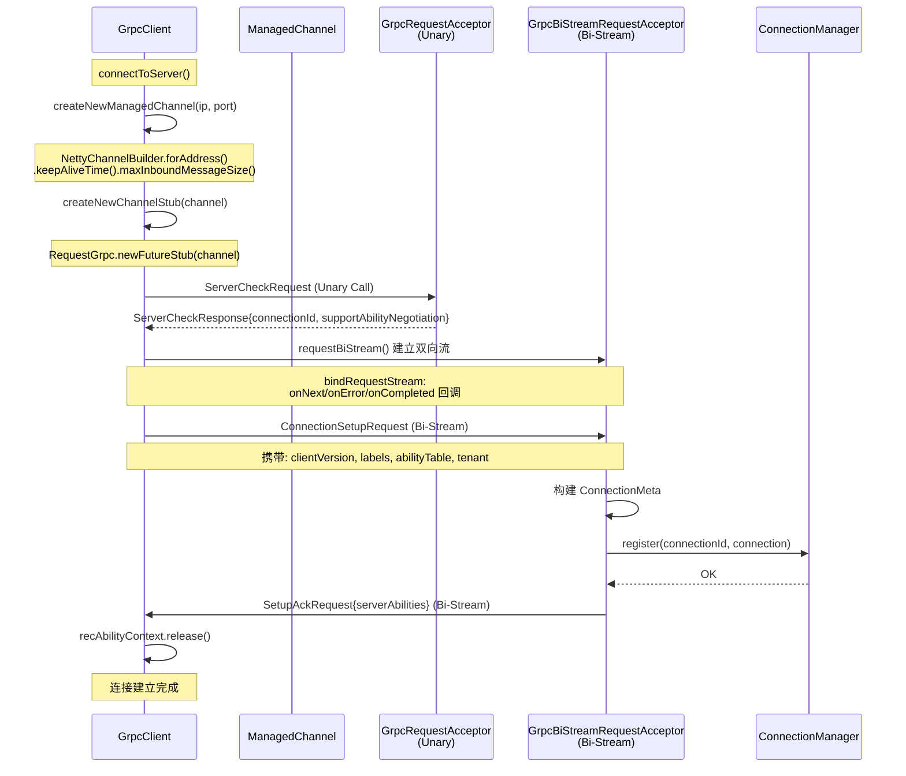
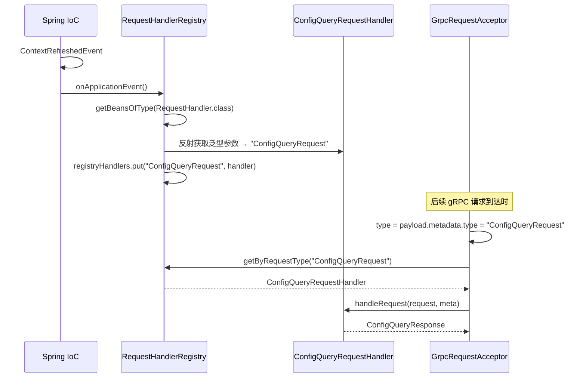
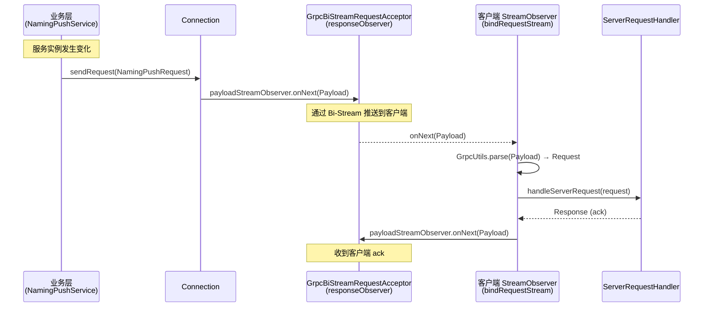
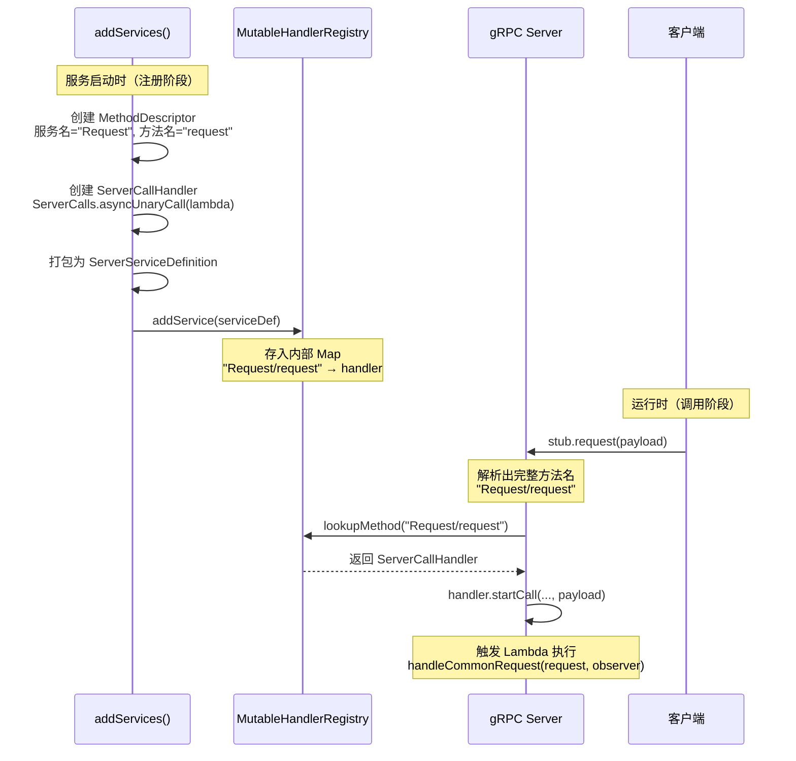

# Nacos gRPC 整合深度源码分析

## 目录

1. [原生 gRPC 使用方式回顾](#1-原生-grpc-使用方式回顾)
2. [Nacos gRPC 封装架构总览](#2-nacos-grpc-封装架构总览)
3. [Proto 定义：极简的通用协议](#3-proto-定义极简的通用协议)
4. [Payload 装箱：动态类型系统](#4-payload-装箱动态类型系统)
5. [客户端封装层](#5-客户端封装层)
6. [服务端封装层](#6-服务端封装层)
7. [连接建立与握手流程](#7-连接建立与握手流程)
8. [请求分发：RequestHandler 机制](#8-请求分发requesthandler-机制)
9. [双向流推送机制](#9-双向流推送机制)
10. [原生 gRPC vs Nacos 封装对比表](#10-原生-grpc-vs-nacos-封装对比表)
11. [总结](#11-总结)

---

## 1. 原生 gRPC 使用方式回顾

在理解 Nacos 的封装之前，先回顾原生 gRPC 的标准使用方式。

### 1.1 原生 Proto 定义

```protobuf
// 原生方式：为每个业务定义独立的 message 和 rpc
service Greeter {
  rpc SayHello (HelloRequest) returns (HelloReply) {}
}

message HelloRequest {
  string name = 1;
}

message HelloReply {
  string message = 1;
}
```

### 1.2 原生服务端

```java
// 1. 继承生成的 ImplBase
public class GreeterImpl extends GreeterGrpc.GreeterImplBase {
    @Override
    public void sayHello(HelloRequest req, StreamObserver<HelloReply> responseObserver) {
        HelloReply reply = HelloReply.newBuilder()
            .setMessage("Hello " + req.getName()).build();
        responseObserver.onNext(reply);
        responseObserver.onCompleted();
    }
}

// 2. 启动服务
Server server = ServerBuilder.forPort(50051)
    .addService(new GreeterImpl())
    .build()
    .start();
```

### 1.3 原生客户端

```java
// 1. 创建 Channel
ManagedChannel channel = ManagedChannelBuilder
    .forAddress("localhost", 50051)
    .usePlaintext()
    .build();

// 2. 创建 Stub
GreeterGrpc.GreeterBlockingStub stub = GreeterGrpc.newBlockingStub(channel);

// 3. 调用
HelloRequest request = HelloRequest.newBuilder().setName("world").build();
HelloReply response = stub.sayHello(request);
```

### 1.4 原生方式的问题

| 问题 | 说明 |
|------|------|
| **Proto 膨胀** | 每新增一个业务接口，都要修改 `.proto` 文件并重新生成代码 |
| **强类型绑定** | Request/Response 类型在编译期确定，无法动态扩展 |
| **无连接管理** | 需要自行管理 Channel 生命周期、重连、健康检查 |
| **无服务发现** | 需要硬编码服务端地址，无法动态切换 |
| **无请求分发** | 需要手动编写 if-else 或 switch 来路由请求到不同 Handler |

---

## 2. Nacos gRPC 封装架构总览

Nacos 在原生 gRPC 之上构建了完整的分层架构：



**核心封装思想：** Nacos 只定义了一个通用的 `Payload` 消息体和两个 gRPC Service（`Request` 和 `BiRequestStream`），所有业务 Request/Response 都通过 JSON 序列化后放入 `Payload.body`，通过 `Metadata.type` 字段实现动态类型路由。

---

## 3. Proto 定义：极简的通用协议

[`nacos_grpc_service.proto`](file:///d:/workspace/java_projects/source_projects/nacos/api/src/main/proto/nacos_grpc_service.proto)

```protobuf
syntax = "proto3";

import "google/protobuf/any.proto";

message Metadata {
  string type = 3;                        // 存放 Java 类名（如 "ConfigQueryRequest"）
  string clientIp = 8;                    // 客户端 IP
  map<string, string> headers = 7;        // 请求头
}

message Payload {
  Metadata metadata = 2;                  // 元数据
  google.protobuf.Any body = 3;           // 实际数据（JSON 字节）
}

service Request {
  rpc request (Payload) returns (Payload) {}    // 一元调用
}

service BiRequestStream {
  rpc requestBiStream (stream Payload) returns (stream Payload) {}  // 双向流
}
```

**设计要点：**

1. **只有 2 个 Service、2 个 Message**：整个 Nacos 系统所有模块（Config、Naming、AI、Lock）共用这同一个 Proto 定义
2. **`Metadata.type` 是关键**：存放 Java 类的 `getSimpleName()`，如 `"ConfigQueryRequest"`、`"InstanceRequest"`、`"QueryMcpServerRequest"`
3. **`google.protobuf.Any body`**：存放 Jackson 序列化后的 JSON 字节数组，而非 Protobuf 消息
4. **无需修改 Proto 即可扩展**：新增业务 Request/Response 类型只需编写 Java 类，无需改 `.proto` 文件

---

## 4. Payload 装箱：动态类型系统

这是 Nacos 对 gRPC 最核心的封装——**用一套通用的 Payload 消息承载所有业务类型**。

### 4.1 PayloadRegistry — SPI 类型扫描

[PayloadRegistry.java](file:///d:/workspace/java_projects/source_projects/nacos/common/src/main/java/com/alibaba/nacos/common/remote/PayloadRegistry.java)

```java
public class PayloadRegistry {
    private static final Map<String, Class<?>> REGISTRY_REQUEST = new HashMap<>();

    public static void init() {
        scan();
    }

    private static synchronized void scan() {
        if (initialized) return;

        // 通过 Java SPI 扫描所有 Payload 接口的实现类
        ServiceLoader<Payload> payloads = ServiceLoader.load(Payload.class);
        for (Payload payload : payloads) {
            // 以类名（simpleName）为 key 注册
            register(payload.getClass().getSimpleName(), payload.getClass());
        }
        initialized = true;
    }

    public static Class<?> getClassByType(String type) {
        return REGISTRY_REQUEST.get(type);  // 通过 type 查找 Class
    }
}
```

**SPI 配置文件** `META-INF/services/com.alibaba.nacos.api.remote.Payload`：

```
com.alibaba.nacos.api.config.remote.request.ConfigQueryRequest
com.alibaba.nacos.api.config.remote.response.ConfigQueryResponse
com.alibaba.nacos.api.naming.remote.request.InstanceRequest
com.alibaba.nacos.api.naming.remote.response.InstanceResponse
com.alibaba.nacos.api.ai.remote.request.QueryMcpServerRequest
...
```

### 4.2 GrpcUtils — 编解码核心

[GrpcUtils.java](file:///d:/workspace/java_projects/source_projects/nacos/common/src/main/java/com/alibaba/nacos/common/remote/client/grpc/GrpcUtils.java)

**编码：Request → Payload**

```java
public static Payload convert(Request request) {
    // 1. 构建 Metadata：type = 类名, clientIp = 本机IP, headers = 请求头
    Metadata newMeta = Metadata.newBuilder()
        .setType(request.getClass().getSimpleName())   // ← 关键：记录类名
        .setClientIp(NetUtils.localIp())
        .putAllHeaders(request.getHeaders())
        .build();

    // 2. Request → Jackson JSON → byte[]
    byte[] jsonBytes = JacksonUtils.toJsonBytes(request);

    // 3. 封装为 Payload
    return Payload.newBuilder()
        .setBody(Any.newBuilder()
            .setValue(UnsafeByteOperations.unsafeWrap(jsonBytes)))
        .setMetadata(newMeta)
        .build();
}
```

**解码：Payload → Object**

```java
public static Object parse(Payload payload) {
    // 1. 通过 Metadata.type 查找对应的 Java Class
    Class<?> classType = PayloadRegistry.getClassByType(
        payload.getMetadata().getType());

    if (classType != null) {
        // 2. 提取 body 中的 JSON 字节
        ByteString byteString = payload.getBody().getValue();
        ByteBuffer byteBuffer = byteString.asReadOnlyByteBuffer();

        // 3. Jackson 反序列化为 Java 对象
        Object obj = JacksonUtils.toObj(
            new ByteBufferBackedInputStream(byteBuffer), classType);

        // 4. 恢复请求头
        if (obj instanceof Request) {
            ((Request) obj).putAllHeader(
                payload.getMetadata().getHeadersMap());
        }
        return obj;
    } else {
        throw new RemoteException(SERVER_ERROR,
            "Unknown payload type:" + payload.getMetadata().getType());
    }
}
```



---

## 5. 客户端封装层

### 5.1 继承层次

```
RpcClient (抽象基类)              ← 连接管理、重连、健康检查、事件通知
  └── GrpcClient (gRPC 实现)      ← Channel 创建、连接握手、Bi-Stream 绑定
        ├── GrpcSdkClient          ← SDK 客户端 (端口 +1000)
        └── GrpcClusterClient      ← 集群客户端 (端口 +1001)
```

### 5.2 RpcClient — 抽象连接管理

[RpcClient.java](file:///d:/workspace/java_projects/source_projects/nacos/common/src/main/java/com/alibaba/nacos/common/remote/client/RpcClient.java)

```java
public abstract class RpcClient implements Closeable {

    static {
        PayloadRegistry.init();  // ← 静态初始化：扫描所有 Payload 类型
    }

    // 核心状态
    protected volatile AtomicReference<RpcClientStatus> rpcClientStatus;
    protected volatile Connection currentConnection;
    private final BlockingQueue<ReconnectContext> reconnectionSignal;

    // 事件监听
    protected List<ConnectionEventListener> connectionEventListeners;
    protected List<ServerRequestHandler> serverRequestHandlers;

    // 核心方法
    public abstract Connection connectToServer(ServerInfo serverInfo);
    public Response request(Request request) throws NacosException { ... }
    public void asyncRequest(Request request, RequestCallBack callback) { ... }
    public RequestFuture requestFuture(Request request) { ... }
}
```

**RpcClient 提供的能力（原生 gRPC 没有的）：**

| 能力 | 说明 |
|------|------|
| **服务发现** | 通过 `ServerListFactory` 动态获取服务端地址列表 |
| **自动重连** | 连接断开、健康检查失败时自动切换服务器 |
| **健康检查** | 定期发送 `HealthCheckRequest` 检测连接状态 |
| **连接事件** | `ConnectionEventListener` 通知连接建立/断开 |
| **服务端推送处理** | `ServerRequestHandler` 处理服务端主动推送 |
| **重试机制** | 请求失败自动重试，带指数退避 |

### 5.3 GrpcClient — gRPC 连接实现

[GrpcClient.java](file:///d:/workspace/java_projects/source_projects/nacos/common/src/main/java/com/alibaba/nacos/common/remote/client/grpc/GrpcClient.java)

```java
public abstract class GrpcClient extends RpcClient {

    private ThreadPoolExecutor grpcExecutor;
    private final RecAbilityContext recAbilityContext;  // 能力协商上下文

    @Override
    public Connection connectToServer(ServerInfo serverInfo) {
        // 1. 创建 gRPC Channel（对应原生: ManagedChannelBuilder）
        int port = serverInfo.getServerPort() + rpcPortOffset();
        ManagedChannel managedChannel = createNewManagedChannel(
            serverInfo.getServerIp(), port);

        // 2. 创建 Stub（对应原生: GreeterGrpc.newBlockingStub）
        RequestGrpc.RequestFutureStub stub = createNewChannelStub(managedChannel);

        // 3. 服务端检查（ServerCheckRequest → ServerCheckResponse）
        Response response = serverCheck(serverInfo.getServerIp(), port, stub);
        ServerCheckResponse checkResponse = (ServerCheckResponse) response;

        // 4. 建立双向流（对应原生: stub.requestBiStream(observer)）
        BiRequestStreamGrpc.BiRequestStreamStub biStreamStub = ...;
        GrpcConnection grpcConn = new GrpcConnection(serverInfo, grpcExecutor);
        StreamObserver<Payload> streamObserver =
            bindRequestStream(biStreamStub, grpcConn);

        // 5. 发送连接注册请求（通过 Bi-Stream）
        ConnectionSetupRequest setupRequest = new ConnectionSetupRequest();
        setupRequest.setAbilityTable(getCurrentNodeAbilities());
        grpcConn.sendRequest(setupRequest);

        // 6. 等待能力协商完成
        if (recAbilityContext.isNeedToSync()) {
            recAbilityContext.await(timeout, MILLISECONDS);
        }

        return grpcConn;
    }
}
```

### 5.4 GrpcConnection — 请求发送封装

[GrpcConnection.java](file:///d:/workspace/java_projects/source_projects/nacos/common/src/main/java/com/alibaba/nacos/common/remote/client/grpc/GrpcConnection.java)

```java
public class GrpcConnection extends Connection {

    protected ManagedChannel channel;                          // gRPC Channel
    protected RequestGrpc.RequestFutureStub grpcFutureServiceStub;  // Unary Stub
    protected StreamObserver<Payload> payloadStreamObserver;   // Bi-Stream 发送端

    // 同步请求（封装了 GrpcUtils.convert + stub.request + GrpcUtils.parse）
    @Override
    public Response request(Request request, long timeouts) throws NacosException {
        Payload grpcRequest = GrpcUtils.convert(request);           // ① 编码
        ListenableFuture<Payload> requestFuture =
            grpcFutureServiceStub.request(grpcRequest);             // ② gRPC 调用
        Payload grpcResponse = requestFuture.get(timeouts, MILLISECONDS);  // ③ 等待
        return (Response) GrpcUtils.parse(grpcResponse);            // ④ 解码
    }

    // 通过 Bi-Stream 发送（服务端推送 Ack、连接注册等）
    public void sendRequest(Request request) {
        Payload convert = GrpcUtils.convert(request);
        payloadStreamObserver.onNext(convert);
    }

    // 异步请求
    @Override
    public void asyncRequest(Request request, RequestCallBack callback) {
        Payload grpcRequest = GrpcUtils.convert(request);
        ListenableFuture<Payload> requestFuture =
            grpcFutureServiceStub.request(grpcRequest);

        Futures.addCallback(requestFuture, new FutureCallback<Payload>() {
            @Override
            public void onSuccess(Payload grpcResponse) {
                Response response = (Response) GrpcUtils.parse(grpcResponse);
                callback.onResponse(response);
            }
            @Override
            public void onFailure(Throwable throwable) {
                callback.onException(throwable);
            }
        }, executor);
    }
}
```

---

## 6. 服务端封装层

### 6.1 继承层次

```
BaseRpcServer (抽象基类)               ← 启动/停止/端口管理
  └── BaseGrpcServer (gRPC 实现)       ← NettyServer 构建、Service 注册
        ├── GrpcSdkServer               ← SDK 端口 (8848+1000=9848)
        └── GrpcClusterServer           ← Cluster 端口 (8848+1001=9849)
```

### 6.2 BaseRpcServer — 抽象启动逻辑

[BaseRpcServer.java](file:///d:/workspace/java_projects/source_projects/nacos/core/src/main/java/com/alibaba/nacos/core/remote/BaseRpcServer.java)

```java
public abstract class BaseRpcServer {

    static {
        PayloadRegistry.init();  // ← 静态初始化
    }

    @PostConstruct  // ← Spring 自动调用
    public void start() throws Exception {
        startServer();  // 子类实现

        // SSL/TLS 证书刷新钩子
        RpcServerSslContextRefresherHolder.getSdkInstance().refresh(this);

        // JVM 关闭钩子
        Runtime.getRuntime().addShutdownHook(new Thread(() -> stopServer()));
    }

    public int getServicePort() {
        return EnvUtil.getPort() + rpcPortOffset();  // 主端口 + 偏移量
    }
}
```

### 6.3 BaseGrpcServer — gRPC 服务构建

[BaseGrpcServer.java](file:///d:/workspace/java_projects/source_projects/nacos/core/src/main/java/com/alibaba/nacos/core/remote/grpc/BaseGrpcServer.java)

```java
public abstract class BaseGrpcServer extends BaseRpcServer {

    @Autowired private GrpcRequestAcceptor grpcCommonRequestAcceptor;
    @Autowired private GrpcBiStreamRequestAcceptor grpcBiStreamRequestAcceptor;

    @Override
    public void startServer() throws Exception {
        final MutableHandlerRegistry handlerRegistry = new MutableHandlerRegistry();

        // 注册两个 gRPC Service + 拦截器
        addServices(handlerRegistry, getSeverInterceptors());

        // 构建 NettyServer（对应原生: ServerBuilder）
        NettyServerBuilder builder = NettyServerBuilder
            .forAddress(new InetSocketAddress(getServicePort()))
            .executor(getRpcExecutor())
            .maxInboundMessageSize(getMaxInboundMessageSize())
            .fallbackHandlerRegistry(handlerRegistry)
            .compressorRegistry(CompressorRegistry.getDefaultInstance())
            .decompressorRegistry(DecompressorRegistry.getDefaultInstance())
            .keepAliveTime(getKeepAliveTime(), MILLISECONDS)
            .keepAliveTimeout(getKeepAliveTimeout(), MILLISECONDS)
            .permitKeepAliveTime(getPermitKeepAliveTime(), MILLISECONDS);

        // 添加 TransportFilter（连接建立/断开时获取 IP/Port）
        for (ServerTransportFilter each : getServerTransportFilters()) {
            builder.addTransportFilter(each);
        }

        // 添加 ProtocolNegotiator（TLS 等）
        Optional<ProtocolNegotiator> negotiator = newProtocolNegotiator();
        if (negotiator.isPresent()) {
            builder.protocolNegotiator(negotiator.get());
        }

        server = builder.build();
        server.start();
    }
}
```

### 6.4 addServices — 手动注册 gRPC Service

**这是 Nacos 封装的关键**：不使用 Proto 生成的 `addService()`，而是手动构建 `MethodDescriptor` 和 `ServerServiceDefinition`：

```java
private void addServices(MutableHandlerRegistry handlerRegistry,
    ServerInterceptor... serverInterceptor) {

    // ========== ① 一元调用：Request/request ==========
    MethodDescriptor<Payload, Payload> unaryPayloadMethod = MethodDescriptor
        .<Payload, Payload>newBuilder()
        .setType(MethodDescriptor.MethodType.UNARY)
        .setFullMethodName("Request/request")
        .setRequestMarshaller(ProtoUtils.marshaller(Payload.getDefaultInstance()))
        .setResponseMarshaller(ProtoUtils.marshaller(Payload.getDefaultInstance()))
        .build();

    ServerCallHandler<Payload, Payload> payloadHandler =
        ServerCalls.asyncUnaryCall((request, responseObserver) -> {
            // 委托给 GrpcRequestAcceptor
            grpcCommonRequestAcceptor.request(request, responseObserver);
        });

    handlerRegistry.addService(ServerInterceptors.intercept(
        ServerServiceDefinition.builder("Request")
            .addMethod(unaryPayloadMethod, payloadHandler).build(),
        serverInterceptor));

    // ========== ② 双向流：BiRequestStream/requestBiStream ==========
    MethodDescriptor<Payload, Payload> biStreamMethod = MethodDescriptor
        .<Payload, Payload>newBuilder()
        .setType(MethodDescriptor.MethodType.BIDI_STREAMING)
        .setFullMethodName("BiRequestStream/requestBiStream")
        .setRequestMarshaller(ProtoUtils.marshaller(Payload.getDefaultInstance()))
        .setResponseMarshaller(ProtoUtils.marshaller(Payload.getDefaultInstance()))
        .build();

    ServerCallHandler<Payload, Payload> biStreamHandler =
        ServerCalls.asyncBidiStreamingCall(
            (responseObserver) -> grpcBiStreamRequestAcceptor
                .requestBiStream(responseObserver));

    handlerRegistry.addService(ServerInterceptors.intercept(
        ServerServiceDefinition.builder("BiRequestStream")
            .addMethod(biStreamMethod, biStreamHandler).build(),
        serverInterceptor));
}
```

**对比原生方式：**

```java
// 原生方式：直接 addService
serverBuilder.addService(new GreeterImpl());

// Nacos 方式：手动构建 MethodDescriptor + MutableHandlerRegistry
handlerRegistry.addService(ServerServiceDefinition.builder("Request")
    .addMethod(unaryPayloadMethod, payloadHandler).build());
```

---

## 7. 连接建立与握手流程



---

## 8. 请求分发：RequestHandler 机制

### 8.1 GrpcRequestAcceptor — 一元调用入口

[GrpcRequestAcceptor.java](file:///d:/workspace/java_projects/source_projects/nacos/core/src/main/java/com/alibaba/nacos/core/remote/grpc/GrpcRequestAcceptor.java)

```java
@Service
public class GrpcRequestAcceptor extends RequestGrpc.RequestImplBase {

    @Autowired RequestHandlerRegistry requestHandlerRegistry;
    @Autowired ConnectionManager connectionManager;

    @Override
    public void request(Payload grpcRequest, StreamObserver<Payload> responseObserver) {

        // 1. 获取 type = Metadata.type（如 "ConfigQueryRequest"）
        String type = grpcRequest.getMetadata().getType();

        // 2. ServerCheckRequest 特殊处理
        if (ServerCheckRequest.class.getSimpleName().equals(type)) {
            Payload response = GrpcUtils.convert(
                new ServerCheckResponse(connectionId, supportAbility));
            responseObserver.onNext(response);
            responseObserver.onCompleted();
            return;
        }

        // 3. 查找 RequestHandler
        RequestHandler requestHandler = requestHandlerRegistry.getByRequestType(type);
        if (requestHandler == null) {
            responseObserver.onNext(GrpcUtils.convert(
                ErrorResponse.build(NO_HANDLER, "RequestHandler Not Found")));
            return;
        }

        // 4. 校验连接有效性
        if (!connectionManager.checkValid(connectionId)) {
            responseObserver.onNext(GrpcUtils.convert(
                ErrorResponse.build(UN_REGISTER, "Connection unregistered")));
            return;
        }

        // 5. 反序列化 Payload → Request 对象
        Request request = (Request) GrpcUtils.parse(grpcRequest);

        // 6. 执行 Handler（经过 Filter 链）
        Response response = requestHandler.handleRequest(request, requestMeta);

        // 7. 返回响应
        Payload payloadResponse = GrpcUtils.convert(response);
        responseObserver.onNext(payloadResponse);
        responseObserver.onCompleted();
    }
}
```

### 8.2 RequestHandler — 泛型业务处理器

[RequestHandler.java](file:///d:/workspace/java_projects/source_projects/nacos/core/src/main/java/com/alibaba/nacos/core/remote/RequestHandler.java)

```java
public abstract class RequestHandler<T extends Request, S extends Response> {

    @Autowired
    private RequestFilters requestFilters;  // 过滤器链

    public Response handleRequest(T request, RequestMeta meta) throws NacosException {
        // 先执行过滤器链
        for (AbstractRequestFilter filter : requestFilters.filters) {
            Response filterResult = filter.filter(request, meta, this.getClass());
            if (filterResult != null && !filterResult.isSuccess()) {
                return filterResult;
            }
        }
        // 再执行实际业务逻辑
        return handle(request, meta);
    }

    public abstract S handle(T request, RequestMeta meta) throws NacosException;
}
```

**具体 Handler 示例：**

```java
// Config 模块
@Component
public class ConfigQueryRequestHandler
    extends RequestHandler<ConfigQueryRequest, ConfigQueryResponse> {
    @Override
    public ConfigQueryResponse handle(ConfigQueryRequest request, RequestMeta meta) {
        // 查询配置内容
    }
}

// Naming 模块
@Component
public class InstanceRequestHandler
    extends RequestHandler<InstanceRequest, InstanceResponse> {
    @Override
    public InstanceResponse handle(InstanceRequest request, RequestMeta meta) {
        // 注册/查询实例
    }
}

// AI 模块
@Component
public class QueryMcpServerRequestHandler
    extends RequestHandler<QueryMcpServerRequest, QueryMcpServerResponse> {
    @Override
    public QueryMcpServerResponse handle(QueryMcpServerRequest request, RequestMeta meta) {
        // 查询 MCP Server
    }
}
```

### 8.3 RequestHandlerRegistry — 自动注册

[RequestHandlerRegistry.java](file:///d:/workspace/java_projects/source_projects/nacos/core/src/main/java/com/alibaba/nacos/core/remote/RequestHandlerRegistry.java)

```java
@Service
public class RequestHandlerRegistry implements ApplicationListener<ContextRefreshedEvent> {

    Map<String, RequestHandler> registryHandlers = new HashMap<>();

    @Override
    public void onApplicationEvent(ContextRefreshedEvent event) {
        // Spring 容器启动后，扫描所有 RequestHandler Bean
        Map<String, RequestHandler> beansOfType =
            event.getApplicationContext().getBeansOfType(RequestHandler.class);

        for (RequestHandler handler : beansOfType.values()) {
            // 通过反射获取泛型参数 T（即 Request 类型）
            Type superClass = handler.getClass().getGenericSuperclass();
            if (superClass instanceof ParameterizedType) {
                Type actualType = ((ParameterizedType) superClass)
                    .getActualTypeArguments()[0];
                String requestType = ((Class<?>) actualType).getSimpleName();
                // 注册：requestType → handler
                registryHandlers.put(requestType, handler);
            }
        }
    }

    public RequestHandler getByRequestType(String requestType) {
        return registryHandlers.get(requestType);
    }
}
```



---

## 9. 双向流推送机制

### 9.1 GrpcBiStreamRequestAcceptor

[GrpcBiStreamRequestAcceptor.java](file:///d:/workspace/java_projects/source_projects/nacos/core/src/main/java/com/alibaba/nacos/core/remote/grpc/GrpcBiStreamRequestAcceptor.java)

```java
@Service
public class GrpcBiStreamRequestAcceptor
    extends BiRequestStreamGrpc.BiRequestStreamImplBase {

    @Autowired ConnectionManager connectionManager;

    @Override
    public StreamObserver<Payload> requestBiStream(
        StreamObserver<Payload> responseObserver) {

        return new StreamObserver<>() {

            @Override
            public void onNext(Payload payload) {
                Object parseObj = GrpcUtils.parse(payload);

                if (parseObj instanceof ConnectionSetupRequest) {
                    // ① 客户端注册请求
                    ConnectionSetupRequest setUpRequest = (ConnectionSetupRequest) parseObj;
                    ConnectionMeta metaInfo = new ConnectionMeta(connectionId, ...);
                    Connection connection = ConnectionGeneratorServiceDelegate
                        .getInstance().getConnection(metaInfo, responseObserver, channel);

                    if (connectionManager.register(connectionId, connection)) {
                        // 返回服务端能力表
                        connection.sendRequestNoAck(new SetupAckRequest(
                            NacosAbilityManagerHolder.getInstance()
                                .getCurrentNodeAbilities(AbilityMode.SERVER)));
                    }
                } else if (parseObj instanceof Response) {
                    // ② 客户端对服务端推送的 Ack
                    Response response = (Response) parseObj;
                    RpcAckCallbackSynchronizer.ackNotify(connectionId, response);
                    connectionManager.refreshActiveTime(connectionId);
                }
            }
        };
    }
}
```

### 9.2 服务端推送流程





---

## 10. 原生 gRPC vs Nacos 封装对比表

| 维度 | 原生 gRPC | Nacos 封装 |
|------|-----------|------------|
| **Proto 定义** | 每个业务独立定义 message 和 rpc | 只定义 1 个 `Payload` + 2 个 Service |
| **新增接口** | 修改 `.proto` → 重新生成代码 | 只需新增 Java 类，SPI 注册即可 |
| **序列化** | Protobuf 强类型 | Jackson JSON + `google.protobuf.Any` |
| **类型路由** | 编译期确定（方法名） | 运行时动态（`Metadata.type` = 类名） |
| **服务端注册** | `serverBuilder.addService(new Impl())` | 手动构建 `MethodDescriptor` + `MutableHandlerRegistry` |
| **请求分发** | gRPC 自动路由到对应方法 | `RequestHandlerRegistry` 通过 type 查找 Handler |
| **连接管理** | 需自行管理 | `RpcClient` 内置重连、健康检查、事件通知 |
| **服务发现** | 硬编码地址 | `ServerListFactory` 动态获取服务器列表 |
| **双向流** | 需自行实现 StreamObserver | `GrpcBiStreamRequestAcceptor` 封装连接注册 + 推送 |
| **拦截器** | `ServerInterceptor` | `ServerInterceptor` + `AbstractRequestFilter` 双层过滤 |
| **TLS** | 手动配置 | `ProtocolNegotiator` + `RpcServerSslContextRefresher` 动态刷新 |
| **能力协商** | 无 | `ConnectionSetupRequest` / `SetupAckRequest` 双向能力交换 |
---

## 11. 总结

Nacos 对 gRPC 的封装可以概括为 **"用一套通用协议承载所有业务"**：

### 核心封装层次

```
┌─────────────────────────────────────────────────────────┐
│                    业务 Handler 层                        │
│  ConfigQueryRequestHandler / InstanceRequestHandler / ... │
│  只需继承 RequestHandler<T, S>，无需关心 gRPC 细节          │
├─────────────────────────────────────────────────────────┤
│                    Nacos 封装层                           │
│  GrpcUtils:        Request ↔ Payload 编解码               │
│  PayloadRegistry:  type → Class 映射（SPI 扫描）           │
│  GrpcRequestAcceptor:  一元调用入口 + 请求分发              │
│  GrpcBiStreamRequestAcceptor: 双向流入口 + 连接注册         │
│  RequestHandlerRegistry: Handler 自动注册（泛型反射）       │
│  RpcClient:        连接管理、重连、健康检查                  │
│  GrpcConnection:   请求发送、响应解析                       │
├─────────────────────────────────────────────────────────┤
│                    原生 gRPC 层                           │
│  nacos_grpc_service.proto: 仅 2 个 Service + 2 个 Message │
│  NettyServerBuilder / NettyChannelBuilder                 │
│  ManagedChannel / StreamObserver                          │
└─────────────────────────────────────────────────────────┘
```

### 三大核心设计

1. **Payload 通用装箱**：所有业务 Request/Response 序列化为 JSON，放入 `Payload.body`，通过 `Metadata.type` 实现运行时类型路由。这消除了"每新增接口就要改 Proto"的痛点。

2. **RequestHandler 自动注册**：通过 Spring `ContextRefreshedEvent` + 泛型反射，自动扫描所有 `RequestHandler<T, S>` Bean，按泛型参数 T 的类名注册到 `registryHandlers` Map。新增业务接口只需写一个 Handler 类。

3. **RpcClient 连接管理抽象**：将 gRPC 的 `ManagedChannel` 包装为 `GrpcConnection`，在上层 `RpcClient` 中统一管理服务发现、自动重连、健康检查、事件通知等能力，业务模块无需关心底层连接细节。
