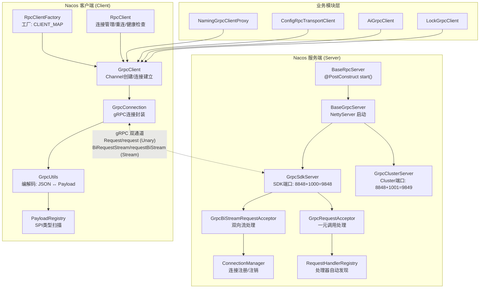
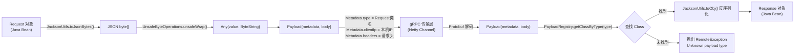
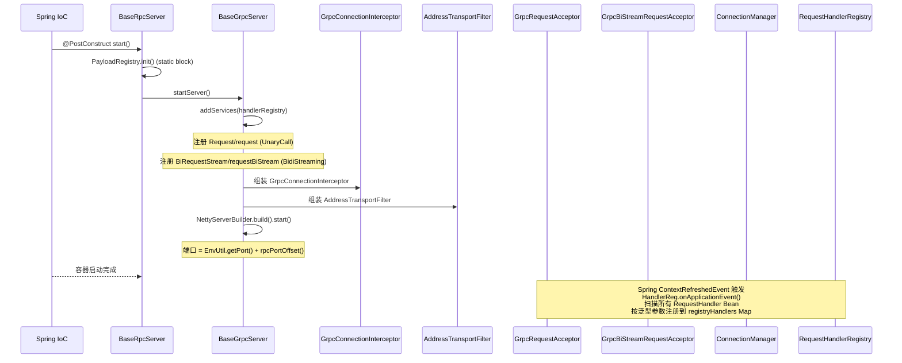
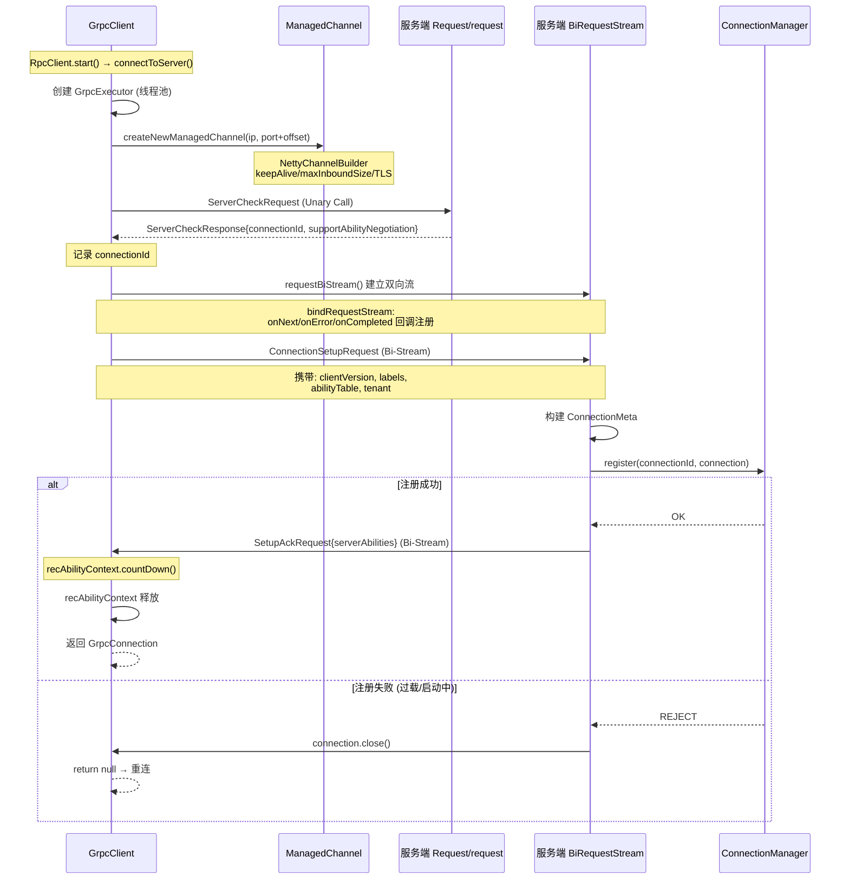
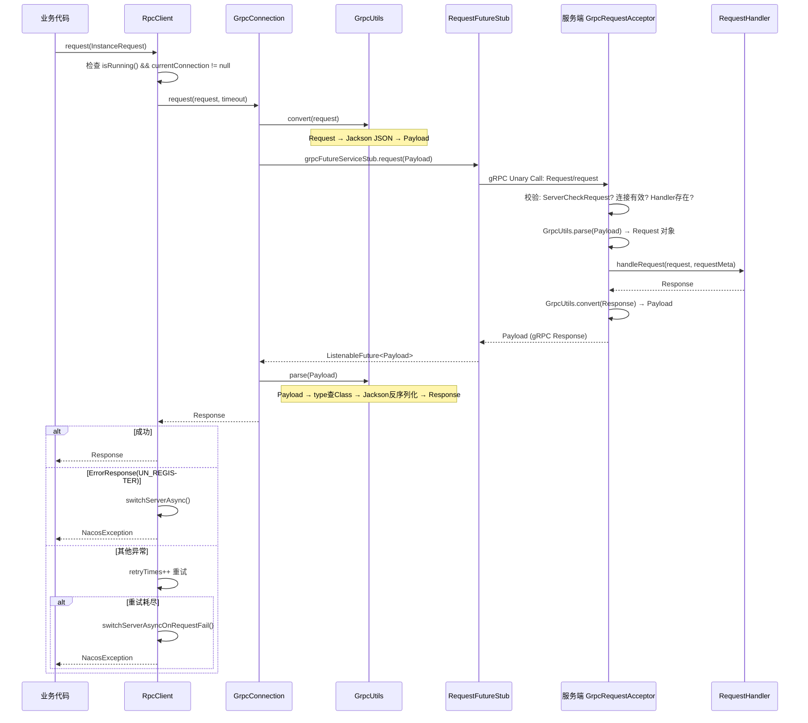
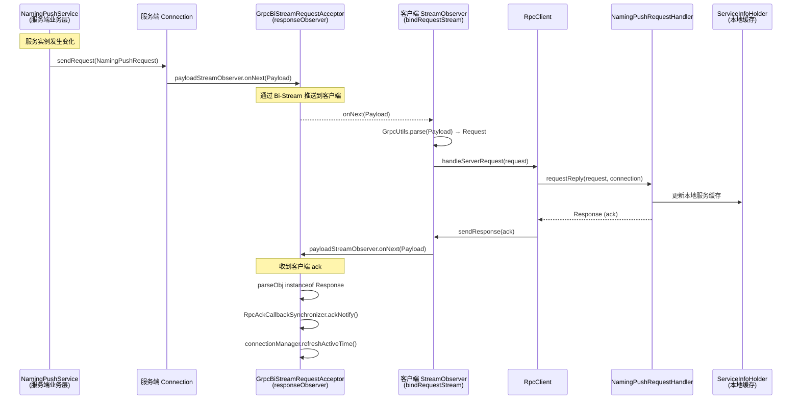
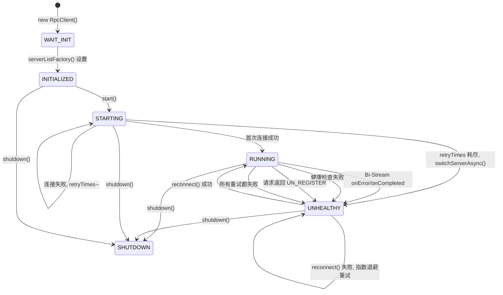
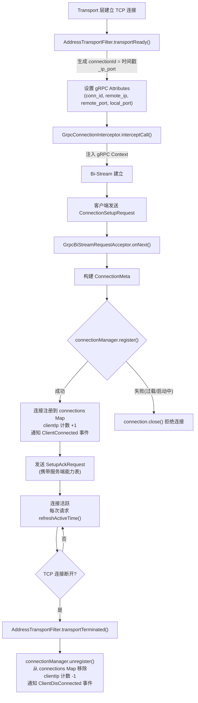
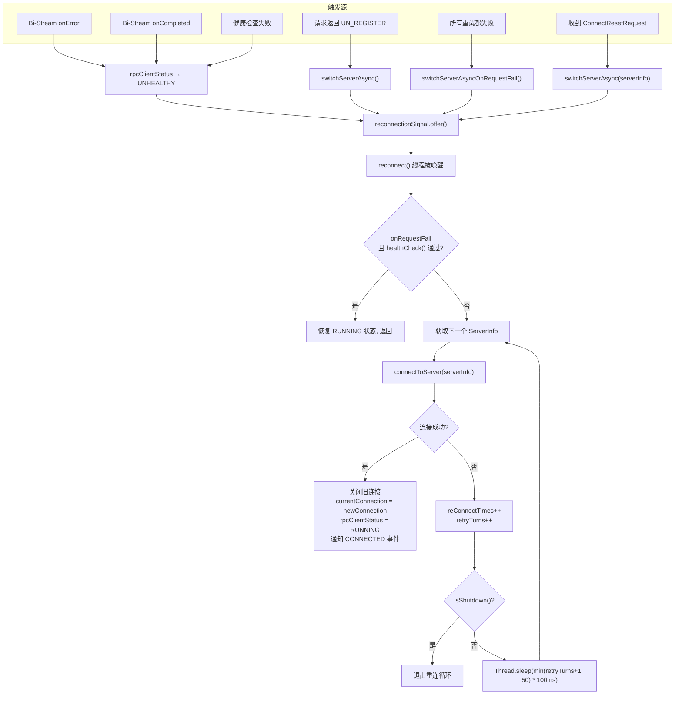

# Nacos 3.x gRPC 通信协议深度源码分析

## 目录

1. [概述](#1-概述)
2. [Proto 协议定义](#2-proto-协议定义)
3. [序列化/反序列化机制](#3-序列化反序列化机制)
4. [服务端初始化流程](#4-服务端初始化流程)
5. [客户端初始化流程](#5-客户端初始化流程)
6. [连接建立与注册流程](#6-连接建立与注册流程)
7. [请求/响应通信流程](#7-请求响应通信流程)
8. [Bi-Stream 服务端推送流程](#8-bi-stream-服务端推送流程)
9. [连接管理与健康检查](#9-连接管理与健康检查)
10. [重连与容错机制](#10-重连与容错机制)
11. [各模块 gRPC 客户端对比](#11-各模块-grpc-客户端对比)
12. [核心类关系图](#12-核心类关系图)

---

## 1. 概述

Nacos 3.x 的 gRPC 通信是整个系统的核心通信层，承担着服务端与客户端之间、集群节点之间的所有 RPC 通信。它基于以下设计原则：

- **双通道设计**：Unary Call（同步请求/响应） + Bi-directional Stream（服务端推送）
- **协议无关层**：抽象出 `RpcClient` / `BaseRpcServer`，底层可替换（当前只实现了 gRPC）
- **多端口隔离**：SDK 客户端端口 = `主端口 + 1000`，Cluster 端口 = `主端口 + 1001`
- **Payload 统一装箱**：所有 Request/Response 序列化为 JSON，通过 Protobuf `Payload` 消息体承载



核心源码位置：

| 模块 | 路径 |
|------|------|
| Proto 定义 | `api/src/main/proto/nacos_grpc_service.proto` |
| 客户端通用层 | `common/src/main/java/com/alibaba/nacos/common/remote/client/` |
| 服务端通用层 | `core/src/main/java/com/alibaba/nacos/core/remote/` |
| 服务端 gRPC 实现 | `core/src/main/java/com/alibaba/nacos/core/remote/grpc/` |
| 客户端 gRPC 实现 | `common/src/main/java/com/alibaba/nacos/common/remote/client/grpc/` |
| Naming 客户端代理 | `client/src/main/java/com/alibaba/nacos/client/naming/remote/gprc/` |
| Config 客户端 | `client/src/main/java/com/alibaba/nacos/client/config/impl/ClientWorker.java` |
| AI 客户端代理 | `client/src/main/java/com/alibaba/nacos/client/ai/remote/AiGrpcClient.java` |
| Lock 客户端 | `client/src/main/java/com/alibaba/nacos/client/lock/remote/grpc/LockGrpcClient.java` |

---

## 2. Proto 协议定义

```protobuf
syntax = "proto3";

import "google/protobuf/any.proto";
import "google/protobuf/timestamp.proto";

option java_multiple_files = true;
option java_package = "com.alibaba.nacos.api.grpc.auto";

message Metadata {
  string type = 3;                          // Request/Response 类名
  string clientIp = 8;                      // 客户端 IP
  map<string, string> headers = 7;          // 请求头
}

message Payload {
  Metadata metadata = 2;                     // 元数据
  google.protobuf.Any body = 3;             // 实际 JSON 数据
}

service Request {
  // 一元调用，客户端请求 → 服务端响应
  rpc request (Payload) returns (Payload) {
  }
}

service BiRequestStream {
  // 双向流，用于连接建立、服务端推送、客户端 ack
  rpc requestBiStream (stream Payload) returns (stream Payload) {
  }
}
```

**关键设计要点：**

- `Metadata.type` 字段存放 Java 类的 `getSimpleName()`，用于反序列化时查找对应的 Class
- `body` 中使用 `protobuf.Any` 包装 JSON 字节数组（由 Jackson 序列化），而非直接使用 Protobuf 消息类型
- 这使得新增 Request/Response 类型无需修改 `.proto` 文件，只需注册到 `PayloadRegistry`

---

## 3. 序列化/反序列化机制

### 3.1 PayloadRegistry — 类型注册中心

[PayloadRegistry.java](file:///d:/workspace/java_projects/source_projects/nacos/common/src/main/java/com/alibaba/nacos/common/remote/PayloadRegistry.java)

```java
public class PayloadRegistry {
    private static final Map<String, Class<?>> REGISTRY_REQUEST = new HashMap<>();

    public static void init() {
        scan();
    }

    private static synchronized void scan() {
        // 通过 Java SPI (ServiceLoader) 扫描所有 Payload 实现类
        ServiceLoader<Payload> payloads = ServiceLoader.load(Payload.class);
        for (Payload payload : payloads) {
            register(payload.getClass().getSimpleName(), payload.getClass());
        }
    }

    public static Class<?> getClassByType(String type) {
        return REGISTRY_REQUEST.get(type);
    }
}
```

`BaseRpcServer` 和 `RpcClient` 在静态初始化时都会调用 `PayloadRegistry.init()`，通过 Java SPI 扫描所有 `Payload` 接口的实现类，将类名（simpleName）与 Class 对象的映射关系注册到内存中。

### 3.2 GrpcUtils — 编解码工具

[GrpcUtils.java](file:///d:/workspace/java_projects/source_projects/nacos/common/src/main/java/com/alibaba/nacos/common/remote/client/grpc/GrpcUtils.java)

**Request → Payload：**

```java
public static Payload convert(Request request) {
    Metadata newMeta = Metadata.newBuilder()
        .setType(request.getClass().getSimpleName())   // 记录类名
        .setClientIp(NetUtils.localIp())                // 记录本机IP
        .putAllHeaders(request.getHeaders())             // 放入请求头
        .build();

    byte[] jsonBytes = JacksonUtils.toJsonBytes(request); // Jackson → JSON 字节

    return Payload.newBuilder()
        .setBody(Any.newBuilder()
            .setValue(UnsafeByteOperations.unsafeWrap(jsonBytes)))
        .setMetadata(newMeta)
        .build();
}
```

**Payload → Object（反序列化）：**

```java
public static Object parse(Payload payload) {
    Class<?> classType = PayloadRegistry.getClassByType(
        payload.getMetadata().getType());   // 通过 type 查找 Class

    ByteString byteString = payload.getBody().getValue();
    Object obj = JacksonUtils.toObj(
        new ByteBufferBackedInputStream(byteString.asReadOnlyByteBuffer()),
        classType);                          // Jackson 反序列化

    if (obj instanceof Request) {
        ((Request) obj).putAllHeader(payload.getMetadata().getHeadersMap());
    }
    return obj;
}
```

**核心链路总结：**



---

## 4. 服务端初始化流程

### 4.1 类继承关系

```
BaseRpcServer (core/remote/)                ← 抽象基类，定义 start()/stop() 等公共逻辑
  └── BaseGrpcServer (core/remote/grpc/)    ← gRPC 实现，启动 NettyServer
        ├── GrpcSdkServer                    ← SDK 客户端端口 (8848+1000=9848)
        └── GrpcClusterServer                ← 集群通信端口 (8848+1001=9849)
```



### 4.2 BaseRpcServer — 抽象启动逻辑

[BaseRpcServer.java](file:///d:/workspace/java_projects/source_projects/nacos/core/src/main/java/com/alibaba/nacos/core/remote/BaseRpcServer.java)

```java
public abstract class BaseRpcServer {

    static {
        PayloadRegistry.init();  // ← 初始化类型注册
    }

    @PostConstruct  // ← Spring 自动调用
    public void start() throws Exception {
        String serverName = getClass().getSimpleName();
        Loggers.REMOTE.info("Nacos {} Rpc server starting at port {}", serverName,
            getServicePort());

        startServer();  // 子类实现真正的 gRPC 启动

        // 注册 SSL/TLS 刷新钩子
        if (RpcServerSslContextRefresherHolder.getSdkInstance() != null) {
            RpcServerSslContextRefresherHolder.getSdkInstance().refresh(this);
        }

        Loggers.REMOTE.info("Nacos {} Rpc server started at port {}", serverName, getServicePort());

        // JVM 关闭钩子
        Runtime.getRuntime().addShutdownHook(new Thread(() -> {
            BaseRpcServer.this.stopServer();
        }));
    }

    public int getServicePort() {
        return EnvUtil.getPort() + rpcPortOffset();  // 基础端口 + 偏移量
    }
}
```

### 4.3 BaseGrpcServer — gRPC 服务端核心实现

[BaseGrpcServer.java](file:///d:/workspace/java_projects/source_projects/nacos/core/src/main/java/com/alibaba/nacos/core/remote/grpc/BaseGrpcServer.java)

```java
public abstract class BaseGrpcServer extends BaseRpcServer {

    @Autowired
    private GrpcRequestAcceptor grpcCommonRequestAcceptor;      // 一元调用处理器
    @Autowired
    private GrpcBiStreamRequestAcceptor grpcBiStreamRequestAcceptor; // 双向流处理器
    @Autowired
    private ConnectionManager connectionManager;
    @Autowired
    private RequestHandlerRegistry requestHandlerRegistry;

    @Override
    public void startServer() throws Exception {
        final MutableHandlerRegistry handlerRegistry = new MutableHandlerRegistry();

        // 1. 注册两个 gRPC Service + 所有拦截器
        addServices(handlerRegistry, getSeverInterceptors().toArray(new ServerInterceptor[0]));

        // 2. 构建 NettyServer
        NettyServerBuilder builder = NettyServerBuilder
            .forAddress(new InetSocketAddress(getServicePort()))
            .executor(getRpcExecutor())
            .maxInboundMessageSize(getMaxInboundMessageSize())       // 默认 10MB
            .fallbackHandlerRegistry(handlerRegistry)
            .compressorRegistry(CompressorRegistry.getDefaultInstance())
            .decompressorRegistry(DecompressorRegistry.getDefaultInstance())
            .keepAliveTime(getKeepAliveTime(), TimeUnit.MILLISECONDS) // 默认 GRPC 常量
            .keepAliveTimeout(getKeepAliveTimeout(), TimeUnit.MILLISECONDS)
            .permitKeepAliveTime(getPermitKeepAliveTime(), TimeUnit.MILLISECONDS);

        // 3. 添加 TransportFilter（用于连接建立/断开时获取 IP/Port）
        for (ServerTransportFilter each : getServerTransportFilters()) {
            builder.addTransportFilter(each);
        }

        // 4. 添加 ProtocolNegotiator（如 TLS）
        Optional<InternalProtocolNegotiator.ProtocolNegotiator> negotiator =
            newProtocolNegotiator();
        if (negotiator.isPresent()) {
            builder.protocolNegotiator(negotiator.get());
        }

        server = builder.build();
        server.start();
    }
}
```

#### 4.3.1 addServices — 注册两个 gRPC 服务

```java
private void addServices(MutableHandlerRegistry handlerRegistry,
    ServerInterceptor... serverInterceptor) {

    // ========== ① 一元调用 (UnaryCall)：Request/Response ==========
    final MethodDescriptor<Payload, Payload> unaryPayloadMethod = MethodDescriptor
        .<Payload, Payload>newBuilder()
        .setType(MethodDescriptor.MethodType.UNARY)
        .setFullMethodName("Request/request")
        .setRequestMarshaller(ProtoUtils.marshaller(Payload.getDefaultInstance()))
        .setResponseMarshaller(ProtoUtils.marshaller(Payload.getDefaultInstance()))
        .build();

    final ServerCallHandler<Payload, Payload> payloadHandler =
        ServerCalls.asyncUnaryCall((request, responseObserver) -> {
            handleCommonRequest(request, responseObserver);  // → GrpcRequestAcceptor
        });

    handlerRegistry.addService(ServerInterceptors.intercept(
        ServerServiceDefinition.builder("Request")
            .addMethod(unaryPayloadMethod, payloadHandler).build(),
        serverInterceptor));

    // ========== ② 双向流 (BidiStreaming)：连接注册 + 服务端推送 ==========
    final ServerCallHandler<Payload, Payload> biStreamHandler =
        ServerCalls.asyncBidiStreamingCall(
            (responseObserver) -> grpcBiStreamRequestAcceptor
                .requestBiStream(responseObserver));

    final MethodDescriptor<Payload, Payload> biStreamMethod =
        MethodDescriptor.<Payload, Payload>newBuilder()
            .setType(MethodDescriptor.MethodType.BIDI_STREAMING)
            .setFullMethodName("BiRequestStream/requestBiStream")
            .setRequestMarshaller(ProtoUtils.marshaller(Payload.getDefaultInstance()))
            .setResponseMarshaller(ProtoUtils.marshaller(Payload.getDefaultInstance()))
            .build();

    handlerRegistry.addService(ServerInterceptors.intercept(
        ServerServiceDefinition.builder("BiRequestStream")
            .addMethod(biStreamMethod, biStreamHandler).build(),
        serverInterceptor));
}
```

### 4.4 GrpcSdkServer — SDK 客户端专用

[GrpcSdkServer.java](file:///d:/workspace/java_projects/source_projects/nacos/core/src/main/java/com/alibaba/nacos/core/remote/grpc/GrpcSdkServer.java)

| 配置项 | 值 |
|--------|-----|
| 端口偏移 | `+1000`（即 9848） |
| 线程池 | `GlobalExecutor.sdkRpcExecutor` |
| Source | `"sdk"` |

### 4.5 GrpcClusterServer — 集群节点通信专用

[GrpcClusterServer.java](file:///d:/workspace/java_projects/source_projects/nacos/core/src/main/java/com/alibaba/nacos/core/remote/grpc/GrpcClusterServer.java)

| 配置项 | 值 |
|--------|-----|
| 端口偏移 | `+1001`（即 9849） |
| 线程池 | `GlobalExecutor.clusterRpcExecutor` |
| Source | `"cluster"` |

### 4.6 GrpcConnectionInterceptor — 连接上下文拦截器

[GrpcConnectionInterceptor.java](file:///d:/workspace/java_projects/source_projects/nacos/core/src/main/java/com/alibaba/nacos/core/remote/grpc/GrpcConnectionInterceptor.java)

每次 gRPC 调用到达时，将 TransportFilter 设置的属性（connectionId、remoteIp、remotePort、localPort）注入到 gRPC Context 中：

```java
public class GrpcConnectionInterceptor implements ServerInterceptor {
    @Override
    public <T, S> ServerCall.Listener<T> interceptCall(ServerCall<T, S> call, Metadata headers,
        ServerCallHandler<T, S> next) {
        Context ctx = Context.current()
            .withValue(GrpcServerConstants.CONTEXT_KEY_CONN_ID,
                call.getAttributes().get(GrpcServerConstants.ATTR_TRANS_KEY_CONN_ID))
            .withValue(GrpcServerConstants.CONTEXT_KEY_CONN_REMOTE_IP, ...)
            .withValue(GrpcServerConstants.CONTEXT_KEY_CONN_REMOTE_PORT, ...)
            .withValue(GrpcServerConstants.CONTEXT_KEY_CONN_LOCAL_PORT, ...);

        // Bi-Stream 才需要 Channel 引用
        if ("BiRequestStream".equals(call.getMethodDescriptor().getServiceName())) {
            Channel internalChannel = getInternalChannel(call);
            ctx = ctx.withValue(GrpcServerConstants.CONTEXT_KEY_CHANNEL, internalChannel);
        }

        return Contexts.interceptCall(ctx, call, headers, next);
    }
}
```

### 4.7 AddressTransportFilter — 连接元数据过滤器

[AddressTransportFilter.java](file:///d:/workspace/java_projects/source_projects/nacos/core/src/main/java/com/alibaba/nacos/core/remote/grpc/AddressTransportFilter.java)

```java
public class AddressTransportFilter extends ServerTransportFilter {
    @Override
    public Attributes transportReady(Attributes transportAttrs) {
        // 从 gRPC transport 层获取真实的 remoteIP/port、localPort
        InetSocketAddress remoteAddress = (InetSocketAddress) transportAttrs
            .get(Grpc.TRANSPORT_ATTR_REMOTE_ADDR);
        InetSocketAddress localAddress = (InetSocketAddress) transportAttrs
            .get(Grpc.TRANSPORT_ATTR_LOCAL_ADDR);

        // 生成唯一的 connectionId = 时间戳_ip_port
        String connectionId = System.currentTimeMillis() + "_" + remoteIp + "_" + remotePort;

        return transportAttrs.toBuilder()
            .set(ATTR_TRANS_KEY_CONN_ID, connectionId)
            .set(ATTR_TRANS_KEY_REMOTE_IP, remoteIp)
            .set(ATTR_TRANS_KEY_REMOTE_PORT, remotePort)
            .set(ATTR_TRANS_KEY_LOCAL_PORT, localPort)
            .build();
    }

    @Override
    public void transportTerminated(Attributes transportAttrs) {
        // 连接断开时从 ConnectionManager 注销
        String connectionId = transportAttrs.get(ATTR_TRANS_KEY_CONN_ID);
        if (StringUtils.isNotBlank(connectionId)) {
            connectionManager.unregister(connectionId);
        }
    }
}
```

---

## 5. 客户端初始化流程

### 5.1 类继承关系

```
RpcClient (common/remote/client/)            ← 抽象基类（连接管理、重连、健康检查）
  └── GrpcClient (common/remote/client/grpc/) ← gRPC Channel 创建、连接建立
        ├── GrpcSdkClient                     ← SDK 客户端
        └── GrpcClusterClient                 ← 集群客户端
```

### 5.2 RpcClient.start() — 核心启动逻辑

[RpcClient.java](file:///d:/workspace/java_projects/source_projects/nacos/common/src/main/java/com/alibaba/nacos/common/remote/client/RpcClient.java)

```java
public final void start() throws NacosException {
    // 1. 状态检查：必须从 INITIALIZED 状态启动
    boolean success = rpcClientStatus.compareAndSet(
        RpcClientStatus.INITIALIZED, RpcClientStatus.STARTING);
    if (!success) return;

    // 2. 启动两个线程：
    //    线程1：消费连接事件（CONNECTED/DISCONNECTED）并通知监听器
    //    线程2：健康检查 + 重连驱动
    clientEventExecutor = new ScheduledThreadPoolExecutor(2, ...);

    // 线程1：连接事件消费者
    clientEventExecutor.submit(() -> {
        while (!isTerminated && !isShutdown) {
            ConnectionEvent take = eventLinkedBlockingQueue.take();
            if (take.isConnected()) {
                notifyConnected(take.connection);     // 通知所有 ConnectionEventListener
            } else if (take.isDisConnected()) {
                notifyDisConnected(take.connection);
            }
        }
    });

    // 线程2：重连 + 健康检查
    clientEventExecutor.submit(() -> {
        while (true) {
            if (isShutdown()) break;

            ReconnectContext reconnectContext = reconnectionSignal
                .poll(connectionKeepAlive, TimeUnit.MILLISECONDS);

            if (reconnectContext == null) {
                // 定期健康检查
                boolean isHealthy = healthCheck();  // 发送 HealthCheckRequest
                if (!isHealthy) {
                    rpcClientStatus.compareAndSet(RUNNING, UNHEALTHY);
                    // 触发重连
                }
                continue;
            }
            reconnect(reconnectContext.serverInfo, reconnectContext.onRequestFail);
        }
    });

    // 3. 启动时同步尝试连接（可配置重试次数）
    int startUpRetryTimes = rpcClientConfig.retryTimes();
    while (startUpRetryTimes >= 0 && connectToServer == null) {
        startUpRetryTimes--;
        ServerInfo serverInfo = nextRpcServer();
        connectToServer = connectToServer(serverInfo);  // → GrpcClient.connectToServer()
    }

    if (connectToServer != null) {
        // 首次连接成功
        this.currentConnection = connectToServer;
        rpcClientStatus.set(RpcClientStatus.RUNNING);
        eventLinkedBlockingQueue.offer(
            new ConnectionEvent(ConnectionEvent.CONNECTED, currentConnection));
    } else {
        // 首次连接失败，异步重连
        switchServerAsync();
    }
}
```

### 5.3 各模块客户端创建示例

以 Naming 为例（[NamingGrpcClientProxy.java](file:///d:/workspace/java_projects/source_projects/nacos/client/src/main/java/com/alibaba/nacos/client/naming/remote/gprc/NamingGrpcClientProxy.java)）：

```java
public NamingGrpcClientProxy(String namespaceId, SecurityProxy securityProxy,
    ServerListFactory serverListFactory, NacosClientProperties properties,
    ServiceInfoHolder serviceInfoHolder, ...) throws NacosException {

    // 1. 设置 Labels（source, module, appName）
    Map<String, String> labels = new HashMap<>();
    labels.put(RemoteConstants.LABEL_SOURCE, RemoteConstants.LABEL_SOURCE_SDK);
    labels.put(RemoteConstants.LABEL_MODULE, RemoteConstants.LABEL_MODULE_NAMING);
    labels.put(Constants.APPNAME, AppNameUtils.getAppName());

    // 2. 通过 RpcClientFactory 创建 GrpcSdkClient
    GrpcClientConfig grpcClientConfig = RpcClientConfigFactory.getInstance()
        .createGrpcClientConfig(properties.asProperties(), labels);
    this.rpcClient = RpcClientFactory.createClient(uuid, ConnectionType.GRPC, grpcClientConfig);

    // 3. 创建 RedoService（断线重做）
    this.redoService = new NamingGrpcRedoService(this, ...);

    // 4. 启动
    rpcClient.serverListFactory(serverListFactory);
    rpcClient.registerConnectionListener(redoService);        // 连接事件 → redo
    rpcClient.registerServerRequestHandler(                   // 服务端推送处理器
        new NamingPushRequestHandler(serviceInfoHolder));
    rpcClient.start();
}
```

### 5.4 RpcClientFactory — 客户端工厂

[RpcClientFactory.java](file:///d:/workspace/java_projects/source_projects/nacos/common/src/main/java/com/alibaba/nacos/common/remote/client/RpcClientFactory.java)

- 使用 `ConcurrentHashMap<String, RpcClient>` 维护 clientName → client 的映射
- `createClient()` 创建 `GrpcSdkClient`（SDK 客户端）
- `createClusterClient()` 创建 `GrpcClusterClient`（集群客户端）
- 相同的 `clientName` 只会创建一个实例（`computeIfAbsent` 保证）



---

## 6. 连接建立与注册流程

这是 Nacos gRPC 最复杂的流程，涉及多个步骤的握手和状态同步。

### 6.1 客户端侧：GrpcClient.connectToServer()

[GrpcClient.java](file:///d:/workspace/java_projects/source_projects/nacos/common/src/main/java/com/alibaba/nacos/common/remote/client/grpc/GrpcClient.java)

```
connectToServer(ServerInfo)
│
├─ 1. 创建 grpcExecutor（线程池）
├─ 2. createNewManagedChannel(ip, port + rpcPortOffset)
│     └─ 构建 NettyChannelBuilder，设置：
│        - compressor/decompressor
│        - maxInboundMessageSize
│        - keepAliveTime/keepAliveTimeout
│        - TLS SSLContext（可选）
│
├─ 3. serverCheck(ip, port, stub)
│     └─ 发送 ServerCheckRequest（Unary Call）
│     └─ 获取 ServerCheckResponse{connectionId, supportAbilityNegotiation}
│
├─ 4. bindRequestStream(biRequestStreamStub, grpcConn)
│     └─ 创建 BiStreamObserver，处理服务端推送
│     └─ onNext() → 解析 Payload → handleServerRequest 或 setupAck
│     └─ onError() → switchServerAsync()
│     └─ onCompleted() → switchServerAsync()
│
├─ 5. 发送 ConnectionSetupRequest (通过 Bi-Stream)
│     └─ 携带 clientVersion、labels、abilityTable、tenant
│
├─ 6. 等待 SetupAckResponse（如果支持能力协商）
│     └─ recAbilityContext.await(timeout)
│     └─ 服务端返回 SetupAckRequest 携带 server abilities
│
└─ 7. 返回 GrpcConnection
```

#### serverCheck 详细流程

```java
private Response serverCheck(String ip, int port, RequestGrpc.RequestFutureStub stub) {
    ServerCheckRequest serverCheckRequest = new ServerCheckRequest();
    Payload grpcRequest = GrpcUtils.convert(serverCheckRequest);
    ListenableFuture<Payload> responseFuture = stub.request(grpcRequest);
    Payload response = responseFuture.get(serverCheckTimeOut, ...);
    return (Response) GrpcUtils.parse(response);
}
```

#### bindRequestStream 详细流程

```java
private StreamObserver<Payload> bindRequestStream(
    BiRequestStreamGrpc.BiRequestStreamStub streamStub, GrpcConnection grpcConn) {

    return streamStub.requestBiStream(new StreamObserver<Payload>() {

        @Override
        public void onNext(Payload payload) {
            // 服务端推来的数据
            Request request = (Request) GrpcUtils.parse(payload);

            if (request instanceof SetupAckRequest) {
                // ① 连接注册成功确认（能力协商）
                setupRequestHandler.requestReply(request, null);
                return;
            }

            // ② 普通服务端推送（如 NamingPushRequest）
            Response response = handleServerRequest(request);
            if (response != null) {
                sendResponse(response);  // 通过 Bi-Stream 返回 ack
            }
        }

        @Override
        public void onError(Throwable throwable) {
            // Bi-Stream 出错 → 切换服务器
            if (rpcClientStatus.compareAndSet(RUNNING, UNHEALTHY)) {
                switchServerAsync();
            }
        }

        @Override
        public void onCompleted() {
            // Bi-Stream 完成 → 切换服务器
            if (rpcClientStatus.compareAndSet(RUNNING, UNHEALTHY)) {
                switchServerAsync();
            }
        }
    });
}
```

### 6.2 服务端侧：GrpcBiStreamRequestAcceptor

[GrpcBiStreamRequestAcceptor.java](file:///d:/workspace/java_projects/source_projects/nacos/core/src/main/java/com/alibaba/nacos/core/remote/grpc/GrpcBiStreamRequestAcceptor.java)

当客户端发起 Bi-Stream 后，服务端处理流程：

```java
public StreamObserver<Payload> requestBiStream(StreamObserver<Payload> responseObserver) {
    return new StreamObserver<>() {

        @Override
        public void onNext(Payload payload) {
            // 从 gRPC Context 获取 connectionId、remoteIp 等信息
            Object parseObj = GrpcUtils.parse(payload);

            if (parseObj instanceof ConnectionSetupRequest) {
                // ① 客户端注册请求

                // a) 构建 ConnectionMeta
                ConnectionMeta metaInfo = new ConnectionMeta(
                    connectionId, clientIp, remoteIp, remotePort, localPort,
                    ConnectionType.GRPC.getType(), clientVersion, appName, labels);

                // b) 创建 Connection 对象
                Connection connection = ConnectionGeneratorServiceDelegate.getInstance()
                    .getConnection(metaInfo, responseObserver, channel);

                // c) 注册到 ConnectionManager
                if (!connectionManager.register(connectionId, connection)) {
                    connection.close();  // 拒绝：服务端过载或正在启动中
                } else {
                    // d) 发送 SetupAck（携带服务端能力表）
                    connection.sendRequestNoAck(new SetupAckRequest(
                        NacosAbilityManagerHolder.getInstance()
                            .getCurrentNodeAbilities(AbilityMode.SERVER)));
                }

            } else if (parseObj instanceof Response) {
                // ② 客户端对服务端推送的 ack
                Response response = (Response) parseObj;
                RpcAckCallbackSynchronizer.ackNotify(connectionId, response);
                connectionManager.refreshActiveTime(connectionId);
            }
        }
    };
}
```

### 6.3 ConnectionManager — 连接注册与管理

[ConnectionManager.java](file:///d:/workspace/java_projects/source_projects/nacos/core/src/main/java/com/alibaba/nacos/core/remote/ConnectionManager.java)

```java
@Service
public class ConnectionManager {
    Map<String, Connection> connections = new ConcurrentHashMap<>();
    Map<String, AtomicInteger> connectionForClientIp = new ConcurrentHashMap<>();

    public synchronized boolean register(String connectionId, Connection connection) {
        if (connection.isConnected()) {
            // 已存在则成功
            if (connections.containsKey(connectionId)) return true;

            // 检查连接数限制（插件化控制）
            if (checkLimit(connection)) return false;

            // 注册
            connections.put(connectionId, connection);
            connectionForClientIp.computeIfAbsent(clientIp, k -> new AtomicInteger(0))
                .getAndIncrement();

            // 通知事件监听器
            clientConnectionEventListenerRegistry.notifyClientConnected(connection);
            return true;
        }
        return false;
    }

    public void unregister(String connectionId) {
        Connection remove = connections.remove(connectionId);
        if (remove != null) {
            connectionForClientIp.get(remove.getMetaInfo().clientIp).decrementAndGet();
            clientConnectionEventListenerRegistry.notifyClientDisConnected(remove);
        }
    }
}
```

---

## 7. 请求/响应通信流程

### 7.1 客户端发送请求

RpcClient 提供了三种调用方式：

```java
// ① 同步请求（最常用）
public Response request(Request request) throws NacosException {
    return request(request, rpcClientConfig.timeOutMills());
}

// ② 异步请求
public void asyncRequest(Request request, RequestCallBack callback) throws NacosException;

// ③ Future 模式
public RequestFuture requestFuture(Request request) throws NacosException;
```



**同步请求完整流程：**

[GrpcConnection.java](file:///d:/workspace/java_projects/source_projects/nacos/common/src/main/java/com/alibaba/nacos/common/remote/client/grpc/GrpcConnection.java)

```java
// GrpcConnection.request()
@Override
public Response request(Request request, long timeouts) throws NacosException {
    // 1. Request → JSON → Payload
    Payload grpcRequest = GrpcUtils.convert(request);

    // 2. 调用 gRPC Unary Call（Request/request）
    ListenableFuture<Payload> requestFuture = grpcFutureServiceStub.request(grpcRequest);

    // 3. 等待响应
    Payload grpcResponse = requestFuture.get(timeouts, TimeUnit.MILLISECONDS);

    // 4. Payload → Response
    return (Response) GrpcUtils.parse(grpcResponse);
}
```

**RpcClient 层的重试逻辑：**

```java
// RpcClient.request()
public Response request(Request request, long timeoutMills) throws NacosException {
    int retryTimes = 0;
    while (retryTimes <= rpcClientConfig.retryTimes()) {
        try {
            if (this.currentConnection == null || !isRunning()) {
                throw new NacosException(CLIENT_DISCONNECT, "Client not connected");
            }
            response = this.currentConnection.request(request, timeoutMills);

            if (response instanceof ErrorResponse) {
                if (response.getErrorCode() == NacosException.UN_REGISTER) {
                    switchServerAsync();  // 连接未注册，切换服务器
                }
                throw new NacosException(response.getErrorCode(), ...);
            }
            lastActiveTimeStamp = System.currentTimeMillis();
            return response;
        } catch (Throwable e) {
            // 重试
            retryTimes++;
        }
    }
    // 全部重试失败 → 切服
    switchServerAsyncOnRequestFail();
    throw exceptionThrown;
}
```

### 7.2 服务端处理请求

[GrpcRequestAcceptor.java](file:///d:/workspace/java_projects/source_projects/nacos/core/src/main/java/com/alibaba/nacos/core/remote/grpc/GrpcRequestAcceptor.java)

```java
@Override
public void request(Payload grpcRequest, StreamObserver<Payload> responseObserver) {
    // 1. 获取 type = Metadata.type（Request 类名）
    String type = grpcRequest.getMetadata().getType();

    // 2. ServerCheckRequest → 特殊处理（直接返回 connectionId）
    if (ServerCheckRequest.class.getSimpleName().equals(type)) {
        Payload response = GrpcUtils.convert(
            new ServerCheckResponse(connectionId, supportAbility));
        responseObserver.onNext(response);
        responseObserver.onCompleted();
        return;
    }

    // 3. 查找 RequestHandler
    RequestHandler requestHandler = requestHandlerRegistry.getByRequestType(type);
    if (requestHandler == null) {
        responseObserver.onNext(GrpcUtils.convert(
            ErrorResponse.build(NacosException.NO_HANDLER, "RequestHandler Not Found")));
        return;
    }

    // 4. 校验连接有效性
    if (!connectionManager.checkValid(connectionId)) {
        responseObserver.onNext(GrpcUtils.convert(
            ErrorResponse.build(NacosException.UN_REGISTER, "Connection unregistered")));
        return;
    }

    // 5. 反序列化 Payload → Request 对象
    Request request = (Request) GrpcUtils.parse(grpcRequest);

    // 6. 执行 handler
    Response response = requestHandler.handleRequest(request, requestMeta);

    // 7. 返回响应
    Payload payloadResponse = GrpcUtils.convert(response);
    responseObserver.onNext(payloadResponse);
    responseObserver.onCompleted();
}
```

### 7.3 RequestHandlerRegistry — 处理器的自动发现

[RequestHandlerRegistry.java](file:///d:/workspace/java_projects/source_projects/nacos/core/src/main/java/com/alibaba/nacos/core/remote/RequestHandlerRegistry.java)

```java
@Override
public void onApplicationEvent(ContextRefreshedEvent event) {
    // Spring 容器刷新后，扫描所有 RequestHandler 类型的 Bean
    Map<String, RequestHandler> beansOfType =
        event.getApplicationContext().getBeansOfType(RequestHandler.class);

    for (RequestHandler requestHandler : beansOfType.values()) {
        // 通过泛型反射获取 Request 类型，注册到 registryHandlers
        // 例如：InstanceRequestHandler → 处理 "InstanceRequest"
        //      ConfigQueryRequestHandler → 处理 "ConfigQueryRequest"
        registryHandlers.put(requestType, requestHandler);
    }
}
```

---

## 8. Bi-Stream 服务端推送流程

### 8.1 推送方向

**服务端 → 客户端（单向流推送）**



### 8.2 服务端推送的关键代码路径

- **连接向客户端推送请求**：通过 `GrpcBiStreamRequestAcceptor` 保存的 `responseObserver`（即客户端侧的 `payloadStreamObserver`）进行推送
- **客户端接收推送**：在 `GrpcClient.bindRequestStream()` 中注册的 `StreamObserver.onNext()` 回调处理
- **推送 Ack 机制**：客户端处理完后通过 Bi-Stream 返回 `Response`，服务端在 `GrpcBiStreamRequestAcceptor.streamObserverOnNext()` 中判断 `parseObj instanceof Response`，调用 `RpcAckCallbackSynchronizer.ackNotify()` 通知等待的线程

---

## 9. 连接管理与健康检查

### 9.1 客户端状态机



### 9.2 客户端健康检查

```java
// RpcClient
private boolean healthCheck() {
    HealthCheckRequest healthCheckRequest = new HealthCheckRequest();
    if (this.currentConnection == null) return false;

    int reTryTimes = rpcClientConfig.healthCheckRetryTimes();
    while (reTryTimes >= 0) {
        reTryTimes--;
        Response response = this.currentConnection
            .request(healthCheckRequest, rpcClientConfig.healthCheckTimeOut());
        return response != null && response.isSuccess();
    }
    return false;
}
```

**触发条件**：

```
RpcClient 状态为 RUNNING 时：
  - reconnectionSignal.poll(connectionKeepAlive, MILLISECONDS) 超时未收到重连信号
  - System.currentTimeMillis() - lastActiveTimeStamp >= connectionKeepAlive
  → 执行 healthCheck()
  → 失败 → 状态变为 UNHEALTHY → 触发异步重连
```

### 9.3 服务端连接生命周期



### 9.4 服务端主动断开连接

服务端可以通过发送 `ConnectResetRequest` 来通知客户端主动断开并重连：

```java
// RpcClient.ConnectResetRequestHandler
public Response requestReply(Request request, Connection connection) {
    if (request instanceof ConnectResetRequest) {
        ConnectResetRequest connectResetRequest = (ConnectResetRequest) request;
        if (StringUtils.isNotBlank(connectResetRequest.getServerIp())) {
            // 切换到指定服务器
            switchServerAsync(resolveServerInfo(
                connectResetRequest.getServerIp() + ":" + connectResetRequest.getServerPort()));
        } else {
            switchServerAsync();
        }
        afterReset(connectResetRequest);  // GrpcClient 中清理 RecAbilityContext
        return new ConnectResetResponse();
    }
    return null;
}
```

---

## 10. 重连与容错机制

### 10.1 重连触发场景

| 场景 | 触发方式 |
|------|----------|
| Bi-Stream onError | `rpcClientStatus → UNHEALTHY → switchServerAsync()` |
| Bi-Stream onCompleted | `rpcClientStatus → UNHEALTHY → switchServerAsync()` |
| 健康检查失败 | `rpcClientStatus → UNHEALTHY → 放入 reconnectionSignal` |
| 请求返回 UN_REGISTER | `switchServerAsync()` |
| 所有重试都失败 | `switchServerAsyncOnRequestFail()` |
| 收到 ConnectResetRequest | `switchServerAsync(serverInfo)` |



### 10.2 重连算法

```java
// RpcClient.reconnect()
protected void reconnect(final ServerInfo recommendServerInfo, boolean onRequestFail) {
    // 如果是因为请求失败触发且健康检查通过，则恢复 RUNNING 状态
    if (onRequestFail && healthCheck()) {
        rpcClientStatus.set(RpcClientStatus.RUNNING);
        return;
    }

    boolean switchSuccess = false;
    int reConnectTimes = 0;
    int retryTurns = 0;  // 轮次

    while (!switchSuccess && !isShutdown()) {
        // 1. 获取下一个服务器：优先推荐服务器，否则 round-robin
        ServerInfo serverInfo = recommendServer.get() == null
            ? nextRpcServer()       // → ServerListFactory.genNextServer()
            : recommendServer.get();

        // 2. 尝试连接
        Connection connectionNew = connectToServer(serverInfo);
        if (connectionNew != null) {
            // 成功 → 关闭旧连接 → 更新 currentConnection → 通知 CONNECTED
            currentConnection.setAbandon(true);
            closeConnection(currentConnection);
            currentConnection = connectionNew;
            rpcClientStatus.set(RpcClientStatus.RUNNING);
            eventLinkedBlockingQueue.add(
                new ConnectionEvent(ConnectionEvent.CONNECTED, currentConnection));
            return;
        }

        // 3. 失败 → 递增重试计数
        reConnectTimes++;
        retryTurns++;  // 每轮 serverList.size() 次后递增

        // 4. 指数退避：延迟 = min(retryTurns + 1, 50) * 100ms
        Thread.sleep(Math.min(retryTurns + 1, 50) * 100L);
    }
}
```

**退避时间：** 第1轮 100ms，第2轮 200ms，...，最大 5000ms（50 * 100ms）

### 10.3 ServerListFactory

客户端启动前会设置 `ServerListFactory`：

```java
public abstract class ServerListFactory {
    // 获取下一个服务器（Round-Robin）
    public abstract String genNextServer();

    // 获取所有服务器列表
    public abstract List<String> getServerList();
}
```

Naming 客户端的实现通过 `NamingServerListManager`，从 Nacos 地址服务获取服务器列表。

---

## 11. 各模块 gRPC 客户端对比

| 特性 | Naming | Config | AI | Lock |
|------|--------|--------|-----|------|
| 模块 Label | `naming` | `config` | `ai` | `lock` |
| 客户端类 | `NamingGrpcClientProxy` | `ConfigRpcTransportClient` (内嵌于 `ClientWorker`) | `AiGrpcClient` | `LockGrpcClient` |
| 唯一标识 | UUID | `uuid + "_config-" + taskId` (多 task) | UUID | UUID |
| 服务端推送 | NamingPushRequestHandler | ConfigChangeBatchListenRequest 等 | AiChangeNotifier (SmartSubscriber) | 无 |
| Redo 机制 | NamingGrpcRedoService | Config redo | AiGrpcRedoService | 无 |
| 缓存 | ServiceInfoHolder | CacheData (cacheMap) | McpServer/AgentCard/Prompt/AgentSpec/Skill CacheHolder | 无 |

### 11.1 Config 模块的特殊设计

[ClientWorker.java](file:///d:/workspace/java_projects/source_projects/nacos/client/src/main/java/com/alibaba/nacos/client/config/impl/ClientWorker.java)

Config 模块比较特殊，每个 `taskId`（对应一个监听组）会创建独立的 RpcClient：

```java
RpcClient ensureRpcClient(String taskId) throws NacosException {
    synchronized (ClientWorker.this) {
        Map<String, String> newLabels = new HashMap<>(labels);
        newLabels.put("taskId", taskId);

        GrpcClientConfig grpcClientConfig = RpcClientConfigFactory.getInstance()
            .createGrpcClientConfig(properties, newLabels);
        RpcClient rpcClient = RpcClientFactory.createClient(
            uuid + "_config-" + taskId,   // ← 不同 taskId 有独立 client
            ConnectionType.GRPC, grpcClientConfig);

        if (rpcClient.isWaitInitiated()) {
            initRpcClientHandler(rpcClient);
            rpcClient.setTenant(getTenant());
            rpcClient.start();
        }
        return rpcClient;
    }
}
```

### 11.2 AI 模块的设计

[AiGrpcClient.java](file:///d:/workspace/java_projects/source_projects/nacos/client/src/main/java/com/alibaba/nacos/client/ai/remote/AiGrpcClient.java)

AI 模块同时使用 gRPC + HTTP 双通道：

```java
public class AiGrpcClient implements AiClientProxy {
    private final RpcClient rpcClient;
    private final AiGrpcRedoService redoService;

    public void start(NacosMcpServerCacheHolder mcpServerCacheHolder,
        NacosAgentCardCacheHolder agentCardCacheHolder) {
        this.serverListManager.start();
        this.rpcClient.registerConnectionListener(this.redoService);
        this.rpcClient.serverListFactory(this.serverListManager);
        this.rpcClient.start();
    }
}
```

---

## 12. 核心类关系图

```
┌──────────────────────────────────────────────────────────────────────────────┐
│                              服务端 (Nacos Server)                             │
├──────────────────────────────────────────────────────────────────────────────┤
│                                                                                │
│  BaseRpcServer                                                                 │
│  ├── start() @PostConstruct                                                  │
│  ├── getServicePort() = 主端口 + rpcPortOffset()                               │
│  │                                                                              │
│  └── BaseGrpcServer                                                            │
│      ├── startServer()                                                         │
│      │   ├── addServices(registry)    ← 注册 Request + BiRequestStream 两个服务  │
│      │   ├── GrpcConnectionInterceptor  ← 设置 gRPC Context（connectionId/ip）  │
│      │   ├── AddressTransportFilter            ← transportReady 分配 connectionId│
│      │   └── NettyServerBuilder.build().start()                                 │
│      │                                                                          │
│      ├── GrpcSdkServer (port=9848, source="sdk")                               │
│      └── GrpcClusterServer (port=9849, source="cluster")                       │
│                                                                                │
│  GrpcRequestAcceptor (一元调用处理器)                                            │
│  └── request(Payload, StreamObserver)                                          │
│      ├── ServerCheckRequest → 返回 connectionId                                │
│      ├── 校验 connectionManager.checkValid()                                    │
│      ├── GrpcUtils.parse() → Request 对象                                      │
│      └── requestHandler.handleRequest() → Response → Payload                   │
│                                                                                │
│  GrpcBiStreamRequestAcceptor (双向流处理器)                                     │
│  └── requestBiStream(StreamObserver<Payload>)                                  │
│      ├── onNext(ConnectionSetupRequest)                                        │
│      │   ├── 构建 ConnectionMeta                                                │
│      │   ├── connectionManager.register(connectionId, connection)               │
│      │   └── 返回 SetupAckRequest（携带服务端能力表）                             │
│      └── onNext(Response) → RpcAckCallbackSynchronizer.ackNotify()             │
│                                                                                │
│  ConnectionManager                                                             │
│  ├── connections: ConcurrentHashMap<connectionId, Connection>                  │
│  ├── register()    ← 校验连接数限制                                              │
│  └── unregister()  ← 清理连接                                                   │
│                                                                                │
│  RequestHandlerRegistry                                                        │
│  └── onApplicationEvent() → 扫描 @Service RequestHandler → registryHandlers    │
│                                                                                │
└──────────────────────────────────────────────────────────────────────────────┘

┌──────────────────────────────────────────────────────────────────────────────┐
│                              客户端 (Nacos Client)                             │
├──────────────────────────────────────────────────────────────────────────────┤
│                                                                                │
│  RpcClientFactory                                                              │
│  ├── CLIENT_MAP: ConcurrentHashMap<clientName, RpcClient>                     │
│  ├── createClient()        → GrpcSdkClient                                    │
│  └── createClusterClient() → GrpcClusterClient                                 │
│                                                                                │
│  RpcClient (抽象基类)                                                           │
│  ├── start()                                                                   │
│  │   ├── 创建 clientEventExecutor (2线程)                                       │
│  │   ├── 线程1: 消费 ConnectionEvent → notifyConnected/notifyDisConnected      │
│  │   ├── 线程2: 健康检查 + 重连驱动                                              │
│  │   ├── 同步连接尝试 (retryTimes 次)                                            │
│  │   │   └── connectToServer(serverInfo) → 子类实现                             │
│  │   └── 注册 ConnectResetRequestHandler / ClientDetectionRequestHandler       │
│  │                                                                              │
│  ├── request(Request) → 带重试的同步请求                                         │
│  ├── asyncRequest(Request, Callback) → 带重试的异步请求                          │
│  ├── requestFuture(Request) → 带重试的 Future 请求                               │
│  ├── healthCheck() → 发送 HealthCheckRequest                                   │
│  └── reconnect() → 重连算法（指数退避）                                          │
│                                                                                │
│  └── GrpcClient                                                               │
│      ├── connectToServer(ServerInfo)                                           │
│      │   ├── createNewManagedChannel() → NettyChannelBuilder                   │
│      │   ├── serverCheck() → Unary Call: ServerCheckRequest                    │
│      │   ├── bindRequestStream() → Bi-Stream Observer（接收服务端推送）          │
│      │   ├── 发送 ConnectionSetupRequest                                       │
│      │   └── await SetupAck（能力协商）                                          │
│      │                                                                          │
│      ├── GrpcSdkClient    (SDK 客户端)                                          │
│      └── GrpcClusterClient (集群客户端)                                         │
│                                                                                │
│  GrpcConnection                                                               │
│  ├── channel: ManagedChannel                                                   │
│  ├── grpcFutureServiceStub: RequestGrpc.RequestFutureStub ← Unary Call        │
│  ├── payloadStreamObserver: StreamObserver<Payload>        ← Bi-Stream 发送    │
│  ├── request(Request, timeout) → stub.request(Payload)                         │
│  ├── asyncRequest(Request, Callback) → Futures.addCallback                     │
│  ├── sendRequest(Request) → payloadStreamObserver.onNext() ← 通过 Bi-Stream    │
│  └── close() → channel.shutdownNow()                                          │
│                                                                                │
│  GrpcUtils                                                                    │
│  ├── convert(Request) → Payload (Jackson JSON → Any)                           │
│  ├── convert(Response) → Payload                                               │
│  └── parse(Payload) → Object (通过 PayloadRegistry 查找 Class)                  │
│                                                                                │
└──────────────────────────────────────────────────────────────────────────────┘

┌──────────────────────────────────────────────────────────────────┐
│                       两套 gRPC Service                           │
├──────────────────────────────────────────────────────────────────┤
│                                                                   │
│  ① Request/request (Unary Call)                                  │
│     client                     server                             │
│       │                          │                                │
│       │── Payload (Unary) ──────→│ GrpcRequestAcceptor.request()  │
│       │                          │  → RequestHandler.handle()     │
│       │←── Payload (Unary) ─────│ GrpcUtils.convert(Response)    │
│                                                                   │
│  ② BiRequestStream/requestBiStream (Bi-directional Streaming)    │
│     client                     server                             │
│       │                          │                                │
│       │── Payload (Stream) ─────→│ onNext:                        │
│       │   ConnectionSetupRequest  │   ConnectionSetupRequest      │
│       │                          │    → connectionManager.register│
│       │                          │    → SetupAck                  │
│       │                            │                              │
│       │                          │ onNext (服务端推送):            │
│       │←── Payload (Stream) ─────│   NamingPushRequest /          │
│       │   NamingPushRequest      │   ConfigChangeRequest 等        │
│       │                          │                                │
│       │── Payload (Stream) ─────→│ onNext (客户端 Ack):            │
│       │   Response (ack)         │   Response 对象                 │
│       │                          │                                │
└──────────────────────────────────────────────────────────────────┘
```

---

## 总结

Nacos 3.x 的 gRPC 通信层设计得十分精巧，核心亮点：

1. **双 Service 设计**：`Request/request`（一元调用）处理所有业务请求/响应，`BiRequestStream/requestBiStream`（双向流）处理连接注册、服务端推送和客户端 Ack

2. **Payload 统一装箱**：通过 `Metadata.type` 实现动态类型解析，无需修改 Proto 即可扩展 Request/Response 类型

3. **完善的重连机制**：Bi-Stream 断开、健康检查、请求失败等场景均能触发重连，带指数退避

4. **能力协商**：`ConnectionSetupRequest` / `SetupAckRequest` 实现客户端和服务端之间的能力表交换

5. **多端口隔离**：SDK 端口（+1000）和 Cluster 端口（+1001）独立运行，互不干扰

6. **插件化架构**：ServerInterceptor、ServerTransportFilter、ProtocolNegotiator、RequestHandler 均可扩展