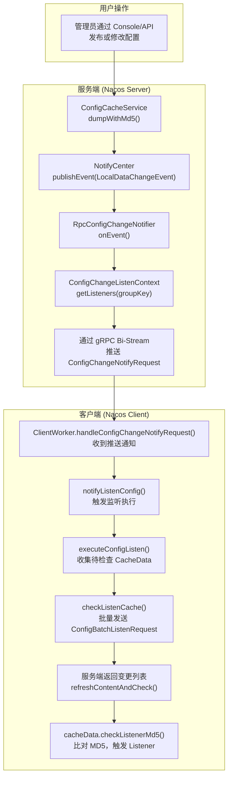
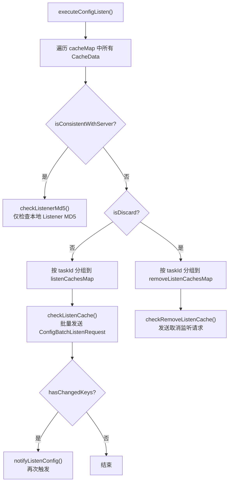
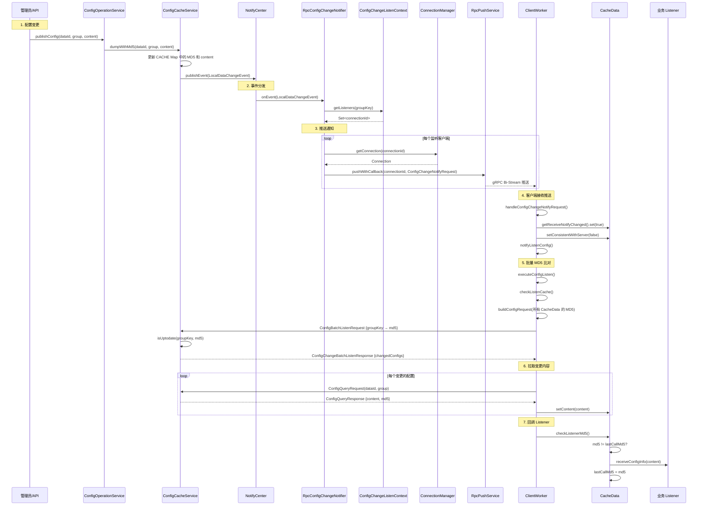
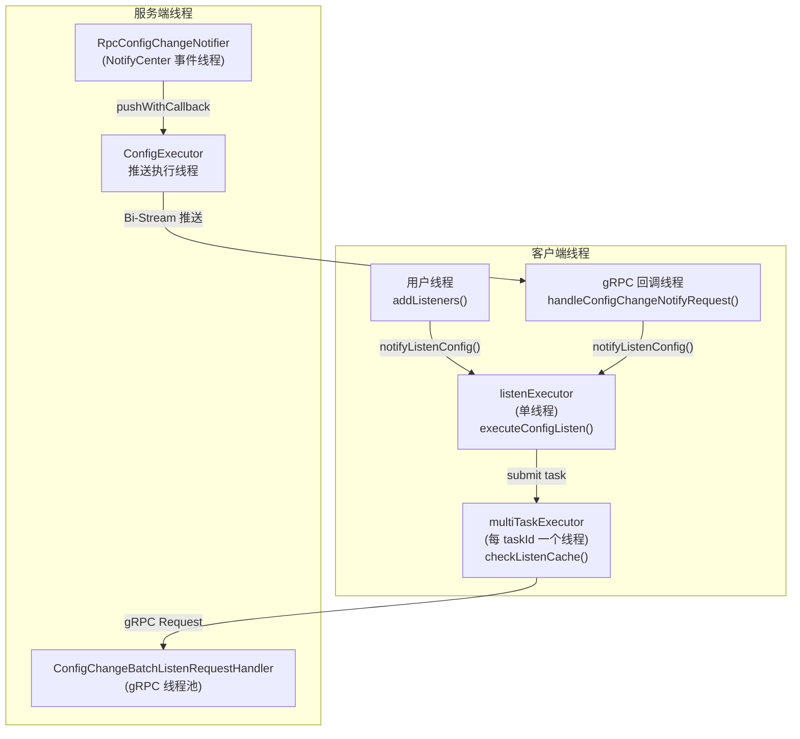

# Nacos 配置动态更新实现原理深度源码分析

## 目录

1. [概述](#1-概述)
2. [整体架构流程](#2-整体架构流程)
3. [客户端：CacheData 本地缓存模型](#3-客户端cachedata-本地缓存模型)
4. [客户端：ClientWorker 监听引擎](#4-客户端clientworker-监听引擎)
5. [客户端：Listener 回调通知机制](#5-客户端listener-回调通知机制)
6. [客户端：gRPC 批量监听请求](#6-客户端grpc-批量监听请求)
7. [服务端：ConfigChangeBatchListenRequestHandler](#7-服务端configchangebatchlistenrequesthandler)
8. [服务端：ConfigChangeListenContext 监听上下文](#8-服务端configchangelistencontext-监听上下文)
9. [服务端：配置变更触发推送](#9-服务端配置变更触发推送)
10. [服务端：RpcConfigChangeNotifier 推送执行](#10-服务端rpcconfigchangenotifier-推送执行)
11. [完整流程时序图](#11-完整流程时序图)
12. [线程模型](#12-线程模型)
13. [容错与重试机制](#13-容错与重试机制)
14. [总结](#14-总结)

---

## 1. 概述

Nacos 配置动态更新是 Config 模块最核心的能力。当服务端配置发生变更时，客户端能在秒级内感知并回调业务 Listener。Nacos 3.x 基于 **gRPC 长连接 + 双向流推送 + 批量 MD5 比对** 实现了高效的配置动态更新机制。

**核心设计思路：**

- **服务端主动推送通知**：配置变更时，服务端通过 gRPC Bi-Stream 向所有监听该配置的客户端推送 `ConfigChangeNotifyRequest`
- **客户端批量 MD5 比对**：客户端收到推送后，批量发起 `ConfigBatchListenRequest`，携带所有监听配置的 MD5，服务端比对后返回变更列表
- **客户端拉取变更内容**：对变更的配置，客户端逐个发起 `ConfigQueryRequest` 拉取最新内容
- **Listener 回调**：内容更新后，通过 `CacheData.checkListenerMd5()` 比对 MD5，触发业务 Listener

核心源码位置：

| 模块 | 文件 | 职责 |
|------|------|------|
| 客户端 | `ClientWorker.java` | 监听引擎，管理 CacheData 和 gRPC 通信 |
| 客户端 | `CacheData.java` | 单个配置的本地缓存，管理 Listener |
| 客户端 | `ConfigRpcTransportClient` | 内部类，gRPC 传输层 |
| 服务端 | `ConfigChangeBatchListenRequestHandler.java` | 处理批量监听请求 |
| 服务端 | `ConfigChangeListenContext.java` | 维护 groupKey → connectionId 映射 |
| 服务端 | `RpcConfigChangeNotifier.java` | 监听 LocalDataChangeEvent，推送变更通知 |
| 服务端 | `ConfigCacheService.java` | 配置缓存，变更时发布 LocalDataChangeEvent |

---

## 2. 整体架构流程



---

## 3. 客户端：CacheData 本地缓存模型

[CacheData.java](file:///d:/workspace/java_projects/source_projects/nacos/client/src/main/java/com/alibaba/nacos/client/config/impl/CacheData.java)

`CacheData` 是客户端对单个配置的本地缓存封装，每个 `dataId + group + tenant` 对应一个 `CacheData` 实例。

### 3.1 核心字段

```java
public class CacheData {
    public final String envName;        // 环境名
    public final String dataId;         // 配置 dataId
    public final String group;          // 配置 group
    public final String tenant;         // 租户

    private final CopyOnWriteArrayList<ManagerListenerWrap> listeners;  // 监听器列表
    private volatile String md5;        // 当前内容 MD5
    private volatile String content;    // 当前配置内容
    private volatile String encryptedDataKey;  // 加密密钥

    private final AtomicLong lastModifiedTs;           // 最后修改时间戳
    private final AtomicBoolean receiveNotifyChanged;  // 是否收到服务端推送
    private final AtomicBoolean isConsistentWithServer; // 是否与服务端一致
    private volatile boolean isDiscard;                 // 是否已废弃
    private int taskId;                                 // 所属 taskId
}
```

### 3.2 ManagerListenerWrap — Listener 包装器

```java
// CacheData 内部类
private static class ManagerListenerWrap {
    final Listener listener;
    String lastCallMd5;      // 上次回调时的 MD5
    String lastContent;      // 上次回调时的内容（用于 ConfigChangeItem 对比）
    final AtomicBoolean inNotifying;  // 是否正在通知中（防重入）
}
```

**关键设计：**
- `lastCallMd5` 用于判断是否需要回调：只有当 `cacheData.md5 != lastCallMd5` 时才触发 `receiveConfigInfo()`
- `inNotifying` 防止同一个 Listener 被并发回调

### 3.3 addListener — 注册监听器

```java
public void addListener(Listener listener) throws NacosException {
    ManagerListenerWrap wrap;
    if (listener instanceof AbstractConfigChangeListener) {
        // 内容变更监听器：需要记录 lastContent 用于 diff
        ConfigResponse cr = new ConfigResponse();
        cr.setDataId(dataId);
        cr.setGroup(group);
        cr.setContent(content);
        cr.setEncryptedDataKey(encryptedDataKey);
        configFilterChainManager.doFilter(null, cr);
        String contentTmp = cr.getContent();
        wrap = new ManagerListenerWrap(listener, md5, contentTmp);
    } else {
        // 普通监听器：只记录 lastCallMd5
        wrap = new ManagerListenerWrap(listener, md5);
    }

    if (listeners.addIfAbsent(wrap)) {
        LOGGER.info("[{}] [add-listener] ok, dataId={}, group={}, cnt={}",
            envName, dataId, group, listeners.size());
    }
}
```

### 3.4 checkListenerMd5 — MD5 比对触发回调

```java
void checkListenerMd5() {
    for (ManagerListenerWrap wrap : listeners) {
        if (!md5.equals(wrap.lastCallMd5)) {
            // MD5 不一致 → 触发回调
            safeNotifyListener(dataId, group, content, type, md5,
                encryptedDataKey, wrap);
        }
    }
}
```

---

## 4. 客户端：ClientWorker 监听引擎

[ClientWorker.java](file:///d:/workspace/java_projects/source_projects/nacos/client/src/main/java/com/alibaba/nacos/client/config/impl/ClientWorker.java)

`ClientWorker` 是客户端配置监听的核心引擎，管理所有 `CacheData` 和 gRPC 通信。

### 4.1 核心数据结构

```java
public class ClientWorker implements Closeable {

    // groupKey -> CacheData，原子引用保证线程安全
    private final AtomicReference<Map<String, CacheData>> cacheMap =
        new AtomicReference<>(new HashMap<>());

    // gRPC 传输客户端（内部类）
    private final ConfigRpcTransportClient agent;

    // taskId -> 该 task 下的 CacheData 数量
    private final List<AtomicInteger> taskIdCacheCountList = new ArrayList<>();
}
```

### 4.2 addListeners — 添加监听入口

```java
public void addListeners(String dataId, String group, List<? extends Listener> listeners)
    throws NacosException {
    group = blank2defaultGroup(group);

    // 1. 获取或创建 CacheData
    CacheData cache = addCacheDataIfAbsent(dataId, group);

    synchronized (cache) {
        // 2. 注册所有 Listener
        for (Listener listener : listeners) {
            cache.addListener(listener);
        }
        // 3. 标记为需要同步
        cache.setDiscard(false);
        cache.setConsistentWithServer(false);

        // 4. 确保 cache 在 cacheMap 中
        if (getCache(dataId, group) != cache) {
            putCache(GroupKey.getKey(dataId, group), cache);
        }

        // 5. 触发监听执行
        agent.notifyListenConfig();
    }
}
```

### 4.3 addCacheDataIfAbsent — 创建 CacheData 并分配 taskId

```java
public CacheData addCacheDataIfAbsent(String dataId, String group) {
    CacheData cache = getCache(dataId, group);
    if (null != cache) return cache;

    String key = GroupKey.getKey(dataId, group);
    cache = new CacheData(configFilterChainManager, agent.getName(), dataId, group);

    synchronized (cacheMap) {
        CacheData cacheFromMap = getCache(dataId, group);
        if (null != cacheFromMap) {
            cache = cacheFromMap;
            cache.setInitializing(true);
        } else {
            // 分配 taskId：每个 task 最多 perTaskConfigSize 个配置
            int taskId = calculateTaskId();
            increaseTaskIdCount(taskId);
            cache.setTaskId(taskId);
        }

        Map<String, CacheData> copy = new HashMap<>(cacheMap.get());
        copy.put(key, cache);
        cacheMap.set(copy);
    }
    return cache;
}
```

**taskId 分配算法：**

```java
private int calculateTaskId() {
    int perTaskSize = (int) ParamUtil.getPerTaskConfigSize();  // 默认 3000
    for (int index = 0; index < taskIdCacheCountList.size(); index++) {
        if (taskIdCacheCountList.get(index).get() < perTaskSize) {
            return index;
        }
    }
    // 所有 task 都满了，新建一个
    taskIdCacheCountList.add(new AtomicInteger(0));
    return taskIdCacheCountList.size() - 1;
}
```

**设计意图：** 将大量监听配置分散到多个 taskId，每个 taskId 对应一个独立的 gRPC 连接（RpcClient），避免单个连接上的批量请求过大。

### 4.4 ConfigRpcTransportClient — gRPC 传输层

`ConfigRpcTransportClient` 是 `ClientWorker` 的内部类，负责 gRPC 通信。

#### 4.4.1 startInternal — 启动监听线程

```java
@Override
public void startInternal() {
    // 单线程监听执行器
    listenExecutor = Executors.newSingleThreadExecutor(
        new NameThreadFactory("com.alibaba.nacos.client.listen-executor"));

    listenExecutor.submit(() -> {
        while (!listenExecutor.isShutdown() && !listenExecutor.isTerminated()) {
            try {
                // 阻塞等待触发信号，超时 5 秒
                listenExecutebell.poll(5L, TimeUnit.SECONDS);
                if (listenExecutor.isShutdown() || listenExecutor.isTerminated()) {
                    continue;
                }
                executeConfigListen();
            } catch (Throwable e) {
                LOGGER.error("[rpc listen execute] exception", e);
                Thread.sleep(50L);
                notifyListenConfig();  // 异常后重新触发
            }
        }
    });
}
```

#### 4.4.2 notifyListenConfig — 触发信号

```java
@Override
public void notifyListenConfig() {
    listenExecutebell.offer(bellItem);  // 向阻塞队列放入信号
}
```

**触发时机：**
1. 用户调用 `addListeners()` 后
2. 收到服务端 `ConfigChangeNotifyRequest` 推送后
3. gRPC 连接建立后（`onConnected`）
4. 上一次 `executeConfigListen()` 发现有变更后
5. 执行异常后

#### 4.4.3 executeConfigListen — 核心监听执行

```java
@Override
public void executeConfigListen() throws NacosException {

    Map<String, List<CacheData>> listenCachesMap = new HashMap<>(16);
    Map<String, List<CacheData>> removeListenCachesMap = new HashMap<>(16);

    long now = System.currentTimeMillis();
    boolean needAllSync = now - lastAllSyncTime >= ALL_SYNC_INTERNAL;  // 3分钟全量同步

    for (CacheData cache : cacheMap.get().values()) {
        synchronized (cache) {
            // 1. 检查本地 failover 文件
            checkLocalConfig(cache);

            // 2. 已与服务端一致的，只检查本地 Listener MD5
            if (cache.isConsistentWithServer()) {
                cache.checkListenerMd5();
                if (!needAllSync) continue;
            }

            // 3. 使用本地配置的，跳过
            if (cache.isUseLocalConfigInfo()) continue;

            // 4. 按 taskId 分组
            if (!cache.isDiscard()) {
                listenCachesMap.computeIfAbsent(
                    String.valueOf(cache.getTaskId()), k -> new LinkedList<>())
                    .add(cache);
            } else {
                removeListenCachesMap.computeIfAbsent(
                    String.valueOf(cache.getTaskId()), k -> new LinkedList<>())
                    .add(cache);
            }
        }
    }

    // 5. 批量检查变更
    boolean hasChangedKeys = checkListenCache(listenCachesMap);

    // 6. 处理待移除的监听
    checkRemoveListenCache(removeListenCachesMap);

    if (needAllSync) lastAllSyncTime = now;

    // 7. 有变更则再次触发
    if (hasChangedKeys) notifyListenConfig();
}
```



---

## 5. 客户端：Listener 回调通知机制

### 5.1 safeNotifyListener — 安全通知

```java
private void safeNotifyListener(final String dataId, final String group,
    final String content, final String type, final String md5,
    final String encryptedDataKey, final ManagerListenerWrap listenerWrap) {

    final Listener listener = listenerWrap.listener;

    // 防重入：如果正在通知中，跳过
    if (!listenerWrap.inNotifying.compareAndSet(false, true)) {
        LOGGER.warn("[notify-currentSkip] listener is not finish yet, will try next time.");
        return;
    }

    NotifyTask job = new NotifyTask() {
        @Override
        public void run() {
            ScheduledFuture<?> timeSchedule = null;
            try {
                // 设置线程 ClassLoader 为应用 ClassLoader
                Thread.currentThread().setContextClassLoader(
                    listener.getClass().getClassLoader());

                // 配置过滤器链处理
                ConfigResponse cr = new ConfigResponse();
                cr.setDataId(dataId);
                cr.setGroup(group);
                cr.setContent(content);
                cr.setEncryptedDataKey(encryptedDataKey);
                configFilterChainManager.doFilter(null, cr);
                String contentTmp = cr.getContent();

                // 启动超时监控（默认 60 秒告警）
                timeSchedule = getNotifyBlockMonitor().schedule(
                    new LongNotifyHandler(...), notifyWarnTimeout, MILLISECONDS);

                // 回调业务 Listener
                listener.receiveConfigInfo(contentTmp);

                // 如果是 ConfigChangeListener，做内容 diff
                if (listener instanceof AbstractConfigChangeListener) {
                    Map<String, ConfigChangeItem> data =
                        ConfigChangeHandler.getInstance()
                            .parseChangeData(listenerWrap.lastContent, contentTmp, type);
                    ConfigChangeEvent event = new ConfigChangeEvent(data);
                    ((AbstractConfigChangeListener) listener).receiveConfigChange(event);
                    listenerWrap.lastContent = contentTmp;
                }

                // 更新 lastCallMd5
                listenerWrap.lastCallMd5 = md5;

            } catch (Throwable t) {
                LOGGER.error("[notify-error] dataId={}, group={}, listener={}",
                    dataId, group, listener, t);
            } finally {
                listenerWrap.inNotifying.set(false);
                Thread.currentThread().setContextClassLoader(myClassLoader);
                if (timeSchedule != null) timeSchedule.cancel(true);
            }
        }
    };

    // 如果 Listener 指定了自定义 Executor，使用自定义线程池
    if (null != listener.getExecutor()) {
        listener.getExecutor().execute(job);
    } else {
        job.run();  // 在当前线程执行
    }
}
```

### 5.2 Listener 类型

| Listener 类型 | 回调方法 | 说明 |
|---------------|---------|------|
| `Listener` | `receiveConfigInfo(String content)` | 接收完整配置内容 |
| `AbstractConfigChangeListener` | `receiveConfigChange(ConfigChangeEvent)` | 接收增量变更（diff） |
| `AbstractSharedListener` | `receiveConfigInfo(String content)` | 共享监听器，支持 fillContext |

---

## 6. 客户端：gRPC 批量监听请求

### 6.1 checkListenCache — 批量检查变更

```java
private boolean checkListenCache(Map<String, List<CacheData>> listenCachesMap)
    throws NacosException {

    final AtomicBoolean hasChangedKeys = new AtomicBoolean(false);
    if (!listenCachesMap.isEmpty()) {
        List<Future> listenFutures = new ArrayList<>();

        for (Map.Entry<String, List<CacheData>> entry : listenCachesMap.entrySet()) {
            String taskId = entry.getKey();
            RpcClient rpcClient = ensureRpcClient(taskId);  // 获取或创建 gRPC 连接

            ExecutorService executorService = ensureSyncExecutor(taskId);
            Future future = executorService.submit(() -> {
                List<CacheData> listenCaches = entry.getValue();

                // 重置通知标记
                for (CacheData cacheData : listenCaches) {
                    cacheData.getReceiveNotifyChanged().set(false);
                }

                // 构建批量监听请求（携带所有 CacheData 的 MD5）
                ConfigBatchListenRequest request = buildConfigRequest(listenCaches);
                request.setListen(true);

                // 发送请求
                ConfigChangeBatchListenResponse listenResponse =
                    (ConfigChangeBatchListenResponse) requestProxy(rpcClient, request);

                if (listenResponse != null && listenResponse.isSuccess()) {
                    Set<String> changeKeys = new HashSet<>();

                    // 处理服务端返回的变更列表
                    List<ConfigChangeBatchListenResponse.ConfigContext> changedConfigs =
                        listenResponse.getChangedConfigs();
                    if (!CollectionUtils.isEmpty(changedConfigs)) {
                        hasChangedKeys.set(true);
                        for (ConfigChangeBatchListenResponse.ConfigContext ctx : changedConfigs) {
                            String changeKey = GroupKey.getKeyTenant(
                                ctx.getDataId(), ctx.getGroup(), ctx.getTenant());
                            changeKeys.add(changeKey);
                            // 拉取最新内容
                            refreshContentAndCheck(rpcClient, changeKey);
                        }
                    }

                    // 处理收到推送但未在变更列表中的配置
                    for (CacheData cacheData : listenCaches) {
                        if (cacheData.getReceiveNotifyChanged().get()) {
                            String changeKey = GroupKey.getKeyTenant(
                                cacheData.dataId, cacheData.group, cacheData.getTenant());
                            if (!changeKeys.contains(changeKey)) {
                                refreshContentAndCheck(rpcClient, changeKey);
                            }
                        }
                    }

                    // 标记未变更的配置为一致
                    for (CacheData cacheData : listenCaches) {
                        cacheData.setInitializing(false);
                        String groupKey = GroupKey.getKeyTenant(
                            cacheData.dataId, cacheData.group, cacheData.getTenant());
                        if (!changeKeys.contains(groupKey)) {
                            synchronized (cacheData) {
                                if (!cacheData.getReceiveNotifyChanged().get()) {
                                    cacheData.setConsistentWithServer(true);
                                }
                            }
                        }
                    }
                }
            });
            listenFutures.add(future);
        }

        // 等待所有 task 完成
        for (Future future : listenFutures) {
            future.get();
        }
    }
    return hasChangedKeys.get();
}
```

### 6.2 buildConfigRequest — 构建批量请求

```java
private ConfigBatchListenRequest buildConfigRequest(List<CacheData> caches) {
    ConfigBatchListenRequest request = new ConfigBatchListenRequest();
    for (CacheData cacheData : caches) {
        request.addConfigListenContext(
            cacheData.group,      // group
            cacheData.dataId,     // dataId
            cacheData.tenant,     // tenant
            cacheData.getMd5()    // 当前 MD5
        );
    }
    return request;
}
```

### 6.3 refreshContentAndCheck — 拉取并检查

```java
private void refreshContentAndCheck(RpcClient rpcClient, CacheData cacheData, boolean notify) {
    try {
        // 通过 gRPC 查询最新配置
        ConfigResponse response = this.queryConfigInner(
            rpcClient, cacheData.dataId, cacheData.group,
            cacheData.tenant, requestTimeout, notify);

        // 更新 CacheData
        cacheData.setEncryptedDataKey(response.getEncryptedDataKey());
        cacheData.setContent(response.getContent());
        if (null != response.getConfigType()) {
            cacheData.setType(response.getConfigType());
        }

        // 检查 MD5 并触发 Listener 回调
        cacheData.checkListenerMd5();
    } catch (Exception e) {
        LOGGER.error("refresh content and check md5 fail", e);
    }
}
```

### 6.4 ensureRpcClient — 每个 taskId 独立 gRPC 连接

```java
RpcClient ensureRpcClient(String taskId) throws NacosException {
    synchronized (ClientWorker.this) {
        Map<String, String> labels = getLabels();
        Map<String, String> newLabels = new HashMap<>(labels);
        newLabels.put("taskId", taskId);

        GrpcClientConfig grpcClientConfig = RpcClientConfigFactory.getInstance()
            .createGrpcClientConfig(properties, newLabels);

        // 每个 taskId 创建独立的 RpcClient
        RpcClient rpcClient = RpcClientFactory.createClient(
            uuid + "_config-" + taskId,  // 唯一名称
            getConnectionType(), grpcClientConfig);

        if (rpcClient.isWaitInitiated()) {
            initRpcClientHandler(rpcClient);
            rpcClient.setTenant(getTenant());
            rpcClient.start();
        }
        return rpcClient;
    }
}
```

### 6.5 服务端推送处理器注册

```java
private void initRpcClientHandler(final RpcClient rpcClientInner) {
    // 注册 ConfigChangeNotifyRequest 处理器
    rpcClientInner.registerServerRequestHandler((request, connection) -> {
        if (request instanceof ConfigChangeNotifyRequest) {
            return handleConfigChangeNotifyRequest(
                (ConfigChangeNotifyRequest) request, rpcClientInner.getName());
        }
        return null;
    });

    // 连接建立时触发监听
    rpcClientInner.registerConnectionListener(new ConnectionEventListener() {
        @Override
        public void onConnected(Connection connection) {
            LOGGER.info("[{}] Connected, notify listen context...",
                rpcClientInner.getName());
            notifyListenConfig();  // 重连后立即同步
        }

        @Override
        public void onDisConnect(Connection connection) {
            // 断开时标记所有 CacheData 为不一致
            String taskId = rpcClientInner.getLabels().get("taskId");
            for (CacheData cacheData : cacheMap.get().values()) {
                if (StringUtils.isNotBlank(taskId)) {
                    if (Integer.valueOf(taskId).equals(cacheData.getTaskId())) {
                        cacheData.setConsistentWithServer(false);
                    }
                } else {
                    cacheData.setConsistentWithServer(false);
                }
            }
        }
    });
}
```

### 6.6 handleConfigChangeNotifyRequest — 处理服务端推送

```java
ConfigChangeNotifyResponse handleConfigChangeNotifyRequest(
    ConfigChangeNotifyRequest request, String clientName) {

    LOGGER.info("[{}] [server-push] config changed. dataId={}, group={}, tenant={}",
        clientName, request.getDataId(), request.getGroup(), request.getTenant());

    String groupKey = GroupKey.getKeyTenant(
        request.getDataId(), request.getGroup(), request.getTenant());

    CacheData cacheData = cacheMap.get().get(groupKey);
    if (cacheData != null) {
        synchronized (cacheData) {
            // 标记收到推送
            cacheData.getReceiveNotifyChanged().set(true);
            // 标记为不一致
            cacheData.setConsistentWithServer(false);
            // 触发监听执行
            notifyListenConfig();
        }
    }
    return new ConfigChangeNotifyResponse();
}
```

---

## 7. 服务端：ConfigChangeBatchListenRequestHandler

[ConfigChangeBatchListenRequestHandler.java](file:///d:/workspace/java_projects/source_projects/nacos/config/src/main/java/com/alibaba/nacos/config/server/remote/ConfigChangeBatchListenRequestHandler.java)

服务端处理客户端发来的批量监听请求：

```java
@Component
public class ConfigChangeBatchListenRequestHandler
    extends RequestHandler<ConfigBatchListenRequest, ConfigChangeBatchListenResponse> {

    @Autowired
    private ConfigChangeListenContext configChangeListenContext;

    @Override
    public ConfigChangeBatchListenResponse handle(
        ConfigBatchListenRequest request, RequestMeta meta) throws NacosException {

        String connectionId = meta.getConnectionId();
        ConfigChangeBatchListenResponse response = new ConfigChangeBatchListenResponse();

        for (ConfigBatchListenRequest.ConfigListenContext ctx :
            request.getConfigListenContexts()) {

            String groupKey = GroupKey2.getKey(ctx.getDataId(), ctx.getGroup(),
                NamespaceUtil.processNamespaceParameter(ctx.getTenant()));
            String md5 = ctx.getMd5();

            if (request.isListen()) {
                // 注册监听：groupKey → connectionId
                configChangeListenContext.addListen(groupKey, md5, connectionId, ...);

                // 比对 MD5，判断是否需要推送
                boolean isUptoDate = ConfigCacheService.isUptodate(
                    groupKey, md5, meta.getClientIp(), tag, meta.getAppLabels());

                if (!isUptoDate) {
                    // MD5 不一致 → 加入变更列表
                    response.addChangeConfig(ctx.getDataId(), ctx.getGroup(), ctx.getTenant());
                }
            } else {
                // 取消监听
                configChangeListenContext.removeListen(groupKey, connectionId);
            }
        }
        return response;
    }
}
```

**关键逻辑：**
- `request.isListen() == true`：注册监听 + MD5 比对
- `request.isListen() == false`：取消监听
- `ConfigCacheService.isUptodate()` 比对本地的 MD5，不一致则加入变更列表

---

## 8. 服务端：ConfigChangeListenContext 监听上下文

[ConfigChangeListenContext.java](file:///d:/workspace/java_projects/source_projects/nacos/config/src/main/java/com/alibaba/nacos/config/server/remote/ConfigChangeListenContext.java)

维护 **groupKey → connectionId 集合** 的双向映射：

```java
@Component
public class ConfigChangeListenContext {

    // groupKey → 监听该配置的 connectionId 集合
    private ConcurrentHashMap<String, HashSet<String>> groupKeyContext =
        new ConcurrentHashMap<>();

    // connectionId → {groupKey → ConfigListenState}
    private ConcurrentHashMap<String, HashMap<String, ConfigListenState>> connectionIdContext =
        new ConcurrentHashMap<>();

    public synchronized void addListen(String groupKey, String md5,
        String connectionId, boolean isNamespaceTransfer) {
        // 正向映射
        groupKeyContext.computeIfAbsent(groupKey, k -> new HashSet<>())
            .add(connectionId);
        // 反向映射
        connectionIdContext.computeIfAbsent(connectionId, k -> new HashMap<>(16))
            .put(groupKey, new ConfigListenState(md5));
    }

    public synchronized void removeListen(String groupKey, String connectionId) {
        Set<String> connectionIds = groupKeyContext.get(groupKey);
        if (connectionIds != null) {
            connectionIds.remove(connectionId);
            if (connectionIds.isEmpty()) {
                groupKeyContext.remove(groupKey);
            }
        }
        HashMap<String, ConfigListenState> groupKeys = connectionIdContext.get(connectionId);
        if (groupKeys != null) {
            groupKeys.remove(groupKey);
        }
    }

    // 获取监听某个配置的所有 connectionId
    public synchronized Set<String> getListeners(String groupKey) {
        HashSet<String> strings = groupKeyContext.get(groupKey);
        if (CollectionUtils.isNotEmpty(strings)) {
            return new HashSet<>(strings);  // 返回副本
        }
        return null;
    }

    // 连接断开时清理
    public synchronized void clearContextForConnectionId(final String connectionId) {
        Map<String, String> listenKeys = getListenKeys(connectionId);
        if (listenKeys != null) {
            for (Map.Entry<String, String> entry : listenKeys.entrySet()) {
                Set<String> connectionIds = groupKeyContext.get(entry.getKey());
                if (CollectionUtils.isNotEmpty(connectionIds)) {
                    connectionIds.remove(connectionId);
                    if (connectionIds.isEmpty()) {
                        groupKeyContext.remove(entry.getKey());
                    }
                }
            }
        }
        connectionIdContext.remove(connectionId);
    }
}
```

---

## 9. 服务端：配置变更触发推送

### 9.1 ConfigCacheService — 配置缓存服务

[ConfigCacheService.java](file:///d:/workspace/java_projects/source_projects/nacos/config/src/main/java/com/alibaba/nacos/config/server/service/ConfigCacheService.java)

当配置发生变更时（通过 dump、publish、remove 等操作），`ConfigCacheService` 会发布 `LocalDataChangeEvent`：

```java
public class ConfigCacheService {

    static final ConcurrentHashMap<String, CacheItem> CACHE = new ConcurrentHashMap<>();

    // 配置 dump 时（从 DB 加载到内存）
    public static boolean dumpWithMd5(String dataId, String group, String tenant,
        String content, String md5, long lastModifiedTs, String type,
        String encryptedDataKey) {

        String groupKey = GroupKey2.getKey(dataId, group, tenant);
        // ... MD5 比对、磁盘缓存更新 ...

        if (md5Changed) {
            updateMd5(groupKey, md5, content, lastModifiedTs, encryptedDataKey);
        }

        return true;
    }

    // MD5 更新后发布事件
    public static void updateMd5(String groupKey, String md5, String content,
        long lastModifiedTs, String encryptedDataKey) {
        CacheItem cache = makeSure(groupKey, encryptedDataKey);
        if (cache.getConfigCache().getMd5Grey() == null
            || !cache.getConfigCache().getMd5Grey().equals(md5)) {
            cache.getConfigCache().setMd5Utf8(md5);
            cache.getConfigCache().setContent(content);
            cache.getConfigCache().setLastModifiedTs(lastModifiedTs);
            cache.getConfigCache().setEncryptedDataKey(encryptedDataKey);

            // 发布 LocalDataChangeEvent，触发推送
            NotifyCenter.publishEvent(new LocalDataChangeEvent(groupKey));
        }
    }
}
```

### 9.2 LocalDataChangeEvent — 本地数据变更事件

```java
public class LocalDataChangeEvent extends Event {
    public final String groupKey;

    public LocalDataChangeEvent(String groupKey) {
        this.groupKey = groupKey;
    }
}
```

**触发 LocalDataChangeEvent 的场景：**
- `dumpWithMd5()` — 从 DB dump 配置到内存时 MD5 变更
- `dump()` — 配置 dump 时
- `remove()` — 配置删除时
- `updateMd5()` — MD5 更新时

---

## 10. 服务端：RpcConfigChangeNotifier 推送执行

[RpcConfigChangeNotifier.java](file:///d:/workspace/java_projects/source_projects/nacos/config/src/main/java/com/alibaba/nacos/config/server/remote/RpcConfigChangeNotifier.java)

`RpcConfigChangeNotifier` 订阅 `LocalDataChangeEvent`，当事件发生时，查找所有监听该配置的客户端连接，通过 gRPC Bi-Stream 推送 `ConfigChangeNotifyRequest`：

```java
@Component(value = "rpcConfigChangeNotifier")
public class RpcConfigChangeNotifier extends Subscriber<LocalDataChangeEvent> {

    @Autowired
    ConfigChangeListenContext configChangeListenContext;

    @Autowired
    private RpcPushService rpcPushService;

    @Autowired
    private ConnectionManager connectionManager;

    // 订阅 LocalDataChangeEvent
    public RpcConfigChangeNotifier() {
        NotifyCenter.registerSubscriber(this);
    }

    @Override
    public void onEvent(LocalDataChangeEvent event) {
        String groupKey = event.groupKey;
        String[] strings = GroupKey.parseKey(groupKey);
        String dataId = strings[0];
        String group = strings[1];
        String tenant = strings.length > 2 ? strings[2] : "";

        configDataChanged(groupKey, dataId, group, tenant);
    }

    @Override
    public Class<? extends Event> subscribeType() {
        return LocalDataChangeEvent.class;
    }

    // 推送变更通知到所有监听客户端
    public void configDataChanged(String groupKey, String dataId, String group, String tenant) {
        // 1. 获取所有监听该 groupKey 的 connectionId
        Set<String> listeners = configChangeListenContext.getListeners(groupKey);
        if (CollectionUtils.isEmpty(listeners)) return;

        int notifyClientCount = 0;
        for (final String client : listeners) {
            Connection connection = connectionManager.getConnection(client);
            if (connection == null) continue;

            // 2. 构建推送请求
            ConfigChangeNotifyRequest notifyRequest =
                ConfigChangeNotifyRequest.build(dataId, group, tenant);

            // 3. 通过 gRPC Bi-Stream 推送（带重试）
            RpcPushTask rpcPushRetryTask = new RpcPushTask(
                notifyRequest, maxPushRetryTimes, client, clientIp, appName);
            push(rpcPushRetryTask, connectionManager);
            notifyClientCount++;
        }
        Loggers.REMOTE_PUSH.info("push [{}] clients, groupKey=[{}]",
            notifyClientCount, groupKey);
    }
}
```

**RpcPushTask — 推送重试任务：**

```java
class RpcPushTask implements Runnable {
    ConfigChangeNotifyRequest notifyRequest;
    int maxRetryTimes = -1;
    int tryTimes = 0;
    String connectionId;

    @Override
    public void run() {
        tryTimes++;
        TpsCheckRequest tpsCheckRequest = new TpsCheckRequest();
        tpsCheckRequest.setPointName(POINT_CONFIG_PUSH);

        if (!tpsControlManager.check(tpsCheckRequest).isSuccess()) {
            // TPS 限流，延迟重试
            push(this, connectionManager);
        } else {
            // 通过 gRPC Bi-Stream 推送
            rpcPushService.pushWithCallback(connectionId, notifyRequest,
                new RpcPushCallback(this, tpsControlManager, connectionManager),
                ConfigExecutor.getConfigSubServiceExecutor());
        }
    }
}
```

---

## 11. 完整流程时序图



---

## 12. 线程模型



**客户端线程说明：**

| 线程 | 数量 | 职责 |
|------|------|------|
| `listen-executor` | 1 | 串行执行 `executeConfigListen()`，收集待检查的 CacheData |
| `multiTaskExecutor` | N（taskId 数量） | 每个 taskId 一个线程，并行发送 `ConfigBatchListenRequest` |
| `client-executor` | CPU 核数（可配） | 通用工作线程池，执行 `queryConfigInner()` 等 |
| gRPC 回调线程 | gRPC 内部 | 处理服务端 Bi-Stream 推送 |

**服务端线程说明：**

| 线程 | 职责 |
|------|------|
| gRPC Worker | 处理 `ConfigChangeBatchListenRequestHandler` |
| NotifyCenter 事件线程 | 分发 `LocalDataChangeEvent` 到 `RpcConfigChangeNotifier` |
| ConfigExecutor | 执行推送任务 `RpcPushTask` |

---

## 13. 容错与重试机制

### 13.1 客户端容错

| 场景 | 处理方式 |
|------|----------|
| gRPC 连接断开 | `onDisConnect` → 标记所有 CacheData 为不一致 |
| gRPC 连接恢复 | `onConnected` → `notifyListenConfig()` 触发全量同步 |
| 监听执行异常 | `catch` → `Thread.sleep(50)` → `notifyListenConfig()` 重试 |
| 批量请求失败 | `catch` → `Thread.sleep(50)` → `notifyListenConfig()` 重试 |
| Listener 回调超时 | 60 秒后打印 WARN 日志 + 线程堆栈 |
| Listener 回调异常 | `catch` → 打印 ERROR 日志，不影响其他 Listener |

### 13.2 服务端容错

| 场景 | 处理方式 |
|------|----------|
| 推送失败 | `RpcPushTask` 重试，最多 `maxPushRetryTimes` 次 |
| TPS 限流 | 延迟重试推送 |
| 连接断开 | `clearContextForConnectionId()` 清理监听映射 |
| 推送超时 | `RpcPushCallback` 超时后标记失败 |

### 13.3 全量同步兜底

```java
// 每 3 分钟强制全量同步一次
private static final long ALL_SYNC_INTERNAL = 3 * 60 * 1000L;

// executeConfigListen() 中：
boolean needAllSync = now - lastAllSyncTime >= ALL_SYNC_INTERNAL;
if (cache.isConsistentWithServer()) {
    cache.checkListenerMd5();
    if (!needAllSync) continue;  // 需要全量同步时不跳过
}
```

### 13.4 Failover 机制

客户端支持本地 failover 文件，当本地存在 `${envName}_data-id_group_tenant` 文件时，优先使用本地配置：

```java
public void checkLocalConfig(CacheData cacheData) {
    File file = LocalConfigInfoProcessor.getFailoverFile(
        envName, dataId, group, tenant);

    // failover 文件存在 → 切换到本地配置
    if (!cacheData.isUseLocalConfigInfo() && file.exists()) {
        String content = LocalConfigInfoProcessor.getFailover(envName, dataId, group, tenant);
        cacheData.setUseLocalConfigInfo(true);
        cacheData.setContent(content);
    }

    // failover 文件被删除 → 切回服务端配置
    if (cacheData.isUseLocalConfigInfo() && !file.exists()) {
        cacheData.setUseLocalConfigInfo(false);
    }
}
```

---

## 14. 总结

Nacos 配置动态更新的核心流程可以概括为 **"推送通知 + 批量 MD5 比对 + 按需拉取"**：

1. **服务端变更触发**：`ConfigCacheService` 更新 MD5 → 发布 `LocalDataChangeEvent`
2. **服务端推送通知**：`RpcConfigChangeNotifier` 收到事件 → 查找监听客户端 → 通过 gRPC Bi-Stream 推送 `ConfigChangeNotifyRequest`
3. **客户端接收通知**：`handleConfigChangeNotifyRequest()` → 标记 `receiveNotifyChanged = true` → `notifyListenConfig()`
4. **客户端批量比对**：`executeConfigListen()` → 按 taskId 分组 → 发送 `ConfigBatchListenRequest`（携带所有 MD5）
5. **服务端 MD5 比对**：`ConfigChangeBatchListenRequestHandler` → `ConfigCacheService.isUptodate()` → 返回变更列表
6. **客户端拉取内容**：`refreshContentAndCheck()` → `ConfigQueryRequest` → 更新 `CacheData.content`
7. **客户端回调**：`checkListenerMd5()` → `safeNotifyListener()` → `listener.receiveConfigInfo(content)`

**核心设计亮点：**

- **批量 MD5 比对**：一次 gRPC 请求携带所有监听配置的 MD5，避免逐个查询
- **taskId 分片**：大量监听配置分散到多个 gRPC 连接，避免单连接瓶颈
- **推送 + 拉取结合**：服务端只推送"有变更"的通知（轻量），客户端按需拉取内容
- **全量同步兜底**：每 3 分钟强制全量同步，防止推送丢失
- **CAS 防重入**：`inNotifying` 原子标记防止 Listener 并发回调
- **Failover 机制**：支持本地文件优先，服务端不可用时仍可使用本地配置
