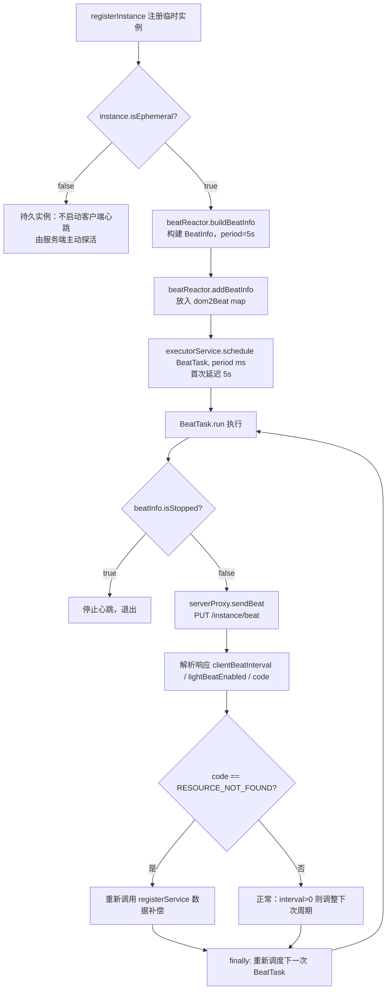
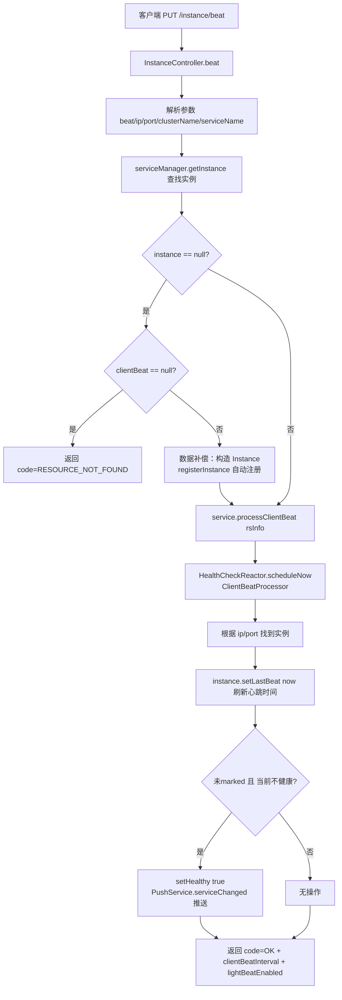
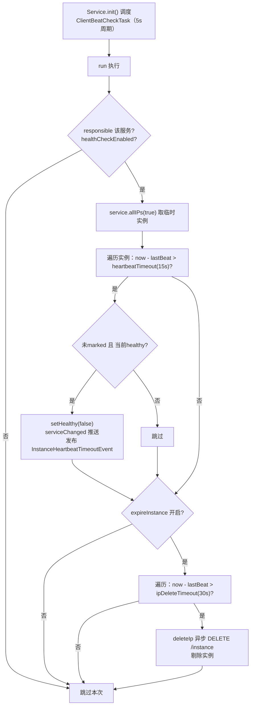
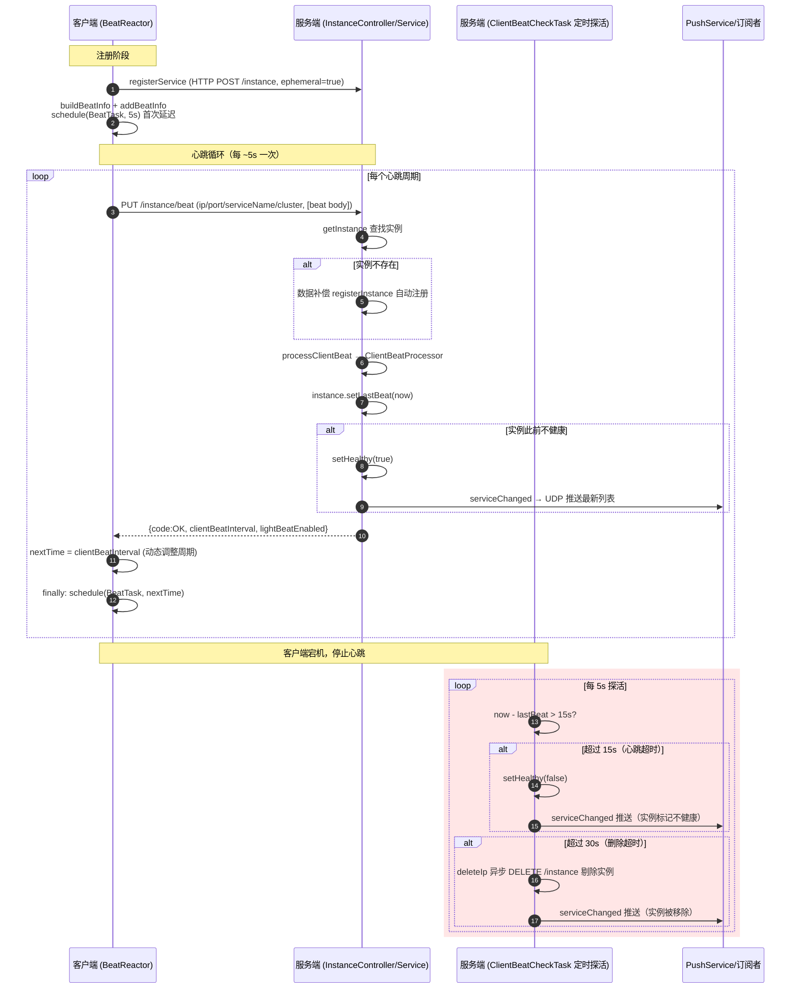

# Nacos 1.4.8 心跳检测流程源码分析

> 基于 Nacos `develop-1.4.8` 分支源码，分析**临时实例（ephemeral=true）**心跳检测的完整流程，涵盖客户端发送心跳与服务端接收/探活两端实现。

## 1. 总体概述

Nacos 1.4.x 采用 **AP 架构（Distro 协议）** 管理临时实例。临时实例由**客户端主动发送心跳**维持其在服务端的注册状态；服务端则通过**定时健康检查任务**判断实例是否超时，超时先标记为不健康，再超时则剔除实例。

| 维度 | 临时实例 (ephemeral=true) | 持久实例 (ephemeral=false) |
|------|--------------------------|--------------------------|
| 心跳发送方 | **客户端主动发送** | 服务端主动探活（TCP/HTTP） |
| 存储协议 | Distro（内存，AP） | Raft（磁盘，CP） |
| 客户端下线 | 不健康→自动剔除 | 永久保留 |
| 心跳间隔 | 默认 5s，可动态调整 | 由服务端 HealthCheckTask 控制 |

### 核心常量（`api/.../Constants.java`）

| 常量 | 值 | 含义 |
|------|----|----|
| `DEFAULT_HEART_BEAT_INTERVAL` | 5s | 心跳间隔（客户端发送周期） |
| `DEFAULT_HEART_BEAT_TIMEOUT` | 15s | 心跳超时（超此时间未收到心跳→标记不健康） |
| `DEFAULT_IP_DELETE_TIMEOUT` | 30s | 删除超时（超此时间未收到心跳→剔除实例） |

---

## 2. 客户端流程

### 2.1 关键类与职责

| 类 | 路径 | 职责 |
|----|------|----|
| `NacosNamingService` | `client/.../naming/NacosNamingService.java` | 注册入口，决定是否启用客户端心跳 |
| `BeatReactor` | `client/.../naming/beat/BeatReactor.java` | 心跳调度核心，管理 `BeatInfo` 与线程池 |
| `BeatTask` | `BeatReactor` 内部类 | 单次心跳发送任务（Runnable） |
| `BeatInfo` | `client/.../naming/beat/BeatInfo.java` | 心跳数据载体 |
| `NamingProxy` | `client/.../naming/net/NamingProxy.java` | HTTP 请求封装，`sendBeat` 实际发送 |

### 2.2 心跳数据结构 `BeatInfo`

```java
// client/.../naming/beat/BeatInfo.java
public class BeatInfo {
    private int port;                    // 实例端口
    private String ip;                   // 实例IP
    private double weight;               // 权重
    private String serviceName;          // 服务名（含 group: group@@serviceName）
    private String cluster;              // 集群名
    private Map<String, String> metadata;// 元数据
    private volatile boolean scheduled;  // 是否已调度
    private volatile long period;        // 心跳周期（ms）
    private volatile boolean stopped;    // 是否停止
}
```

### 2.3 注册时启用心跳

`NacosNamingService.registerInstance` 在实例为临时实例时，构建并注册 `BeatInfo`，触发首次心跳调度：

```java
// client/.../naming/NacosNamingService.java:212-221
public void registerInstance(String serviceName, String groupName, Instance instance) throws NacosException {
    NamingUtils.checkInstanceIsLegal(instance);
    String groupedServiceName = NamingUtils.getGroupedName(serviceName, groupName);
    if (instance.isEphemeral()) {                                   // 仅临时实例才启用客户端心跳
        BeatInfo beatInfo = beatReactor.buildBeatInfo(groupedServiceName, instance);
        beatReactor.addBeatInfo(groupedServiceName, beatInfo);
    }
    serverProxy.registerService(groupedServiceName, groupName, instance);
}
```

> 关键点：`ephemeral=true` 才走客户端心跳；`ephemeral=false`（持久实例）由服务端 `HealthCheckTask` 主动探活，客户端不参与。

### 2.4 心跳调度 `BeatReactor`

```java
// client/.../naming/beat/BeatReactor.java:61-72
public BeatReactor(NamingProxy serverProxy, int threadCount) {
    this.serverProxy = serverProxy;
    this.executorService = new ScheduledThreadPoolExecutor(threadCount, ...);
    // 线程数：Runtime.getRuntime().availableProcessors() / 2，至少 1
}
```

```java
// client/.../naming/beat/BeatReactor.java:80-90
public void addBeatInfo(String serviceName, BeatInfo beatInfo) {
    String key = buildKey(serviceName, beatInfo.getIp(), beatInfo.getPort());
    BeatInfo existBeat = null;
    if ((existBeat = dom2Beat.put(key, beatInfo)) != null) {  // 同一实例重复注册，停止旧任务
        existBeat.setStopped(true);
    }
    // 首次延迟 = beatInfo.getPeriod()（默认 5s），即注册后 5s 发第一拍
    executorService.schedule(new BeatTask(beatInfo), beatInfo.getPeriod(), TimeUnit.MILLISECONDS);
}
```

> 注意：客户端用的是 `schedule`（一次性），而非 `scheduleAtFixedRate`。每次心跳执行完，在 `finally` 中根据服务端响应**重新调度下一次**，从而实现周期可被服务端动态调整。

### 2.5 心跳发送 `BeatTask` 与 `sendBeat`

```java
// client/.../naming/beat/BeatReactor.java:159-206
class BeatTask implements Runnable {
    public void run() {
        if (beatInfo.isStopped()) return;                    // 已注销，停止
        long nextTime = beatInfo.getPeriod();                // 默认下次间隔
        try {
            JsonNode result = serverProxy.sendBeat(beatInfo, BeatReactor.this.lightBeatEnabled);
            long interval = result.get("clientBeatInterval").asLong();  // 服务端下发的间隔
            if (result.has(CommonParams.LIGHT_BEAT_ENABLED)) {
                BeatReactor.this.lightBeatEnabled = result.get(CommonParams.LIGHT_BEAT_ENABLED).asBoolean();
            }
            if (interval > 0) { nextTime = interval; }       // 动态调整心跳周期
            int code = result.has(CommonParams.CODE) ? result.get(CommonParams.CODE).asInt() : NamingResponseCode.OK;
            if (code == NamingResponseCode.RESOURCE_NOT_FOUND) {  // 服务端实例已被剔除
                // 重新注册实例，做数据补偿
                Instance instance = new Instance();
                ...
                instance.setEphemeral(true);
                serverProxy.registerService(...);
            }
        } catch (NacosException ex) {
            NAMING_LOGGER.warn("[CLIENT-BEAT] failed to send beat ...");
        } catch (Exception unknownEx) {
            NAMING_LOGGER.error("[CLIENT-BEAT] failed to send beat ...");
        } finally {
            // 无论成功失败，按 nextTime 重新调度下一次心跳
            executorService.schedule(new BeatTask(beatInfo), nextTime, TimeUnit.MILLISECONDS);
        }
    }
}
```

HTTP 请求实际发送（`NamingProxy.sendBeat`）：

```java
// client/.../naming/net/NamingProxy.java:426-443
public JsonNode sendBeat(BeatInfo beatInfo, boolean lightBeatEnabled) throws NacosException {
    Map<String, String> params = new HashMap<>(8);
    Map<String, String> bodyMap = new HashMap<>(2);
    if (!lightBeatEnabled) {
        bodyMap.put("beat", JacksonUtils.toJson(beatInfo));   // 非 light 模式，心跳体放 body
    }
    params.put(CommonParams.NAMESPACE_ID, namespaceId);
    params.put(CommonParams.SERVICE_NAME, beatInfo.getServiceName());
    params.put(CommonParams.CLUSTER_NAME, beatInfo.getCluster());
    params.put("ip", beatInfo.getIp());
    params.put("port", String.valueOf(beatInfo.getPort()));
    // PUT http://{server}/nacos/v1/ns/instance/beat
    String result = reqApi(UtilAndComs.nacosUrlBase + "/instance/beat", params, bodyMap, HttpMethod.PUT);
    return JacksonUtils.toObj(result);
}
```

> **轻量心跳（lightBeat）**：开启后客户端不再发送完整 `beat` JSON body，只发 ip/port/serviceName/cluster 参数，降低带宽。是否启用由服务端在响应中通过 `lightBeatEnabled` 字段下发，客户端首次按 `false` 发送，之后跟随服务端值。

### 2.6 客户端心跳流程图



---

## 3. 服务端流程

### 3.1 关键类与职责

| 类 | 路径 | 职责 |
|----|------|----|
| `InstanceController` | `naming/.../controllers/InstanceController.java` | 接收心跳的 HTTP 入口 `beat()` |
| `ServiceManager` | `naming/.../core/ServiceManager.java` | 实例查找/注册 |
| `Service` | `naming/.../core/Service.java` | 处理心跳入口 `processClientBeat`，持有 `ClientBeatCheckTask` |
| `ClientBeatProcessor` | `naming/.../healthcheck/ClientBeatProcessor.java` | 更新 `lastBeat`、恢复健康状态 |
| `ClientBeatCheckTask` | `naming/.../healthcheck/ClientBeatCheckTask.java` | 定时探活：超时标记不健康、剔除 |
| `HealthCheckReactor` | `naming/.../healthcheck/HealthCheckReactor.java` | 调度器 |
| `PushService` | `naming/.../push/PushService.java` | 状态变更后 UDP 推送给订阅者 |

### 3.2 心跳接收入口 `InstanceController.beat`

```java
// naming/.../controllers/InstanceController.java:464-539
@CanDistro                                            // 标记走 Distro 协议（可转发到对应节点）
@PutMapping("/beat")
@Secured(parser = NamingResourceParser.class, action = ActionTypes.WRITE)
public ObjectNode beat(HttpServletRequest request) throws Exception {
    ObjectNode result = JacksonUtils.createEmptyJsonNode();
    result.put(SwitchEntry.CLIENT_BEAT_INTERVAL, switchDomain.getClientBeatInterval()); // 默认下发的间隔

    // 1. 解析参数
    String beat = WebUtils.optional(request, "beat", StringUtils.EMPTY);
    RsInfo clientBeat = StringUtils.isNotBlank(beat) ? JacksonUtils.toObj(beat, RsInfo.class) : null;
    String clusterName = WebUtils.optional(request, CommonParams.CLUSTER_NAME, UtilsAndCommons.DEFAULT_CLUSTER_NAME);
    String ip = WebUtils.optional(request, "ip", StringUtils.EMPTY);
    int port = Integer.parseInt(WebUtils.optional(request, "port", "0"));
    ...
    String serviceName = WebUtils.required(request, CommonParams.SERVICE_NAME);
    NamingUtils.checkServiceNameFormat(serviceName);

    // 2. 查找实例
    Instance instance = serviceManager.getInstance(namespaceId, serviceName, clusterName, ip, port);

    // 3. 实例不存在 → 数据补偿：自动注册（首次心跳或实例被剔除后重新上线）
    if (instance == null) {
        if (clientBeat == null) {
            result.put(CommonParams.CODE, NamingResponseCode.RESOURCE_NOT_FOUND);
            return result;
        }
        instance = new Instance();
        instance.setPort(clientBeat.getPort());
        instance.setIp(clientBeat.getIp());
        ...
        instance.setEphemeral(clientBeat.isEphemeral());
        serviceManager.registerInstance(namespaceId, serviceName, instance);  // 重新注册
    }

    // 4. 交给 Service 处理心跳
    Service service = serviceManager.getService(namespaceId, serviceName);
    if (service == null) {
        throw new NacosException(NacosException.SERVER_ERROR, "service not found: " + serviceName + "@" + namespaceId);
    }
    if (clientBeat == null) {
        clientBeat = new RsInfo();
        clientBeat.setIp(ip); clientBeat.setPort(port); clientBeat.setCluster(clusterName);
    }
    service.processClientBeat(clientBeat);   // 异步处理

    // 5. 构造响应：code + clientBeatInterval + lightBeatEnabled
    result.put(CommonParams.CODE, NamingResponseCode.OK);
    if (instance.containsMetadata(PreservedMetadataKeys.HEART_BEAT_INTERVAL)) {
        result.put(SwitchEntry.CLIENT_BEAT_INTERVAL, instance.getInstanceHeartBeatInterval()); // 实例级自定义间隔
    }
    result.put(SwitchEntry.LIGHT_BEAT_ENABLED, switchDomain.isLightBeatEnabled());
    return result;
}
```

> **动态调整心跳周期**：服务端优先返回实例元数据 `preserved.heart-beat-interval` 指定的间隔，否则返回全局 `switchDomain.clientBeatInterval`。客户端据此更新 `nextTime`，从而实现心跳周期可按实例/全局动态调节。

### 3.3 心跳处理 `Service.processClientBeat` → `ClientBeatProcessor`

```java
// naming/.../core/Service.java:126-131
public void processClientBeat(final RsInfo rsInfo) {
    ClientBeatProcessor clientBeatProcessor = new ClientBeatProcessor();
    clientBeatProcessor.setService(this);
    clientBeatProcessor.setRsInfo(rsInfo);
    HealthCheckReactor.scheduleNow(clientBeatProcessor);  // 立即异步执行
}
```

```java
// naming/.../healthcheck/ClientBeatProcessor.java:65-94
public void run() {
    Service service = this.service;
    String ip = rsInfo.getIp();
    String clusterName = rsInfo.getCluster();
    int port = rsInfo.getPort();
    Cluster cluster = service.getClusterMap().get(clusterName);
    List<Instance> instances = cluster.allIPs(true);   // 仅临时实例

    for (Instance instance : instances) {
        if (instance.getIp().equals(ip) && instance.getPort() == port) {
            instance.setLastBeat(System.currentTimeMillis());   // ★ 刷新最后心跳时间
            if (!instance.isMarked() && !instance.isHealthy()) { // 当前不健康（之前超时被标记）
                instance.setHealthy(true);                        // ★ 恢复健康
                getPushService().serviceChanged(service);         // 推送变更给订阅者
            }
        }
    }
}
```

> 关键：心跳的核心动作是**刷新 `lastBeat` 时间戳**。若实例此前因超时被标记为不健康，收到心跳后恢复为健康并推送变更。`marked` 实例（手动标记的）不受自动健康恢复影响。

### 3.4 定时探活 `ClientBeatCheckTask`

由 `Service.init()` 调度，固定 5s 周期执行：

```java
// naming/.../core/Service.java:295-301
public void init() {
    HealthCheckReactor.scheduleCheck(clientBeatCheckTask);
    ...
}
```

```java
// naming/.../healthcheck/HealthCheckReactor.java:53-56
public static void scheduleCheck(ClientBeatCheckTask task) {
    futureMap.computeIfAbsent(task.taskKey(),
        k -> GlobalExecutor.scheduleNamingHealth(task, 5000, 5000, TimeUnit.MILLISECONDS)); // 延迟5s，周期5s
}
```

探活逻辑（两阶段：标记不健康 → 剔除）：

```java
// naming/.../healthcheck/ClientBeatCheckTask.java:76-130
public void run() {
    try {
        if (!getDistroMapper().responsible(service.getName())) return;  // 仅负责该服务的节点执行
        if (!getSwitchDomain().isHealthCheckEnabled()) return;

        List<Instance> instances = service.allIPs(true);

        // 第一阶段：超时未心跳 → 标记不健康（超时时间默认 15s）
        for (Instance instance : instances) {
            if (System.currentTimeMillis() - instance.getLastBeat() > instance.getInstanceHeartBeatTimeOut()) {
                if (!instance.isMarked()) {
                    if (instance.isHealthy()) {
                        instance.setHealthy(false);
                        getPushService().serviceChanged(service);
                        ApplicationUtils.publishEvent(new InstanceHeartbeatTimeoutEvent(this, instance));
                    }
                }
            }
        }

        if (!getGlobalConfig().isExpireInstance()) return;  // 未开启自动剔除则跳过

        // 第二阶段：超时更久 → 删除实例（删除超时默认 30s）
        for (Instance instance : instances) {
            if (instance.isMarked()) continue;
            if (System.currentTimeMillis() - instance.getLastBeat() > instance.getIpDeleteTimeout()) {
                deleteIp(instance);   // 异步 HTTP DELETE 自身 /instance 接口
            }
        }
    } catch (Exception e) {
        Loggers.SRV_LOG.warn("Exception while processing client beat time out.", e);
    }
}
```

### 3.5 状态变更推送 `PushService`

`serviceChanged(service)` 发布 `ServiceChangeEvent`，由监听器通过 **UDP** 将最新实例列表推送给所有订阅该服务的客户端（订阅者），客户端据此更新本地服务列表缓存。

### 3.6 服务端流程图



### 3.7 服务端定时探活流程图



---

## 4. 完整时序图（客户端 ↔ 服务端）



---

## 5. 关键机制总结

### 5.1 双向时间驱动
- **客户端推**：`BeatTask` 每周期主动发心跳，刷新服务端 `lastBeat`。
- **服务端拉/判**：`ClientBeatCheckTask` 每 5s 巡检，基于 `lastBeat` 判定超时。

### 5.2 心跳周期的动态调整链路
```
实例元数据 preserved.heart-beat-interval (优先)
        └─ 否 → switchDomain.clientBeatInterval (全局开关, 默认5s)
                 └─ 服务端在 beat 响应中通过 clientBeatInterval 下发
                    └─ 客户端 BeatTask 用该值作为下一次 schedule 的 nextTime
```

### 5.3 健康状态机（临时实例）
```
[首次注册/自动补偿] healthy=true, lastBeat=now
        │ 收到心跳（<15s）
        ▼
    healthy=true ◄──────────┐ 收到心跳恢复
        │ >15s 无心跳        │
        ▼                    │
    healthy=false ───────────┘
        │ >30s 无心跳
        ▼
    实例被剔除（deleteIp）
```

### 5.4 数据补偿与自愈
- **服务端**：心跳到达但实例不存在时，`beat()` 自动重新注册实例（`registerInstance`），保证实例不会因临时被剔除而永久丢失。
- **客户端**：收到 `RESOURCE_NOT_FOUND` 响应码时，`BeatTask` 主动重新 `registerService`，与服务端形成双重补偿。

### 5.5 关键文件索引

| 关注点 | 文件:行号 |
|--------|----------|
| 客户端注册启用心跳 | `NacosNamingService.java:212-221` |
| 客户端心跳调度核心 | `BeatReactor.java:80-90, 159-206` |
| 客户端 HTTP 发送 | `NamingProxy.java:426-443` |
| 心跳数据结构 | `BeatInfo.java:26-45` |
| 服务端心跳入口 | `InstanceController.java:464-539` |
| 服务端心跳处理 | `Service.java:126-131` + `ClientBeatProcessor.java:65-94` |
| 服务端定时探活 | `ClientBeatCheckTask.java:76-130` |
| 探活调度 | `HealthCheckReactor.java:53-56` + `Service.java:295-301` |
| 默认超时常量 | `Constants.java:169-173` |
